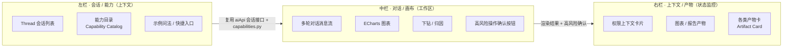
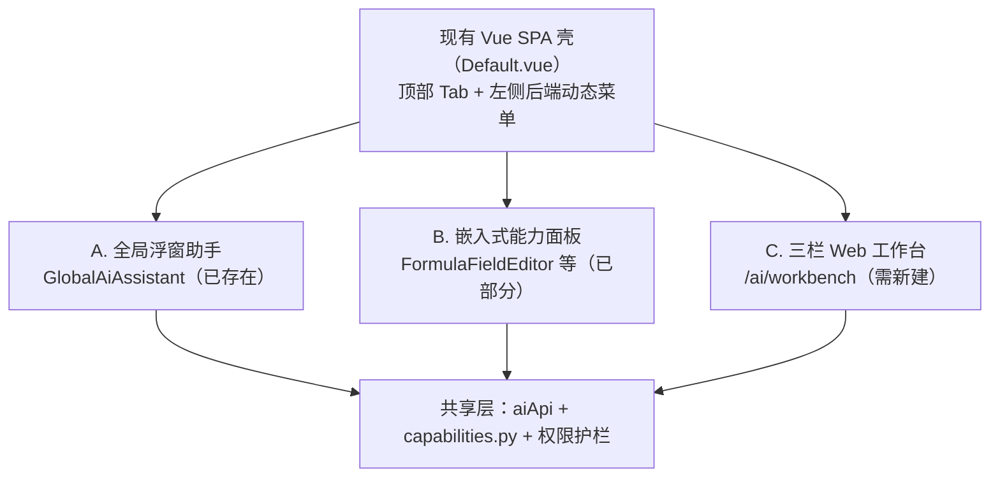

# HR Agent 建设方案（专家修订版）

> **版本**：V1.0（专家修订版）
> **修订日期**：2026-07-14
> **修订基线**：原《HR Agent 完整建设方案》V12.0
> **修订方式**：在对 `hr-portal/` 代码库（后端 `app/ai/`、`app/ucp/`、`app/warehouse/`、`app/datasets/`、`app/auth/`、`app/roles/`、`app/scopes/` 及既有 spec `004`/`011`/`012`）逐模块审计的基础上，保留原方案的战略判断、产品设计与全部迭代细节，**修正与代码现状冲突的技术假设**，并优化整体结构。

---

## 修订说明（先读这一页）

| 维度 | 原方案 V12.0 | 本修订版处理 |
|:---|:---|:---|
| 战略/产品/交互设计 | 方向正确、细节完整 | **完整保留**（双入口、权限贯穿、数据不出域、Skill 编排、自进化、三栏工作台、超链接协同） |
| 数据库 DDL | MySQL 语法（`AUTO_INCREMENT`、`TIMESTAMP ... ON UPDATE`） | **修正**：底座为 PostgreSQL + SQLAlchemy 2.0 async + Alembic；所有建表改为 ORM 模型 + 迁移 |
| LLM 提供方 | "Claude Agent SDK" | **修正**：实际为 OpenAI-compatible HTTP 端点（`app/ai/provider.py`，无 `anthropic`/`langgraph` 依赖）；改为"提供方无关 + 企业签约端点"口径 |
| 能力注册表 `agent_skills` | 新建表 | **复用** `app/ai/capabilities.py` 的 `CapabilityDefinition`（更成熟：含 `risk_level`/`confirmation`/`sensitive_context`/`policy_profile`/`audit`） |
| 脱敏 `sensitive_fields` + `apply_data_masking` | 新建 | **复用** `app/ucp/masking.py`（`mask_value`/`mask_phone`/`mask_name`/`mask_sensitive_fields`） |
| 编排 `WorkflowOrchestrator` + `workflow_definitions` | 新建 | **复用** `app/ucp/pipeline_engine.py`（生产级 DAG：CONNECTOR/TRANSFORM/BRANCH/LOOP） |
| 审批/二次确认 | 新建 | **复用** `app/ucp/approval_service.py`（SINGLE/ANY/ALL + NONE/SIMPLE/TOKEN） |
| AI 审计 `ai_interaction_logs` | 新建 | **复用** `app/ai/audit.py` + `AiConversation` |
| 指标层 | "七层数仓已 populated" | **二次校准**：实为 4 层（ODS/DWD/DWS/ADS）；指标定义和聚合链路已有基础，但 HR 指标 seed、DWS 聚合定义和端到端验证仍缺失，统一后移至当前阶段 4 |
| 权限 `PermissionContext`/`feishu_user_mapping` | 新建 | **派生**自现有 `app/auth`+`app/roles`+`app/scopes`+`app/menus`（RBAC：menu_code × V/C/U/D/E）；`feishu_user_mapping` 先核实是否已存在 |
| 迭代工期 | 1-2 天/版本、硬骨头低估 | **重排**：将工程量从建表/CRUD 挪到 Planner/Reasoner/RAG/飞书对话 bot/指标引擎修复；取消不切实际的 1 天承诺 |
| 评估/质检 | 仅"成功率统计" | **新增**：复用 `app/ai/evals.py`，设定可量化 KPI（见第十三章） |

---

## 文档定位与实施关系

本文档是 HR Agent 的总体架构、产品战略和长期演进路线，不直接承载所有业务场景的原子开发任务。

| 文档 | 权威职责 |
|:---|:---|
| `specs/004-ai-native-workbench/` | AI 技术宪法、公共 Runtime 协议和实施状态台账 |
| 本文档 | HR Agent 总架构、产品路线图、业务场景索引 |
| `specs/008-hr-adjustment-assistant/atomic-tasks.md` | 首个完整高风险业务场景——组织与人员调整助手的执行文档 |
| `specs/011-universal-connector-platform/implementation-plan.md` | 外部连接、凭证、Pipeline、审批、执行、重试和监控底座 |

实施关系：

- 004 定义公共能力和技术边界，本文不重复定义公共协议细节；
- 本文决定产品建设顺序和各业务场景在 HR Agent 中的位置；
- 008 定义调整业务模型、状态机、页面、接口、UCP 配置和原子任务；
- 011 定义外部执行机制，不决定调整业务规则；
- 业务场景不得重复建设 Capability Runtime、权限闸、审计、UCP 或飞书基础设施。

公式/计算字段是 AI 底座的首个技术验证场景；组织与人员调整助手是 HR Agent 的首个完整高风险业务场景。

---

## 一、战略定位

### 1.1 核心结论

> **HR Agent 不是替代 HR Portal 的新产品，而是 HR Portal 的"智能交互层"。** 用户可通过两种方式交互：① 飞书机器人（轻量触达，随时随地）② Web 工作台（深度分析，完整体验）。两者共享同一套能力底座和数据，通过"飞书预览 + 链接跳转"实现无缝协同。

> **最关键的设计原则：权限管理贯穿始终，从第一个版本开始就是最高优先级。没有权限管控，Agent 再聪明也不能上线。**

> **数据安全是底线：未脱敏的原始数据不出 HR Portal 服务器；仅向 LLM 发送经过权限过滤和脱敏后的数据摘要（聚合统计优先）。** 〔专家修正：原"原始数据不出域"易在合规审计时产生歧义，准确口径见第七章。〕

> **Skill（Capability）编排是 Agent 能力的核心载体：原子能力是"乐高积木"，工作流编排是"设计图"。从第一天就预留编排能力，具体能力逐步填充——但编排引擎复用既有 UCP 管线引擎，不另起炉灶。**

### 1.2 双入口协同战略

| 入口 | 定位 | 适用场景 | 核心能力 | 输出形式 |
|:---|:---|:---|:---|:---|
| **飞书机器人** | 轻量触达入口 | 快速问答、即时查询、接收预警、消息通知 | 指标查询、简单分析、摘要推送 + 超链接 | 文本 + 表格 + 图表预览 + 跳转链接 |
| **Web 工作台** | 深度消费入口 | 复杂分析、图表交互、归因报告、下钻探索 | 全量能力（图表、下钻、报告、编排） | 完整图表 + 交互操作 + 报告 + 协作分享 |

### 1.3 数据安全的核心地位〔专家修正措辞〕

> **在 HR 系统中，数据安全不是"功能"，而是"底线"。** 未脱敏的原始数据绝不离开 HR Portal 服务器；发送给 LLM 的是脱敏后的数据摘要，且**优先发送聚合统计值而非行级明细**。

| 安全维度 | 正确表述 | 在 Agent 中的体现 |
|:---|:---|:---|
| **原始数据不出域** | 未脱敏的原始明细不出 HR Portal 服务器 | 查询/过滤/聚合/脱敏均在后端完成 |
| **脱敏摘要出域** | 脱敏后的摘要/统计值会发送至 LLM 端点 | 需明确告知：这是"出域"的，但不可还原为个人信息 |
| **权限强制隔离** | 行/列权限在数据查询层强制执行 | 复用 `scope_strategy_auto_inject`，AI 无法获取无权数据 |
| **不用于训练** | 仅发送至企业签约 LLM 端点，合同约束不用于训练 | **提供方无关**口径，不绑定单一厂商承诺 |
| **全链路审计** | 所有数据访问和 AI 调用记录在案 | 复用 `app/ai/audit.py` + `AiConversation` |

### 1.4 权限管理的核心地位

> **在 HR 系统中，权限不是"功能"，而是"底线"。没有权限管控，数据安全、合规审计、隐私保护全部无从谈起。**

| 权限维度 | 说明 | 在 Agent 中的体现 |
|:---|:---|:---|
| **身份认证** | 确认"你是谁" | 飞书用户与 HR Portal 用户身份映射（复用 `app/auth`） |
| **行级权限** | 控制"能看哪些行" | 不同部门的 HRBP 看到不同部门的数据 |
| **列级权限** | 控制"能看哪些列" | 普通 HR 看不到薪酬列，HRVP 可以看到 |
| **功能权限** | 控制"能做什么操作" | 普通用户只能查询，管理员可以修改指标口径 |
| **数据脱敏** | 敏感数据展示控制 | 飞书消息中敏感数据自动脱敏（复用 `masking.py`） |

### 1.5 飞书 + Web 协同模式

> **飞书做"通知+预览"，Web 做"深度交互"**

```
飞书机器人                              Web 工作台
┌─────────────────────┐                ┌─────────────────────┐
│ ① 快速问答           │                │ ⑤ 完整上下文恢复     │
│   文本 + 表格 + 预览 │                │   图表 + 下钻 + 编辑 │
│ ↓                   │                │ ↑                   │
│ ② 图表预览卡片       │ ── 点击链接 ─▶ │ ⑥ 深度交互分析       │
│   "查看完整图表"     │                │   归因报告 + 下载    │
│ ↓                   │                │ ↑                   │
│ ③ 分析摘要推送       │ ── 点击链接 ─▶ │ ⑦ 完整报告查看       │
│   "查看完整报告"     │                │   编辑 + 分享        │
│ ↓                   │                │ ↑                   │
│ ④ 预警消息推送       │ ── 点击链接 ─▶ │ ⑧ 预警详情查看       │
│   "查看详情"         │                │   趋势分析 + 建议    │
└─────────────────────┘                └─────────────────────┘
```

### 1.6 与通用 Agent 的本质区别〔专家修正〕

| 对比维度 | 通用 Agent（Cursor/Claude Code） | 你的 HR Agent |
|:---|:---|:---|
| **核心任务** | 写代码、处理通用任务 | 查询 HR 数据、分析离职率、生成报告 |
| **数据来源** | 公开数据 + 用户提供 | **HR Portal 数仓底座（可信数据，ODS/DWD/DWS/ADS 四层 + WarehouseMetric 口径目录）**〔修正：非"七层"〕 |
| **知识基础** | 通用知识 | **知识库 + 指标口径 + 分析方法论** |
| **权限边界** | 无 | **行/列权限贯穿始终，飞书用户身份自动映射** |
| **数据安全** | 数据可能被用于训练 | **原始数据不出域 + 脱敏处理，仅发送至签约 LLM 端点**〔修正：提供方无关〕 |
| **入口方式** | 单一工作台 | **飞书机器人 + Web 工作台双入口协同** |
| **图表能力** | 无 | **自动生成可交互图表 + 多格式下载 + 下钻** |
| **能力组织** | 零散工具 | **Capability 编排 + DAG 工作流（复用既有引擎），可复用可组合**〔修正〕 |
| **进化方式** | 模型升级 | **从第一天开始的反馈闭环 + 知识沉淀 + Skill 沉淀** |

### 1.7 与 AI 行业趋势的呼应

头部 AI Agent 产品（Cursor、Claude Code、Codex）不约而同采用三栏布局作为标准前端架构，这已成为行业共识。同时，Agent 的核心数据模型（Thread/Run/Artifact/Tool Invocation）和 Capability 编排机制已成为业界标准架构，这些理念将贯穿整个 HR Agent 设计方案。

---

## 二、现状资产盘点〔★专家新增·核心价值★〕

> 本章是本次修订的核心。在动手前先盘清"已有什么、该复用什么、该修正什么"，可避免约 40%-60% 的重复建设。

### 2.1 已具备能力（直接复用，勿重建）

| 方案计划新建 | 现有代码（已实现/更优） | 复用方式 |
|:---|:---|:---|
| Skill 注册表 `agent_skills` | `app/ai/capabilities.py`：`CapabilityDefinition`（含 `capability_id`/`required_permission`(接 RBAC)/`risk_level`/`confirmation`/`sensitive_context`/`policy_profile`/`audit_enabled`/`examples`/`failure_modes`） | **直接扩展 `capabilities.py`**，新增 HR 域 capability，不新建表 |
| 脱敏 `sensitive_fields` + `apply_data_masking` + `mask_*` | `app/ucp/masking.py`：`mask_value`/`mask_phone`/`mask_name`/`mask_sensitive_fields` | **直接调用**，如需配置化扩展字段分类元数据 |
| 工作流 `WorkflowOrchestrator` + `workflow_definitions` | `app/ucp/pipeline_engine.py`：CONNECTOR/TRANSFORM/BRANCH/LOOP 四类节点 + DAG 拓扑 + 版本快照 | **复用管线引擎**；Agent 工作流作为一类特殊 pipeline 接入 |
| 高风险二次确认/审批 | `app/ucp/approval_service.py`：SINGLE/ANY/ALL + NONE/SIMPLE/TOKEN | **直接调用** |
| AI 交互审计 `ai_interaction_logs` | `app/ai/audit.py` + `AiConversation`（多轮会话/审计） | **直接调用** |
| 行级权限 `WHERE dept_id IN (...)` | `data.compare` 的 `scope_strategy_auto_inject` + `app/scopes/` | **复用 scope 注入** |
| 飞书接入（通知/回调） | `app/integrations/feishu/` + `app/ucp/feishu_webhook.py` | **复用**；但现有为推送/回调，需新增**对话式 bot**能力 |
| 评估/质检 | `app/ai/evals.py` | **复用**做质量基线 |
| 指标定义模型 | `app/datasets/models.py:209` `WarehouseMetric`（表 `warehouse_metrics`） | **复用**，作为指标定义载体 |
| 数仓管道（DWS/ADS 物化） | `app/warehouse/materialization.py`、`modeling.py`(`generate_dws_view`)、`metric_automation.py` | **复用**物理视图构建 |

### 2.2 AI 公共能力真实状态

> 详细代码证据、缺口和禁止重建事项以 `specs/004-ai-native-workbench/current-state-and-gaps.md` 为准。

| 公共能力 | 状态 | 当前依据 | 当前动作 |
|:---|:---|:---|:---|
| Capability 注册与权限/风险元数据 | 已实现 | `app/ai/capabilities.py` | 直接复用 |
| ChatRoute 与 LLM-first 分类 | 已实现 | `app/ai/router.py` | 追加 Route，不建关键词 Router |
| Schema Validator / Policy Guard | 已实现基础 | `app/ai/schema_validator.py`、`policy_guard.py` | 补目标 Capability 统一校验 |
| PostgreSQL 会话 | 已实现 | `app/ai/conversation.py`、`AiConversation` | 直接复用 |
| AI Audit / trace_id | 已实现基础 | `app/ai/audit.py` | 补实际命中能力与失败阶段 |
| Context Packet | 已实现基础 | `app/ai/context_builder.py` | 强制权限过滤、字段裁剪和脱敏契约 |
| `BaseCapabilityPlan` | 未统一 | Extractor 当前返回普通 `dict` | 阶段 0A 收口 |
| `CapabilityResultEnvelope` | 部分实现 | `AiChatOut` + 任意 `artifact` | 阶段 0A 收口并兼容旧字段 |
| 通用 Runtime | 部分实现 | `global_ai_chat` 主链集中于 `router.py` | 收口现有主链，不另建平台 |
| Web/飞书共享 Handler | 未完成 | Web 已有，飞书以通知/卡片为主 | Web 稳定后接入同一 Handler |
| AI 与 UCP Pipeline 适配 | 未完成 | UCP 执行底座已实现 | 只补 Plan Validator 和节点映射 |

**结论**：现有底层组件大部分已具备，第一阶段不是“建设 HR Agent 最小底座”，而是“盘点并收口现有 AI 公共底座，补齐统一 Runtime 缺口”。

### 2.3 需修正/重建的部分

| 项目 | 问题 | 修正方向 |
|:---|:---|:---|
| `compute_metric` / 指标计算链路 | 旧版问题是 `SELECT * FROM {表} LIMIT 1` 单行算公式；当前代码已演进为读取已发布 `DwsAggregateDefinition`、生成 `ds_dws_{agg.id}` view、按 period 过滤并写入 `MetricResult`/`MetricResultRow`。新问题不是“无聚合”，而是 HR 指标缺少配套 `WarehouseMetric` seed、DWS 聚合定义、period 规则和权限过滤验证 | **Phase 0 校准**：沿用现有 `DwsAggregateDefinition → DWS view → MetricResult` 链路，补齐 HR 指标定义、聚合定义、周期规则、权限过滤和端到端测试；不要另写一套指标 SQL 编译器 |
| `WarehouseMetric` 指标定义 | 缺少可直接服务 HR Agent 的核心 HR 指标（离职率/HC/人均成本）seed | **Phase 0 seed** 首批指标定义，并同步生成/配置对应 DWS 聚合定义 |
| 新建 `feishu_user_mapping` | 需先核实 `app/auth` 是否已存飞书 open_id 映射 | 核实后决定复用 or 扩展 |
| 新建独立 `PermissionContext` | 会与现有 RBAC/scope 形成双真理源 | **从现有角色/范围/用户模型派生** |

### 2.4 指标层现状复核〔据代码核实〕

- **分层实为 4 层**：`layer_policy.py:40` `LAYER_ORDER = {"ODS":0,"DWD":1,"DWS":2,"ADS":3}`，无 DM 层、无独立 METRIC 层。原方案"七层数仓"与代码不符。
- **`WarehouseMetric` 自身定位**：docstring 写明"一期为口径目录，不自动计算"。
- **指标计算链路已演进**：当前 `compute_metric` 不再是旧版 `LIMIT 1` 单行公式计算，而是要求存在已发布 `DwsAggregateDefinition`，生成 `ds_dws_{agg.id}` 视图后读取结果、按 period 过滤，并写入 `MetricResult`/`MetricResultRow`。
- **新瓶颈**：HR Agent 所需的离职率/HC/人均成本等指标缺少成体系的 `WarehouseMetric` seed、DWS 聚合定义、period 规则、权限过滤和验收数据。
- **自动发布默认关**：`metric_automation`/L4 级联 feature flag 在 `core/config.py` 默认 `False`。

> **结论**：指标**定义骨架 + DWS 聚合计算链路**已具备，但**HR 指标未补齐、聚合定义未形成可直接消费的标准资产、权限过滤未完成端到端验证**。方案不能把指标层当"已完成依赖"直接消费，必须单列 Phase 0；但 Phase 0 的重点应从"修复单行 bug"改为"补齐 HR 指标计算链路"。

### 2.5 技术栈基线〔专家明确〕

- **数据库**：PostgreSQL（`asyncpg`）+ SQLAlchemy 2.0 async + Alembic。所有表以 ORM 模型 + 迁移脚本落地，禁止裸 MySQL DDL。
- **LLM 提供方**：OpenAI-compatible HTTP 端点（`app/ai/provider.py` 经 `httpx` 直连）。**不引入未经预研的 Agent SDK**；如确需增强编排能力（如 function-calling），在现有 provider 上扩展，保持提供方无关。
- **部署形态**：**集成进现有 FastAPI 应用**（`hr-portal/backend/app/`），作为 `app/agent/` 模块，复用现有 DB 连接、auth、Alembic、权限体系。**不另起独立后端服务**。
- **前端**：扩展现有 Vue 3 + Element Plus + Pinia 前端；三栏工作台可复用 `@vue-flow` 管线可视化经验；`GlobalAiAssistant.vue` 浮层作为起点。

---

## 三、核心设计原则

### 3.1 十大原则

| 原则 | 说明 |
|:---|:---|
| **权限贯穿始终** | 从第一个版本开始，每个迭代都必须包含权限管理内容。没有权限，不上线 |
| **数据不出域（精确口径）** | 未脱敏原始数据不出服务器；脱敏摘要/聚合统计可出域；优先聚合在库、LLM 只看统计 |
| **底座先行（二次校准）** | Agent 的智能程度取决于底座。数仓与 DWS 聚合计算链路已具备雏形，但**HR 指标 seed、DWS 聚合定义、period 规则、权限过滤和端到端验收数据仍需补齐**，属一期前置 |
| **双入口协同** | 飞书机器人和 Web 工作台同步建设，共享同一套后端能力，通过超链接实现无缝协同 |
| **Skill（Capability）驱动** | 能力封装为 Capability，原子可组合为工作流；**复用既有 `capabilities.py` 与管线引擎** |
| **极小迭代** | 每个版本快速验证，用户可感知（*注：1-2 天仅适用于建表/CRUD 类轻量项；智能内核类需更久，见第九章*） |
| **资产持续复用** | **优先复用 `app/ai/`、`app/ucp/`、`app/warehouse/` 既有模块，不推翻重来**〔新增强调〕 |
| **渐进式增强** | 功能从简单到复杂，自然演进（原子 → 组合 → 工作流） |
| **底层支撑远期** | 早期架构预留扩展点（Capability 注册表、DAG 引擎已存在），但不提前实现复杂编排 |
| **自进化从第一天启动** | 反馈闭环从第一个用户开始；但需加防污染护栏（见第六章） |

### 3.2 演进哲学：从 A 到 B

| 场景 | MVP（A） | 后期（B） | 演进方式 |
|:---|:---|:---|:---|
| 知识库 | 口径配置表（复用 `WarehouseMetric`） | RAG + 知识图谱 | 配置表数据作为种子导入 |
| 反馈机制 | 点赞/点踩 | 完整自循环闭环 | 反馈数据持续积累 |
| 成功案例 | 简单 JSON 存储（复用 `AiConversation`/审计） | Few-shot 示例库 + 向量索引 | 案例数据迁移升级 |
| 图表 | ECharts 基础渲染 | 图表模板学习 + 智能推荐 | 用户偏好持续积累 |
| 飞书交互 | 文本问答（**新增：对话式 bot**） | 卡片交互 + 快捷按钮 + 超链接跳转 | 逐步丰富交互形态 |
| 权限管理 | 基础身份映射 + 行级权限（复用 scope） | 完整 RBAC + 列级权限 + 审计日志 | 权限体系持续增强 |
| 数据安全 | 基础脱敏 + 权限过滤（复用 `masking.py`） | 完整数据不出域 + 全链路审计 | 安全体系持续增强 |
| Skill | 原子 Capability（单一任务） | 组合 Capability + DAG 工作流（复用 `pipeline_engine`） | 从简单到复杂逐步演进 |

---

## 四、整体架构

### 4.1 分层架构（修正版）

```
┌──────────────────────────────────────────────────────────────────────────┐
│ HR Agent 分层架构（权限管理 + 数据安全 + Capability 编排贯穿所有层级）        │
├──────────────────────────────────────────────────────────────────────────┤
│ 第1层 交互层：飞书机器人入口（群聊/私聊/快捷命令/卡片/图表预览/超链接）      │
│           + Web 工作台入口（三栏布局 / ECharts / 侧边栏 / URL 恢复上下文）   │
│           🔐 身份认证（飞书 open_id → 系统用户，复用 app/auth）             │
│           🔒 飞书消息敏感数据自动脱敏（复用 masking.py）                     │
│ ↓                                                                          │
│ 第2层 推理层（Agent 引擎）：意图识别 → 任务拆解(Planner) → Capability 匹配   │
│           → 编排执行(复用 pipeline_engine) → 结果汇总(Reasoner)             │
│           🔐 每次工具调用前校验权限（复用 capabilities.required_permission） │
│           🔒 输入/输出全链路审计（复用 audit.py）                           │
│ ↓                                                                          │
│ 第3层 编排层（复用 UCP pipeline_engine，不新建引擎）：                       │
│           DAG 解析/拓扑排序/并行调度/条件分支/错误处理重试/数据传递           │
│           🔐 每个 Capability 执行前校验权限                                 │
│ ↓                                                                          │
│ 第4层 工具/Capability 层：原子（指标查询/维度拆解/趋势/归因/图表/知识检索…） │
│           复合（离职分析/成本分析/HC 分析…）                                │
│           🔐 注入当前用户权限上下文（部门 ID、角色、可见字段）              │
│           🔒 敏感字段脱敏（姓名→工号，薪酬→等级）复用 masking.py            │
│ ↓                                                                          │
│ 第5层 数据层（HR Portal 底座）：数仓（ODS/DWD/DWS/ADS 四层）                │
│           + WarehouseMetric 口径目录 + 行/列权限(scope)                     │
│           🔐 行级权限（scope_strategy_auto_inject）列级权限（白名单字段）    │
│           🔒 原始数据不出域；聚合在库，LLM 仅收统计摘要                     │
│ ↓                                                                          │
│ 第6层 执行层（连接器平台 UCP）：北森/飞书/滴滴/曹操 API + 管线编排          │
│           🔐 跨系统操作需二次确认（复用 approval_service）                  │
│ ↓                                                                          │
│ 第7层 进化层（自循环）：反馈采集 → 成功案例入库 → Few-shot 检索             │
│           → 口径完善 → 路径优化 → 图表模板学习 → Capability 沉淀            │
│           🔐 不同角色看到不同维度效果数据                                   │
└──────────────────────────────────────────────────────────────────────────┘
```

### 4.2 飞书机器人架构 + 权限集成 + 数据安全

```
飞书端                                         HR Portal Agent 后端（app/agent/）
┌──────────────┐  ┌──────────────┐  ┌──────────────────────────────────────┐
│ 群聊 @机器人  │─▶│ 飞书开放平台  │─▶│ ① 提取 open_id（复用 app/auth）       │
│ 私聊 机器人   │  │ 事件订阅      │  │ ② 映射为系统用户（核实 feishu 映射）  │
│ 快捷命令 /hr  │  │ 消息卡片交互  │  │ ③ 加载权限上下文（派生自 roles/scope）│
│ 图表预览图片  │  │              │  │ ④ 匹配 Capability/工作流              │
│ 超链接跳转 Web│  │              │  │ ⑤ 编排执行（复用 pipeline_engine）    │
└──────────────┘  └──────────────┘  │ ⑥ 权限过滤结果                       │
                                    │ ⑦ 数据脱敏（复用 masking.py）         │
                                    │ ⑧ 返回（无权限/敏感已屏蔽）           │
                                    └──────────────────────────────────────┘
▼ 返回结果（两种格式 + 超链接，均已脱敏/过滤）
  轻量结果（飞书消息卡片：文本+表格+图表预览+"查看完整分析→"）
  深度结果（Web 工作台：完整图表+交互+归因报告+下钻+下载+分享）
🔐 飞书用户身份自动映射到 HR Portal 权限体系，无权限数据永不返回
🔒 原始数据不出域；脱敏摘要出域；优先聚合统计
```

### 4.3 权限体系架构（派生自现有 RBAC）

```
身份层：飞书用户 → open_id 查询 → HR Portal 用户（含部门/角色/权限，复用 app/auth+roles+scopes）
   ↓
权限层：PermissionContext（从现有角色/范围/用户模型派生，不新建真理源）
   user_permission_context = {
     "user_id": ..., "department_ids": [...],   ← 行级（派生自 scope）
     "role": "HRBP",
     "visible_columns": [...],                  ← 列级（派生自 role+menu 配置）
     "can_manage_metrics": bool,                ← 功能权限（派生自 role）
     "can_export_data": bool,
     "sensitive_masks": [...]                   ← 复用 masking.py 规则
   }
   ↓
执行层：权限注入与过滤（复用既有机制）
   · 行级：scope_strategy_auto_inject 自动拼 WHERE dept_id IN (...)
   · 列级：返回数据裁剪至 visible_columns
   · 敏感操作：二次确认（复用 approval_service）
   · 审计：谁/何时/做了什么/结果（复用 audit.py）
```

### 4.4 数据安全架构（复用既有，非新建）

```
敏感字段脱敏（复用 app/ucp/masking.py：mask_value/mask_phone/mask_name/mask_sensitive_fields）
   │ 规则：手机号中间4位*、身份证中间*、银行卡前后4位、薪酬/凭证整体[已脱敏]
   ▼
数据脱敏执行（在后端完成，绝不发原始值给 LLM）
   apply_data_masking(data, permission_context)  ← 直接调用 masking.py
   ▼
AI 交互审计（复用 app/ai/audit.py + AiConversation）
   记录：谁、何时、问了什么、AI 看到的数据摘要（已脱敏）、AI 返回、权限上下文
```

### 4.5 Capability（Skill）编排架构（复用 capabilities.py + pipeline_engine）

```
Capability 定义层（复用 app/ai/capabilities.py）
   · 原子 Capability（单一任务：query_metric, drill_down, trend_analysis…）
   · 复合 Capability（组合：dimission_analysis）
   · 元数据（名称/描述/触发关键词/所需权限/版本/risk_level/confirmation/sensitive_context）
        ↓
编排层（复用 app/ucp/pipeline_engine.py，不新建 WorkflowOrchestrator）
   · DAG 解析与拓扑排序 · 并行执行调度 · 条件分支 · 错误处理与重试 · 数据传递
        ↓
执行层（复用既有执行器 + 审计）
   · Capability 调度 · 并发控制 · 状态管理 · 结果收集 · 审计日志
```

### 4.6 Capability 与工具的关系

```
工具层（原子能力）        Capability 层（组合能力）              工作流层（编排能力）
┌─────────────────┐    ┌─────────────────────────────┐    ┌────────────────┐
│ 指标查询工具     │    │ 离职分析 Capability          │    │ DAG 工作流     │
│ 维度拆解工具     │──▶│ → 指标查询 → 维度拆解         │──▶│ 条件分支       │
│ 趋势分析工具     │ 组合│ → 趋势分析 → 图表生成        │    │ 并行执行       │
│ 图表生成工具     │    │ → 报告生成                   │    └────────────────┘
│ 知识检索工具     │    └─────────────────────────────┘
│ 归因分析工具     │
└─────────────────┘
特点：工具是"做什么"，Capability 是"怎么做"，工作流是"什么时候做、谁先做"
```

---

## 五、产品与交互设计

### 5.1 首页入口策略

| 区域 | 内容 | 作用 | 权限控制 | 数据安全 |
|:---|:---|:---|:---|:---|
| 核心指标卡片 | 员工数、入职数、离职数 | 一登录即见关键数据 | 受行/列权限管控 | 敏感数据自动脱敏 |
| 异常预警 | 主动推送预警 | 点击进入 Agent 工作台 | 仅显示有权限部门预警 | 预警内容脱敏 |
| 首页对话输入框 | 快捷提问入口 | 降低门槛 | 自动注入权限上下文 | 输入/输出审计 |
| 快捷入口 | 各模块导航 | 传统界面 + Agent 入口 | 按角色显隐 | — |

### 5.2 Agent 工作台三栏布局

> 规划原文（方案第 95/145 行）明确将"三栏布局"列为 Web 工作台的核心入口（行业共识，类 Claude Code / Cursor）。**三栏是"布局"，不是"独立应用"**——它作为现有 `Default.vue` 壳里的一个普通路由页 `/ai/workbench` 存在，走既有菜单注册三步（后端 menuCode → 前端 `MENU_ROUTE_MAP` → 懒加载路由），不引入 iframe / 微前端 / 另起 Vue 工程。
>
> 〔**专家评审保留意见**〕三栏对"深度分析会话"合理，但**不宜作为所有 HR 用户的默认唯一入口**（详见 5.2.4）。HR 用户为轻度、任务型，固定三栏在轻交互时左右空白、首屏负担重；建议改为渐进式披露（默认单栏、会话变深再展开）。

#### 5.2.1 三栏布局结构（与现有资产对接）



| 栏 | 规划定位（深度消费） | 复用现有资产 |
|:---|:---|:---|
| **左栏 · 会话/能力** | Thread 列表 + 能力目录 + 示例问法 | `capabilities.py` 数据 + `aiApi` 会话接口；把 `GlobalAiAssistant` 的聊天逻辑抽成可复用组件 |
| **中栏 · 对话/画布** | 多轮对话 + ECharts 图表 + 下钻归因 | `aiApi.chat()` 直接复用；图表接 ECharts；后端出 Plan、前端只渲染结果 + 高风险确认按钮 |
| **右栏 · 上下文/产物** | 权限上下文 + 图表/报告 + 各类产物卡 | `CompareResultCard` / `DocumentActionPreview` / `AutomationRuleArtifactPreview` **现成组件，零新建** |

#### 5.2.2 三种 AI 触达方式并存（前端共存模型）

三栏工作台不是"取代"现有界面，而是与另外两种已存在的 AI 触达方式**并存**；三者共享 `aiApi` + `capabilities.py` + 同一套权限护栏（policy_guard / scope / masking），互不复写：



- **A. 全局浮窗助手**（`components/GlobalAiAssistant.vue`，已存在）：任意页面右下角随时唤起的轻量对话，复用 `aiApi.chat()`，**不重写**。
- **B. 嵌入式能力面板**（如 `FormulaFieldEditor.vue` / `ReportFieldWorkbench.vue`，已部分）：在业务页里"长"出来的 AI 能力，复用现有产物渲染组件。
- **C. 三栏 Web 工作台**（`/ai/workbench`，需新建）：规划要求的深度分析主入口，内部三栏布局。

#### 5.2.3 注册到现有界面的三步（标准套路）

1. **后端**：菜单表加一条 `menuCode: 'ai.workbench'`，父级挂到对应顶级 Tab。
2. **前端 `constants/menuRoutes.ts`**：`MENU_ROUTE_MAP['ai.workbench'] = '/ai/workbench'`。
3. **前端 `router/index.ts`**：加一条懒加载路由，权限自动生效（route guard 比对 `userStore.menus`，无权限跳 `/home`，与现有页面一致）：
   ```ts
   { path: 'workbench', name: 'AiWorkbench',
     component: () => import('@/views/ai/Workbench.vue'),
     meta: { label: 'AI 工作台', menuCode: 'ai.workbench' } }
   ```

> 三栏页 ≈ **组装**而非**从零造**：聊天逻辑抽组件（来自已存在的 `GlobalAiAssistant`）、能力目录（来自 `capabilities.py`）、右栏产物卡（全现成）。真正难点在后端——把 `/api/v1/ai/chat` 接到 Planner / Reasoner / Capability 编排层。

#### 5.2.4 专家评审：三栏布局的适用边界与渐进式建议〔批判性〕

> 本节是对"三栏为核心入口"的独立审视，不盲从原规划与行业范式。结论：**三栏方向对，但被高估**——它是"深度分析会话"的正确形态，而非所有 HR 用户的默认唯一入口。

| 批判性观点 | 说明 | 对原方案的影响 |
|:---|:---|:---|
| **用户画像错配** | Claude/Cursor 三栏服务于"全天候泡在工具里的开发者"；HR 用户（HRBP/SSC/HRVP）是**轻度、任务型**，多数交互"问一句→拿结果就走"。固定三栏在轻交互时左右空白、首屏负担重，对非技术用户有 intimidation 效应 | 不应作为默认首屏 |
| **右栏易与中栏重复** | 示例图右栏放"图表/报告产物卡"，但图表本就在中栏对话流渲染；若仅回显即时结果则是重复 chrome | 右栏须重定义为**常驻可操作产物**（保存的报告/导出文件/下钻面包屑/书签分析），而非即时回显 |
| **左栏目录默认应折叠** | 静态能力目录仅在 agent 路由不准的早期有"可发现性"价值；成熟后应靠上下文推荐 | 默认收起，或改为"情境化建议问法"，避免对轻度用户造成噪音 |
| **隐喻值得商榷** | HR 是"消费洞察"而非"与 agent 协同编辑"；右栏用"正在生长的报告文档"（类 ChatGPT canvas / Notion AI）比"工具结果面板"更贴合，本质是 2.5 栏 | 右栏定位从"工具结果"改为"生长中的报告/答案文档" |
| **ROI 最低、成本最高** | 三触达点中（A 全局浮窗已存在 / B 嵌入式价值高 / C 三栏），C 前端成本最高、使用频次最不确定 | 建设顺序应为 **A → B → C 最后做**，且 C 由 B 演化，非另起大工程（原 9.7 将 5.1 三栏列为核心入口，是最贵赌注） |
| **应渐进式披露** | 默认聚焦单栏对话；当会话变深（产生图表/多轮/产物）时**自动展开**左右栏 | 比"一进来就三栏"更契合 HR 使用节律，也拆薄前端一次性投入 |

**修订结论（写入迭代编排）**：
- 三栏保留为"**深度分析模式**"，但降级为可选展开形态，而非 Web 工作台唯一核心入口。
- 默认轻量（单栏对话 + 渐进展开）；右栏重定义为常驻可操作产物；左栏默认折叠。
- 五期 5.1"三栏布局"建议改为"深度分析模式（渐进式三栏）"，优先级排在 A/B 之后；B（嵌入式能力面板）应作为前期主要 Web AI 载体优先建设。

### 5.3 权限不足时的交互反馈

| 场景 | 交互反馈 |
|:---|:---|
| 飞书提问无权限 | "您暂无权限查看该数据，如需访问请联系 HRVP 授权" |
| Web 工作台无权限 | 友好权限提示，引导申请权限 |
| 部分权限 | 数据正常展示，无权字段自动隐藏，不展示敏感信息 |
| 操作权限不足 | 操作按钮置灰，hover 提示"您暂无此操作权限" |
| 跨系统操作需确认 | 弹窗二次确认（复用 approval_service），记录审计 |
| Capability 执行中权限不足 | 状态面板显示"步骤 2/5 权限不足，已跳过" |
| 敏感数据脱敏提示 | 数据显示为"***"，旁标"🔒 数据已脱敏" |

---

## 六、Agent 能力架构〔专家重写〕

### 6.1 推理层：意图识别 → Planner → Capability 匹配 → 编排 → Reasoner

复用既有 `ai.chat` capability（"识别用户目标并受控调用已注册 Capability"）作为起点。关键专家判断：

- **LLM 调用协议：结构化 Plan + 后端执行（不自主调工具）**。明确采用已验证的安全范式（见 `data.compare`）：`LLM 仅输出结构化 Plan/JSON → 后端引擎编译执行（含权限注入、零注入风险）`。**不要**走"LLM 实时自主调工具"模式——在 HR 高敏场景风险过高、可控性差。
- **Capability 匹配**：优先 keyword 触发（MVP），逐步升级为 LLM 路由；匹配目标是 `capabilities.py` 中已注册的 capability。
- **编排执行**：复用 `pipeline_engine`，Agent 工作流作为一类 pipeline。

### 6.2 Capability（Skill）注册（复用 capabilities.py）

原 `agent_skills` 表的字段，应映射到既有 `CapabilityDefinition`：

| 原方案 agent_skills 字段 | 映射到 CapabilityDefinition |
|:---|:---|
| skill_code / skill_name | capability_id / name |
| description | description |
| trigger_keywords | examples（兼作触发语料） |
| steps（JSON） | 通过 pipeline_engine 的 DAG 实现，不存 steps JSON |
| required_permissions（JSON） | required_permission（接现有 RBAC） |
| version / status | version / is_enabled |
| execution_count / avg_success_rate | 复用 audit + evals 统计 |

> **不要新建 `agent_skills` 表**；在 `capabilities.py` 追加 HR 域 capability 即可。

### 6.3 编排层（复用 pipeline_engine，不新建 WorkflowOrchestrator）

原方案的 `WorkflowOrchestrator` + `workflow_definitions` 与既有 `pipeline_engine.py` 功能重叠。改为：
- Agent 复合 Capability = 一个 `pipeline`（DAG），节点类型为既有 CONNECTOR/TRANSFORM/BRANCH/LOOP，或在 semantic 上映射为"Capability 调用节点"。
- 并行组、依赖、条件分支、重试均复用引擎能力。
- 工作流定义可视化：可复用前端 `@vue-flow` 管线设计器经验。

### 6.4 Capability Runtime 与统一执行协议〔二次校准新增〕

> 规划不能只定义“有哪些 Capability”，还必须定义“谁来路由、谁来执行、怎么返回、怎么记录状态”。因此在 `ai.chat` 与各 HR Capability 之间新增一层 **Agent Capability Runtime**。它不是新产品，也不是独立服务，而是现有 FastAPI 应用内的受控执行层。

#### 6.4.1 Runtime 职责边界

```text
用户输入（Web / 飞书）
  ↓
CapabilityRouter：识别意图，产出 CapabilityPlan
  ↓
CapabilityRuntime：校验权限、装载上下文、调度执行
  ↓
CapabilityHandler：执行具体业务能力（查指标/拆解/趋势/图表/报告）
  ↓
ResultNormalizer：统一结果结构、脱敏、裁剪
  ↓
AuditRecorder：记录用户、能力、权限上下文、输入摘要、输出摘要、耗时
  ↓
返回 Web / 飞书统一可渲染结果
```

Runtime 必须坚持三条边界：

1. **LLM 不直接执行工具**：LLM 只输出结构化 Plan；所有执行由后端 Runtime 完成。
2. **权限不只在入口校验**：`required_permission` 只判断是否允许使用 Capability；行级/列级权限必须在数据查询与结果返回层再次执行。
3. **原始明细不直接出域**：发送给 LLM 的只能是权限过滤后的聚合统计或脱敏摘要。

#### 6.4.2 CapabilityRouter：从用户问题到 CapabilityPlan

MVP 阶段采用关键词/规则路由，避免一开始依赖不稳定的 LLM Planner：

| 用户意图 | 示例 | 路由到 |
|:---|:---|:---|
| 指标查询 | “6月 HC 是多少”“离职率是多少” | `hr.metric.query` |
| 指标口径 | “离职率怎么算” | `hr.metric.definition` |
| 趋势 | “近6个月离职率趋势” | `hr.metric.trend` |
| 拆解 | “按部门拆一下”“哪个岗位离职高” | `hr.metric.drill_down` |
| 综合分析 | “为什么研发离职率上升” | 二期后路由到复合 Capability |

后期再升级为 LLM 输出结构化 Plan：

```json
{
  "intent": "metric_analysis",
  "steps": [
    {"capability_id": "hr.metric.query", "args": {"metric_code": "dimission_rate", "period": "2026-06"}},
    {"capability_id": "hr.metric.trend", "args": {"metric_code": "dimission_rate", "months": 6}},
    {"capability_id": "hr.metric.drill_down", "args": {"dimension": "department"}}
  ]
}
```

该 Plan 只是一份“待执行计划”，不能被模型直接执行；Runtime 必须逐步校验每个 step。

#### 6.4.3 CapabilityHandler：每个 Capability 必须有后端执行器

`capabilities.py` 只定义能力元数据，不等于能力已经可执行。每个 HR Capability 必须绑定明确 handler：

| Capability | Handler 职责 | 依赖 |
|:---|:---|:---|
| `hr.metric.query` | 查询指标结果、口径、周期、维度行 | `WarehouseMetric` + `MetricComputeService` + `MetricResultRow` |
| `hr.metric.definition` | 返回指标业务定义、计算说明、相关字段 | `WarehouseMetric` |
| `hr.metric.trend` | 查询连续周期指标结果，生成趋势序列 | `MetricResult` / DWS view |
| `hr.metric.drill_down` | 按部门/岗位/司龄等维度拆解 | DWS 聚合定义 + scope 过滤 |
| `hr.chart.generate` | 将结构化指标结果转成图表配置 | ECharts 配置 schema |
| `hr.report.summary` | 基于已脱敏摘要生成分析文本 | LLM provider + audit |

一期只要求 `hr.metric.query` 和 `hr.metric.definition` 可用；趋势、拆解、图表和报告按二期/四期演进。

#### 6.4.4 统一 Result Schema

所有 Capability 返回必须归一化，否则 Web、飞书、图表和报告会各自适配，后期必然混乱。建议统一为：

```json
{
  "type": "metric_result",
  "capability_id": "hr.metric.query",
  "status": "success",
  "period": "2026-06",
  "metric": {
    "code": "dimission_rate",
    "name": "离职率",
    "value": 0.052,
    "unit": "%"
  },
  "definition": {
    "business_definition": "统计周期内离职人数 / 期末在职人数",
    "calculation_desc": "按当前用户可见组织范围过滤后计算"
  },
  "rows": [
    {
      "dimensions": {"department": "研发部"},
      "measures": {"dimission_rate": 0.052, "headcount": 120, "left_count": 6}
    }
  ],
  "permission": {
    "filtered": true,
    "note": "已按当前用户数据范围过滤"
  },
  "masking": {
    "applied": true,
    "note": "敏感字段已脱敏"
  },
  "artifacts": [],
  "trace_id": "..."
}
```

最小字段要求：`type`、`capability_id`、`status`、`trace_id` 必填；业务结果放在 `metric` / `rows` / `artifacts` 中；权限和脱敏提示必须显式返回，便于 Web 和飞书一致展示。

#### 6.4.5 Execution State：复合 Capability 的执行状态

复合 Capability 不能只返回最终文本，必须记录每一步状态，供 Web 状态面板、飞书错误提示和审计使用：

```json
{
  "run_id": "run_20260714_001",
  "capability_id": "dimission_analysis",
  "status": "partial_success",
  "steps": [
    {"step_id": "query", "capability_id": "hr.metric.query", "status": "success", "duration_ms": 320},
    {"step_id": "trend", "capability_id": "hr.metric.trend", "status": "success", "duration_ms": 410},
    {"step_id": "drill_down", "capability_id": "hr.metric.drill_down", "status": "skipped", "reason": "permission_denied"}
  ],
  "permission_context_hash": "...",
  "trace_id": "..."
}
```

状态枚举建议：

| 状态 | 含义 |
|:---|:---|
| `pending` | 已生成计划，尚未执行 |
| `running` | 执行中 |
| `success` | 全部成功 |
| `partial_success` | 部分步骤成功，部分跳过/失败 |
| `skipped` | 因权限/条件不满足跳过 |
| `failed` | 执行失败 |
| `requires_confirmation` | 需要用户确认后继续 |

一期可先以内存/审计日志记录轻量状态；二期做顺序编排时再持久化 run/step 状态；三期接 DAG 时再适配 `pipeline_engine`。

#### 6.4.6 当前收口与后续演进

| 阶段 | Runtime 能力 |
|:---|:---|
| 阶段 0A | 收口现有 LLM-first ChatRoute、目标 Capability 权限/Policy 闸、Plan、Result、审计和 Handler 契约 |
| 阶段 0B-3 | 用调整助手验证单 Capability、多轮歧义、UCP 执行及 Web/飞书共享 Handler |
| 阶段 4 及以后 | 在同一公共协议上扩展指标、趋势、拆解、分析、图表和组合 Plan |
| 治理成熟期 | Capability 管理界面；需先设计受限 DB override，不能覆盖代码安全边界 |

工作流 DAG 始终复用 `pipeline_engine`，不新建独立 Orchestrator。

### 6.5 Capability 自沉淀 / 受控发布〔二次校准新增〕

> 长期需要支持类似 Claude Code “自然语言沉淀 Skill”的体验，但 HR 场景不能允许用户一句话创建后立即上线执行。正确形态是：**自然语言生成 Capability 草稿 → 管理员审核 → evals 验证 → 发布后 Agent 才能调用**。

#### 6.5.1 目标流程

```text
用户反复问类似问题
  ↓
系统通过审计/反馈/聚类发现高频需求
  ↓
AI 生成 Capability 草稿
  ↓
管理员审核：口径、权限、脱敏、风险等级、执行步骤
  ↓
evals 验证：准确性、越权拦截、脱敏、失败路径
  ↓
发布为正式 Capability
  ↓
Agent 后续可路由并调用
```

该能力名称建议为：**Capability 自沉淀 / 受控发布**，而不是“用户自然语言直接创建 Skill”。

#### 6.5.2 为什么必须受控发布

HR Capability 不只是提示词，背后通常绑定真实数据、权限边界和业务动作。任何自动创建的能力都必须明确：

| 必审项 | 说明 |
|:---|:---|
| 业务口径 | 指标定义、计算公式、周期规则是否正确 |
| 数据范围 | 是否继承当前用户 scope，是否允许跨部门/全局查看 |
| 列级权限 | 是否涉及薪酬、绩效、身份证、手机号等敏感字段 |
| 脱敏策略 | 发给 LLM、飞书、Web 的内容是否已脱敏 |
| 风险等级 | 查询/导出/外发/写入分别定级 |
| 二次确认 | 外发、导出、写入类默认需要确认 |
| 审计要求 | 必须记录谁创建、谁审核、谁发布、谁调用 |
| evals | 必须有最小评测集，覆盖正确、无权限、敏感字段、异常输入 |

#### 6.5.3 Capability 草稿结构

自然语言生成的结果只能进入草稿态，建议结构如下：

```json
{
  "draft_id": "cap_draft_20260714_001",
  "source": "usage_mining|admin_prompt|negative_feedback",
  "proposed_capability": {
    "capability_id": "hr.alert.dimission_risk",
    "name": "离职风险预警",
    "description": "识别离职率超过阈值的部门并生成预警摘要",
    "required_permission": ["warehouse.metrics", "V"],
    "risk_level": "medium",
    "confirmation": "required_for_external_send",
    "sensitive_context": "aggregated_only",
    "policy_profile": {
      "allowed_side_effect": "none_by_default",
      "row_filter": "scope_required",
      "output_contract": "schema_validated"
    },
    "steps": [
      {"capability_id": "hr.metric.query", "args": {"metric_code": "dimission_rate"}},
      {"capability_id": "hr.metric.drill_down", "args": {"dimension": "department"}},
      {"capability_id": "hr.report.summary", "args": {"style": "alert"}}
    ]
  },
  "eval_cases": [
    {"input": "哪些部门离职风险高", "expected_behavior": "只返回当前用户有权限的部门"}
  ],
  "status": "draft"
}
```

状态流转：

```text
draft → pending_review → changes_requested → eval_pending → approved → published → archived
```

其中 `published` 前 Agent 不得自动调用。

#### 6.5.4 前期必须预留的接口和埋点

虽然自沉淀放在五期/六期实现，但一期就要把数据埋好，否则后期无法判断“哪些需求值得沉淀”。前期至少预留：

| 埋点/接口 | 用途 | 一期是否需要 |
|:---|:---|:---|
| `AiConversation` / audit 中记录原始问题、归一化意图、命中 Capability | 统计高频问题和路由成功率 | 必须 |
| 记录未命中问题（no_match） | 发现缺失 Capability | 必须 |
| 记录追问链路 | 判断是否需要复合 Capability | 必须 |
| 点赞/点踩 + 负反馈原因 | 判断回答质量和沉淀优先级 | 必须 |
| Capability 执行耗时、失败原因、权限拒绝原因 | 生成 evals 和优化 Runtime | 必须 |
| 草稿表/接口 | 存放 AI 生成的 Capability 草稿 | 可五期实现，前期只预留数据字段和审计事件 |
| evals 结果记录 | 判断草稿是否可发布 | 二期后逐步补 |

#### 6.5.5 分阶段落地

| 阶段 | 能力 |
|:---|:---|
| 一期 | 只做埋点：问题、意图、命中 Capability、未命中、反馈、权限拒绝、失败原因 |
| 二期 | 基于审计和反馈做人工统计，识别高频需求，手工补 Capability |
| 三期 | 自动生成“候选沉淀清单”，但不自动生成草稿 |
| 五期 | 支持 AI 生成 Capability 草稿，管理员审核、修改、补 evals |
| 六期 | 支持草稿通过 evals 后发布为正式 Capability，并进入 Agent 路由 |

### 6.6 自进化闭环（保留 + 加护栏）

```
用户提问 → Agent 回答 → 用户反馈（👍/👎/追问/修改）
   → ① 正反馈 → 成功案例入库（脱敏后存储，复用审计）
   → ② 负反馈 → 分析原因 → 口径待补充
   → ③ 追问 → 记录盲区 → 生成知识补充任务
   → ④ 用户修改 → 记录偏好 → 个性化适配
   → ⑤ 高频成功案例 → 沉淀为 Capability 模板
   → 每周分析：高频成功案例→Few-shot；高频追问→补知识库；高频路径→生成 Capability
   → 下次回答更准确
```

**专家护栏（原方案缺失）**：
1. **防反馈污染**：点赞直接入库可能自我强化错误回答。设置"管理员确认门槛"才将案例升级为 Few-shot 候选（原方案 1.5 点赞直存与 6.3 管理员确认前后不一致，已统一为需确认）。
2. **复用 `app/ai/evals.py`** 做质量基线，Few-shot 仅采用通过评估的案例。
3. MVP 阶段案例量不足以支撑 few-shot，先以"口径问答对"做检索增强。

---

## 七、权限与数据安全详细设计〔专家修正〕

### 7.1 核心原则：数据不出域（精确口径）

> **未脱敏的原始数据不离开 HR Portal 服务器；仅向 LLM 发送经过权限过滤和脱敏后的数据摘要（优先聚合统计值）。**

```
用户请求 → HR Portal 后端（数据查询 + 权限过滤 + 聚合 + 脱敏）→ 发送给 LLM 的仅是脱敏摘要/统计 →
AI 返回分析 → 后端合并原始数据(如需展示明细) → 返回用户
```

### 7.2 敏感字段与脱敏（复用 masking.py）

现有 `app/ucp/masking.py` 已实现：

| 字段类型 | 现有函数 | 示例（原始 → 脱敏后） |
|:---|:---|:---|
| 姓名 | `mask_name` | "张三" → "张*" |
| 手机号 | `mask_phone` | "13812345678" → "138****5678" |
| 身份证 | （mask_value 中间替换） | "1101…1234" → "1101********1234" |
| 银行卡 | （mask_value 前后4位） | "6222…1234" → "6222****1234" |
| 薪酬/凭证 | （整体替换） | "25000" → "[已脱敏]" |

> 原方案 `sensitive_fields` 表 + `apply_data_masking` 属重复建设。**如需"字段分类元数据驱动"的更强脱敏，应在 `masking.py` 之上扩展配置表，而非另建引擎。**

### 7.3 权限上下文（派生自现有 RBAC）

```python
# PermissionContext：从现有 app/auth + app/roles + app/scopes + app/menus 派生，不新建表
class PermissionContext:
    def __init__(self, user):
        self.user_id = user.id
        self.department_ids = get_subordinate_departments(user)   # 派生自 scope
        self.visible_columns = get_visible_columns(user)           # 派生自 role+menu 配置
        self.can_manage_metrics = user.role in ['HRVP', 'ADMIN']
        self.can_export_data = user.role in ['HRVP', 'SSC', 'ANALYST']
        self.can_execute_actions = user.role in ['HRVP', 'SSC']
        self.sensitive_masks = load_mask_rules()                  # 复用 masking.py
```

### 7.4 行/列权限实现（复用 scope 注入）

```sql
-- 行级：复用 scope_strategy_auto_inject，自动注入用户可见部门
SELECT * FROM dws.monthly_dimission
WHERE dept_id IN (${user_department_ids})  -- 自动注入，无需手写
  AND month = '2026-06';

-- 列级：返回时按 visible_columns 裁剪（复用既有白名单字段机制）
```

### 7.5 数据流向详解（修正示例）

```
用户："研发部离职率为什么上升了？"
   → ① 权限校验：HRBP，仅看本部门(dept_id=101)
   → ② 数据查询（聚合在库）：SELECT dept_id, COUNT(*) FILTER(WHERE is_left) / COUNT(*) ...
   → ③ 脱敏：姓名→工号/星号，薪酬→等级（复用 masking.py）
   → ④ 发送给 LLM 的内容（仅统计，无行级明细）：
        "2026年6月，部门101离职率20%，同比上升8%。"（LLM 看不到具体员工）
   → ⑤ AI 返回分析 → 后端合并原始数据(如需明细展示) → 返回用户
   → ⑥ 用户看到：完整部门名、数据表格、图表（均基于权限）
```

### 7.6 与通用 Agent 的数据安全对比（修正）

| 对比维度 | 通用 Agent | 你的 HR Agent |
|:---|:---|:---|
| 数据访问 | Agent 直读文件 | 经 API，权限过滤 |
| 处理位置 | Agent 运行环境 | HR Portal 后端，原始数据不出域 |
| 脱敏摘要出域 | — | 脱敏摘要/统计**会**发送至 LLM 端点（明确告知） |
| 是否用于训练 | 可能 | 仅签约 LLM 端点，合同约束不用于训练（提供方无关） |
| 权限控制 | OS 权限 | 行/列级精细控制 |
| 脱敏 | 无 | 敏感字段自动脱敏 |
| 审计 | 有限 | 完整审计（复用 audit.py） |

---

## 八、指标体系后续建设〔阶段 4 能力〕

> 指标体系仍是完整 HR Agent 的重要基础，但不再作为当前首个业务场景的 Phase 0。当前先用组织与人员调整助手收口公共 Runtime 并跑通高风险写闭环；指标、分析和图表能力在阶段 4 继续建设。

### 8.1 现状

- 分层 4 层（ODS/DWD/DWS/ADS），无 DM/METRIC 独立层。
- `WarehouseMetric`（`warehouse_metrics`）仍是指标口径目录，承载指标编码、业务定义、公式描述、相关数据集等元数据。
- 当前 `compute_metric` 已不是旧版 `SELECT * ... LIMIT 1` 单行计算，而是依赖已发布 `DwsAggregateDefinition`：先生成 `ds_dws_{agg.id}` DWS view，再按 period 过滤结果并写入 `MetricResult` / `MetricResultRow`。
- 因此当前瓶颈不是“系统完全不会聚合”，而是：首批 HR 指标缺少 seed、每个指标缺少对应 DWS 聚合定义、period 规则未统一、行/列权限未在指标查询链路中完成端到端验证。
- `metric_automation`/L4 级联 feature flag 默认 `False`，自动发布能力不能作为 MVP 默认依赖。

### 8.2 阶段 4-A：补齐 HR 指标计算链路

沿用现有 `WarehouseMetric → DwsAggregateDefinition → DWS view → MetricResult/MetricResultRow` 链路，不另写一套指标 SQL 编译器。Phase 0-A 的任务是：

1. 核实 HR 指标源表与字段：员工月度、实时花名册、薪酬、成本、离职状态/离职日期、部门/成本中心、period 字段。
2. 统一周期规则：`YYYY-MM` 如何映射到月度表、实时快照表、DWS view 中的 `year`/`month`/`period_ym` 字段。
3. 为每个核心指标补齐 DWS 聚合定义：聚合函数、度量字段、group_by、过滤条件、时间粒度。
4. 通过 `compute_metric` 跑通结果写入，验证 `MetricResultRow` 能承载明细维度结果。
5. 在 Agent 查询层接入权限过滤：Capability 的 `required_permission` 只管“能否使用能力”，行级/列级权限必须在数据查询和结果裁剪层再次执行。

### 8.3 阶段 4-B：定义首批 HR 指标（seed + 聚合定义）

向 `warehouse_metrics` 写入并发布首批指标，同时为每个指标配置/生成对应 `DwsAggregateDefinition`：

- HC / Headcount
- 入职人数
- 离职人数
- 离职率
- 人均成本（cost per capita）

每个指标至少包含：`metric_code`、`metric_name`、`business_definition`、`calculation_desc`、`formula_expr`、`related_dataset_id`、`related_fields`、`subject_area`、`stat_period`，以及对应 DWS 聚合定义。

> 完成阶段 4-A/4-B 后，HR 指标问答才可真正跑通。验收不是“表里有指标”，而是 Web/后端 API 能返回可信数值、口径说明、权限过滤后的结果，并留下审计痕迹。

---

## 九、当前实施顺序与长期迭代路线

### 9.1 当前权威开发顺序

当前不是重做一遍 HR Agent 底座，也不是绕开 HR Agent 直接开发调整助手。权威顺序为：

| 阶段 | 目标 | 主要交付与进入条件 |
|:---|:---|:---|
| **阶段 0A** | 收口现有 HR Agent 公共能力 | 目标 Capability 权限/Policy 闸、`BaseCapabilityPlan`、`CapabilityResultEnvelope`、审计和 Handler 契约；完成后才新增调整 ChatRoute |
| **阶段 0B** | 北森 + UCP 技术切片 | 固化业务规则，跑通人员调动、调动+换上级、纯上级变更；切片通过后才开发正式执行 |
| **阶段 1** | 调整助手 Web 业务闭环 | 草稿、实体歧义、确认、批次、SSC 复核、待办；Web UAT 通过后才进入飞书 |
| **阶段 2** | UCP 预演、审批和执行 | 预演、审批、正式执行、部分失败、重试和全链路审计 |
| **阶段 3** | 调整助手正式飞书业务闭环 | 复用同一 Handler、Result Envelope 和业务状态，不复制业务逻辑 |
| **阶段 4** | 完整 HR Agent 能力 | 继续指标、趋势、分析、图表、报告、RAG 等长期能力 |

首个业务场景是“组织与人员调整助手”，它用真实高风险 HR 写场景验证：结构化 Plan、多轮槽位和歧义处理、行级权限、人工确认、UCP 审批执行、Web/飞书共享 Handler、trace_id、部分失败和待办闭环。

执行文档：`specs/008-hr-adjustment-assistant/atomic-tasks.md`。

### 9.2 阶段 0A：现有 AI 主链收口（约 3-5 人天）

目标不是新建另一套 Runtime，而是将现有 `global_ai_chat` 主链收口为可复用协议：

1. 在 ChatRoute 分发后统一校验目标 Capability 权限和 Policy；
2. 定义 `BaseCapabilityPlan`；
3. 定义 `CapabilityResultEnvelope`，兼容旧字段但禁止新增顶层业务专属字段；
4. 审计记录 `matched_capability_id`、`normalized_intent`、权限拒绝和 `failure_stage`；
5. 明确 Handler 的权限过滤、脱敏和 Context Packet 契约；
6. 对补偿金、权限解释、自动化和数据对账做回归，保持已有能力兼容。

沿用现有 LLM-first ChatRoute：LLM 在已注册 Route 中分类，`active_capability_id` 承担多轮续接，分类失败返回 `general_question`。不使用散落的关键词 Router；高风险动作始终通过确定性业务 API、确认和审批。

### 9.3 阶段 0B 至阶段 3：首场景执行

具体业务规则、表、API、页面、UCP Pipeline 和任务编号只在 008 中定义。本文只保留里程碑和进入条件，不复制原子任务。

### 9.4 阶段 4 及以后：长期能力路线

飞书公共渠道底座可在阶段 0A 后由单一低风险、只读 Capability 做受控验证：仅内部测试账号、仅私聊、无群聊/导出、限速、独立审计、可关闭并设置有效期。该验证必须先在 004 收口公共验签、幂等、身份映射、会话、Envelope 适配和受控 action 分发，不得形成独立业务 Bot；调整助手的正式飞书业务闭环仍按阶段 3 推进。

原指标问答、维度拆解、趋势分析、图表、深度工作台、RAG、预警和 Capability 沉淀方案继续有效，但统一后移到阶段 4 及以后，复用阶段 0A-3 形成的公共底座。以下原迭代细节作为长期能力池保留，不代表当前优先级。

#### 9.4.1 HR 指标计算链路与可信问答

| 里程碑 | 迭代 | 天数（修正） | 飞书能力 | Web 能力 | 权限 | 数据安全 | Capability 编排 | 超链接 |
|:---|:---|:---|:---|:---|:---|:---|:---|:---|
| **长期指标准备** | 原 0-A/0-B | 5-8 天 | — | 后端/API验证 | 权限链路验证 | 审计/脱敏链路验证 | 指标 Capability 依赖准备 | — |
| **长期可信问答** | 原 1.1-1.6 | 12-16 天 | 飞书能力须遵循当前阶段 3 门禁 | 复用全局 AI 助手 | 身份映射+行级 | 脱敏+审计 | HR 指标 Capability 复用统一 Runtime | 基础跳转 |
| 二期扩展 | 2.1-2.9 | 14-18 天 | 维度拆解+多轮+按钮 | 同步增强 | 列级+角色 | 脱敏扩展 | 复合+顺序编排 | 上下文链接 |
| 三期分析 | 3.1-3.6 | 14-18 天 | 分析摘要+链接 | 完整归因报告 | 操作权限+审计 | 审计增强 | 工作流(DAG) | 报告跳转 |
| 四期图表 | 4.1-4.6 | 12-16 天 | 图表预览+链接 | 图表交互+下载+下钻 | 脱敏+导出权限 | 飞书消息脱敏 | 图表 Capability | 图表跳转 |
| 五期成熟 | 5.1-5.8 | 18-24 天 | 预警卡片+命令 | 深度分析模式(渐进式三栏)+RAG | 完整 RBAC | 审计看板 | 工作流库+编排界面 | 全场景 |
| 六期主动 | 6.1-6.3 | 8-12 天 | 预警推送 | 预警看板 | 权限审计 | 合规报告 | Capability 自沉淀 | 预警跳转 |

> **历史工期说明**：以下指标/分析能力估算保留作阶段 4 以后排期参考，不代表当前实施优先级。飞书对话入口统一遵循阶段 3 门禁，不与指标问答同步抢跑。

---

#### 9.4.2 HR 指标计算链路补齐（历史估算 5-8 天）

| 迭代 | 做什么 | 技术实现（复用/修正） | 验收标准 |
|:---|:---|:---|:---|
| 0-A | 核实源表、字段、周期规则和权限链路 | 梳理员工月度/实时花名册/薪酬/成本/离职状态字段；明确 `YYYY-MM` 到 DWS view 的 period 映射；确定行级 scope 与列级裁剪落点 | 能列出每个核心指标的数据来源、字段、过滤条件、权限规则 |
| 0-B | 定义首批 HR 指标并配置 DWS 聚合定义 | 向 `warehouse_metrics` seed HC/入职人数/离职人数/离职率/人均成本；同步创建/发布对应 `DwsAggregateDefinition`；沿用现有 `compute_metric` 计算结果 | `POST /metrics/{id}/compute` 能返回正确结果；`MetricResultRow` 有维度明细；不同权限用户结果不同 |

> 本项不再定义为当前 Phase 0，也不是“修复 `compute_metric` 单行 bug”。当前代码已走 DWS 聚合链路，需补的是 HR 指标资产、DWS 聚合定义、周期规则、权限过滤和端到端验收数据。

#### 9.4.3 可信指标问答闭环（长期能力）

> 一期目标从“铺开 11 个功能点”调整为“跑通一个真实可信闭环”：用户在 Web 全局 AI 助手中询问 HR 指标，系统返回真实计算值、口径说明、权限过滤后的结果、脱敏提示和审计记录；随后再接入飞书对话 Bot。三栏工作台、Capability 管理界面、脱敏规则配置界面后移，不阻塞 MVP。

#### 迭代 1.1：HR 指标查询 Capability（2-3 天）

| 项目 | 内容 |
|:---|:---|
| 做什么 | 在 `capabilities.py` 注册 HR 指标查询能力，如 `hr.metric.query` / `query_metric`；同步建立一期轻量 Capability Runtime 协议 |
| 技术实现 | 复用 `WarehouseMetric` + `MetricComputeService` + `MetricResultRow`；不建 `metric_definitions` / `agent_skills` 表；按阶段 0A 已收口的 LLM-first ChatRoute、Handler 和 Result Envelope 接入 |
| 用户可感知 | 能问“6月 HC 是多少”“离职率是多少” |
| 验收标准 | 3-5 个核心指标能返回数值、口径说明、周期、维度结果；返回结构符合统一 Result Schema |

#### 迭代 1.2：权限上下文与查询过滤适配层（2-3 天）★权限★

| 项目 | 内容 |
|:---|:---|
| 做什么 | 从现有 `users`/`roles`/`scopes`/`menus` 派生 Agent 查询权限上下文 |
| 技术实现 | `required_permission` 只负责能力入口校验；行级过滤、列级裁剪、敏感字段脱敏必须在指标查询和结果返回层执行 |
| 用户可感知 | 不同角色/部门看到不同指标范围，无权数据不返回 |
| 验收标准 | 同一指标用不同用户查询结果不同；无权限时返回友好提示；审计记录权限上下文 |

#### 迭代 1.3：Web 全局 AI 助手接入 HR 指标（2 天）

| 项目 | 内容 |
|:---|:---|
| 做什么 | 复用 `GlobalAiAssistant.vue`，让 Web 先具备 HR 指标问答能力 |
| 技术实现 | 扩展现有 `aiApi.chat()` 对应的 LLM-first ChatRoute/Handler；前端渲染文本、表格、口径、权限和脱敏说明 |
| 用户可感知 | 在任意页面右下角 AI 助手直接问 HR 指标 |
| 验收标准 | Web 对话可用；回答包含数值、口径、周期、权限/脱敏提示 |

#### 迭代 1.4：脱敏与 AI 审计闭环（1-2 天）★安全★

| 项目 | 内容 |
|:---|:---|
| 做什么 | 对发送给 LLM 的摘要和返回给用户的结果执行脱敏；记录 AI 调用与 Capability 执行日志 |
| 技术实现 | 复用 `app/ucp/masking.py` 与 `app/ai/audit.py`；优先使用字段元数据 `is_sensitive`，关键词脱敏仅作兜底；审计事件需额外记录 `normalized_intent`、`matched_capability_id`、`no_match`、权限拒绝原因和失败原因，为后续 Capability 自沉淀提供数据 |
| 用户可感知 | 敏感字段被屏蔽或标记“🔒 已脱敏” |
| 验收标准 | 审计日志可查；敏感字段漏脱率为 0；LLM 不接收未脱敏行级明细；能按问题/意图/Capability/未命中/失败原因统计，为后续受控沉淀提供数据 |

#### 历史迭代 1.5：飞书对话 Bot（统一后移至当前阶段 3）

> 本能力不再与指标问答同步建设。只有组织与人员调整 Web UAT 及 UCP 闭环通过后，才按当前阶段 3 接入；届时必须复用同一 Handler 和 Result Envelope。

| 项目 | 内容 |
|:---|:---|
| 做什么 | 在现有飞书通知/回调能力上新增 message 事件接收、open_id 映射、Agent 路由和回复 |
| 技术实现 | 复用 `app/integrations/feishu/` 发送能力和 `users.feishu_user_id`；新增对话式 Bot 主链路，处理私聊/群聊、幂等、权限失败提示 |
| 用户可感知 | 飞书中 @机器人 能查询基础 HR 指标 |
| 验收标准 | Bot 能接收消息、识别用户、执行权限过滤、返回指标结果；无映射/无权限时有明确提示 |

#### 迭代 1.6：反馈与评测闭环（2 天）

| 项目 | 内容 |
|:---|:---|
| 做什么 | 支持点赞/点踩、失败原因记录、基础 evals 集合；沉淀后续 Capability 草稿所需的高频问题统计口径 |
| 技术实现 | 复用 `AiConversation`/audit；正反馈只作为候选，不直接进入 Few-shot，必须管理员确认 + evals 通过；记录高频问题、未命中问题、追问链路、负反馈原因，后续用于 Capability 自沉淀 |
| 用户可感知 | 用户能反馈回答是否有用 |
| 验收标准 | 指标查询评测集通过；反馈可追溯；不形成反馈污染；能输出“高频问题/未命中问题/负反馈原因”基础统计 |

> 后移项：原 1.10 Capability 管理界面需先设计 DB override，否则静态 `capabilities.py` 无法真正启停；原 1.11 脱敏规则配置界面应与字段元数据/字段分类合并设计；三栏工作台保留到五期深度分析模式。

---

### 9.4 二期：维度拆解 + 多轮对话 + 列级权限 + 顺序编排（14-18 天）

#### 迭代 2.1：单维度拆解 Capability（2 天）
封装"按部门拆解"原子 Capability；权限继承行级；部门名敏感自动脱敏。

#### 迭代 2.2：列级权限（2 天）★权限★
不同角色可见不同字段（如薪酬列管控）；验收：同指标不同角色返回字段不同。

#### 迭代 2.3：多维度拆解 Capability（2 天）
按司龄/岗位/职级拆解；全部受权限与脱敏管控。

#### 迭代 2.4：趋势分析 Capability（1-2 天）
封装趋势分析；问"近 6 个月离职率趋势"可见。

#### 迭代 2.5：多轮对话上下文保持（2-3 天）
上下文管理，理解省略追问（"研发部呢？"）；复用 `AiConversation` 多轮。

#### 迭代 2.6：飞书消息卡片增强 + 快捷按钮（1-2 天）

#### 迭代 2.7：Web 工作台增强（1-2 天）
维度拆解/趋势可视化展示。

#### 迭代 2.8：上下文传递 + 深度链接 + 权限继承（1-2 天）
thread_id 携带；Web 恢复上下文并继承权限/安全配置。

#### 迭代 2.9：顺序编排 + 复合 Capability（2 天）★Capability★
"离职分析"复合 = query_metric → drill_down_by_dept → trend_analysis（**复用 pipeline_engine 串联**，非新建引擎）。

---

### 9.5 三期：分析能力 + 操作权限 + DAG 工作流（14-18 天）

#### 迭代 3.1：Planner 基础版 + 操作权限（3-4 天）★权限★〔修正工期〕
任务拆解；只读 vs 可操作区分。〔专家：Planner 稳定性非 2 天可成〕

#### 迭代 3.2：Reasoner 基础版（3-4 天）〔修正工期〕
归因分析；输出归因结论。

#### 迭代 3.3：分析报告生成 Capability（1-2 天）
报告中敏感数据自动脱敏。

#### 迭代 3.4：工作流定义 + DAG 编排（3-4 天）★Capability★〔修正〕
**复用 `pipeline_engine`** 实现 Agent 工作流 DAG（拓扑排序/并行/条件分支）；不建 `workflow_definitions` 表。

#### 迭代 3.5：飞书分析摘要 + 链接跳转（1-2 天）

#### 迭代 3.6：审计增强 + 工作流执行日志 + AI 审计增强（2 天）★权限+安全★
复用 audit；脱敏前后对比。

---

### 9.6 四期：图表能力 + 数据脱敏 + 图表 Capability（12-16 天）

#### 迭代 4.1：ECharts 基础图表 + 图表 Capability（2-3 天）
图表数据基于权限过滤；敏感自动脱敏。

#### 迭代 4.2：图表自动选择 + Capability 增强（1-2 天）

#### 迭代 4.3：图表下载 + 导出权限（2-3 天）★权限★
PNG/SVG/PDF/CSV；仅可导出角色；导出保持脱敏。

#### 迭代 4.4：下钻功能 + 下钻 Capability（2-3 天）
下钻继承原权限上下文；保持脱敏。

#### 迭代 4.5：飞书图表预览 + 链接跳转（1-2 天）

#### 迭代 4.6：飞书消息数据脱敏（1-2 天）★安全★

---

### 9.7 五期：工作台完善 + RAG + 完整 RBAC + 编排界面 + 安全看板（18-24 天）

#### 迭代 5.1：深度分析模式（渐进式三栏）+ Capability 状态面板（2-3 天）
> 〔依 §5.2.4 评审修正〕三栏**不再作为默认首屏**，而是"会话变深（产生图表/多轮/产物）时自动展开"的**深度分析模式**；右栏重定义为常驻可操作产物（保存的报告/导出文件/下钻面包屑），左栏默认折叠。前期 Web AI 载体以 **B（嵌入式能力面板）** 为主，C（三栏）排最后。
#### 迭代 5.2：执行状态面板 + 步骤可视化（2-3 天）
#### 迭代 5.3：完整 RBAC + 功能权限 + Capability 权限绑定（3 天）★权限★
每个 Capability 绑定所需权限（复用 `required_permission`）。
#### 迭代 5.4：传统界面 AI 助手侧边栏 + 上下文感知推荐（3 天）
#### 迭代 5.5：RAG 知识库升级 + 知识检索 Capability（4-5 天）〔修正工期〕
RAG 切片/向量库/召回率均非 3 天可生产级。
#### 迭代 5.6：飞书快捷命令 /hr（1-2 天）
#### 迭代 5.7：深度链接全面覆盖 + 权限继承 + Capability 恢复（1-2 天）
#### 迭代 5.8：工作流可视化编排界面 + 数据安全审计看板（3-4 天）★Capability+安全★
复用 `@vue-flow` 管线设计器经验；安全审计看板复用 audit 数据。

---

### 9.8 六期：主动智能 + 权限审计 + Capability 自沉淀 + 合规（8-12 天）

#### 迭代 6.1：异常主动发现 + 飞书预警推送 + 预警 Capability（3-4 天）

#### 迭代 6.2：权限审计看板 + Capability 使用统计 + 安全合规报告（2-3 天）★权限+安全★

#### 迭代 6.3：Capability 自沉淀 / 受控发布（2-3 天）★Capability★

高频成功案例、未命中问题、追问链路、负反馈原因 → AI 生成 Capability 草稿 → 管理员审核口径/权限/脱敏/风险等级 → evals 通过 → 发布为正式 Capability。发布前 Agent 不得自动调用。

---

## 十、演进总览〔保留原结构·修正底层模块名〕

### 10.1 数据安全演进总览

| 迭代 | 数据安全新增能力 | 类型 |
|:---|:---|:---|
| 1.3 | 敏感字段声明（masking.py 配置扩展） | 声明 |
| 1.6 | 基础脱敏（复用 masking.py） | 脱敏 |
| 1.6 | AI 交互审计（复用 audit.py） | 审计 |
| 1.8 | 飞书消息脱敏标识 | 可视化 |
| 1.11 | 脱敏规则配置界面 | 管理 |
| 2.8 | 深度链接安全上下文传递 | 继承 |
| 3.6 | AI 审计增强（脱敏前后对比） | 审计 |
| 4.6 | 飞书消息数据脱敏 | 脱敏 |
| 5.8 | 数据安全审计看板 | 可观测 |
| 6.2 | 安全合规报告 | 报告 |

### 10.2 权限管理演进总览

| 迭代 | 权限新增能力 | 类型 |
|:---|:---|:---|
| 1.3 | 身份映射（飞书→系统，复用 app/auth） | 身份认证 |
| 1.3 | 基础行级权限（复用 scope） | 行级 |
| 1.7 | 权限不足友好提示 | 交互 |
| 1.9 | 操作审计 + Capability 执行审计（复用 audit） | 审计 |
| 2.2 | 列级权限 | 列级 |
| 3.1 | 操作权限（只读 vs 可执行） | 功能 |
| 3.6 | 审计增强 + 工作流执行日志 | 审计 |
| 4.3 | 导出权限 | 功能 |
| 5.3 | 完整 RBAC + Capability 权限绑定 | 功能 |
| 5.7 | 深度链接权限继承 | 传递 |
| 6.2 | 权限审计看板 | 审计 |

### 10.3 Capability/工作流编排演进总览

| 迭代 | 新增能力 | 类型 |
|:---|:---|:---|
| 1.2 | Capability 注册（复用 capabilities.py） | 框架 |
| 1.2-1.4 | 原子 Capability | 原子 |
| 1.7 | 执行状态展示 | 可视化 |
| 1.10 | 注册表管理界面 | 管理 |
| 2.9 | 顺序编排 + 复合 Capability（复用 pipeline_engine） | 顺序 |
| 3.4 | DAG 工作流编排（复用 pipeline_engine） | DAG |
| 3.6 | 工作流执行日志 | 可观测 |
| 4.1-4.4 | 图表/下钻 Capability | 原子 |
| 5.1-5.2 | 状态面板 + 步骤可视化 | 可视化 |
| 5.3 | Capability 权限绑定 | 权限 |
| 5.4 | 上下文感知推荐 | 智能 |
| 5.8 | 可视化编排界面 | 管理 |
| 6.1 | 异常检测 Capability | 原子 |
| 6.3 | Capability 自沉淀 / 受控发布（草稿→审核→evals→发布） | 进化 |

### 10.4 飞书机器人能力演进总览

| 迭代 | 新增能力 | 交互 | 权限 | 安全 | Capability |
|:---|:---|:---|:---|:---|:---|
| 1.1 | 消息接收回复（对话式 bot） | 文本 | ❌ | ❌ | ❌ |
| 1.2 | 指标查询（口径说明） | 文本+引用 | ❌ | ❌ | ✅ |
| 1.3 | 行级权限生效 | 文本 | ✅ | ✅ | ❌ |
| 1.5 | 点赞/点踩 | 卡片按钮 | ❌ | ❌ | ✅ |
| 1.6 | AI 审计 | 后台 | ❌ | ✅ | ❌ |
| 1.7 | 卡片优化+Capability 名 | 卡片+链接 | ✅ | ❌ | ✅ |
| 1.8 | 脱敏标识 | 卡片 | ❌ | ✅ | ❌ |
| 2.1-2.2 | 维度拆解 | 表格 | ✅+列级 | ✅ | ✅ |
| 2.3 | 趋势分析 | 表格 | ✅ | ✅ | ✅ |
| 2.5 | 快捷按钮 | 按钮 | ❌ | ❌ | ❌ |
| 2.7 | 上下文+深度链接 | 链接 | ✅ | ✅ | ✅ |
| 2.9 | 复合 Capability | 文本 | ✅ | ✅ | ✅ |
| 3.4 | 分析摘要+链接 | 文本+链接 | ✅ | ✅ | ✅ |
| 4.5 | 图表预览+链接 | 图片+链接 | ✅ | ✅ | ✅ |
| 4.6 | 飞书消息脱敏 | 卡片 | ❌ | ✅ | ❌ |
| 5.6 | 快捷命令 /hr | 命令 | ✅ | ❌ | ✅ |
| 5.7 | 深度链接全覆盖 | 链接 | ✅ | ✅ | ✅ |
| 6.1 | 异常预警推送 | 主动卡片 | ✅ | ✅ | ✅ |

---

## 十一、超链接协同技术规范〔保留〕

### 11.1 链接格式
```
https://{portal_domain}/agent/redirect?thread_id={thread_id}&chart_id={chart_id}&report_id={report_id}&alert_id={alert_id}&skill_code={skill_code}
```

### 11.2 权限继承 + 安全上下文传递
用户点击 → Web 解析 URL → 从 Session/Token 取身份 → 验证 thread/skill 权限 → 加载脱敏规则 → 有权限则恢复上下文并执行（自动脱敏），无权限则展示权限不足页。

### 11.3 参数说明

| 参数 | 说明 | 必填 | 示例 |
|:---|:---|:---|:---|
| `thread_id` | 会话 ID | 是 | `thread_20260714_001` |
| `chart_id` | 图表 ID | 否 | `chart_20260714_003` |
| `report_id` | 报告 ID | 否 | `report_20260714_001` |
| `alert_id` | 预警 ID | 否 | `alert_20260714_002` |
| `skill_code` | Capability 编码 | 否 | `dimission_analysis` |

---

## 十二、工具/Capability 层完整清单〔保留〕

### 12.1 原子 Capability 清单

| 名称 | 功能 | 权限 | 安全 | 迭代 |
|:---|:---|:---|:---|:---|
| `query_metric` | 查询指标值（带口径） | 行级 | 脱敏 | 1.2 |
| `query_metric_definition` | 查询业务口径 | 读取 | 无 | 1.2 |
| `drill_down_by_dept` | 按部门拆解 | 行+列 | 脱敏 | 2.1 |
| `drill_down_by_tenure` | 按司龄拆解 | 行+列 | 脱敏 | 2.3 |
| `drill_down_by_position` | 按岗位拆解 | 行+列 | 脱敏 | 2.3 |
| `trend_analysis` | 时间序列趋势 | 行级 | 脱敏 | 2.4 |
| `search_knowledge` | RAG 检索 | 读取 | 无 | 5.5 |
| `generate_chart` | 自动生成图表 | 行+列 | 脱敏 | 4.1 |
| `drill_down` | 图表下钻 | 继承 | 继承 | 4.4 |
| `attribution_analysis` | 归因分析 | 读取 | 脱敏 | 3.2 |
| `generate_report` | 生成报告 | 读取 | 脱敏 | 3.3 |
| `anomaly_detection` | 异常检测 | 读取 | 脱敏 | 6.1 |

### 12.2 复合 Capability 清单

| 名称 | 组合 | 包含原子 | 权限 | 迭代 |
|:---|:---|:---|:---|:---|
| `dimission_analysis` | 顺序 | query_metric→drill_down_by_dept→trend_analysis→attribution_analysis→generate_report | 行+列 | 2.9 |
| `cost_analysis` | 顺序 | query_metric→drill_down_by_dept→trend_analysis→generate_report | 行+列 | 3.4 |
| `hc_analysis` | 顺序 | query_metric→drill_down_by_dept→generate_chart | 行+列 | 3.4 |

### 12.3 工作流清单（复用 pipeline_engine）

| 工作流 | DAG 节点 | 并行组 | 权限 | 安全 | 迭代 |
|:---|:---|:---|:---|:---|:---|
| `dimission_analysis_workflow` | 5 | ②③④并行 | 行+列 | 脱敏 | 3.4 |
| `cost_analysis_workflow` | 4 | ②③并行 | 行+列 | 脱敏 | 3.4 |
| `full_hr_dashboard_workflow` | 8 | 多组并行 | 行+列 | 脱敏 | 5.8 |

---

## 十三、验收与评估〔★专家新增★〕

> 原方案仅有"成功率统计"，不足以衡量 Agent 质量。本版引入可量化 KPI，并复用 `app/ai/evals.py`。

### 13.1 质量基线（复用 evals.py）
- 每个 Capability 上线前跑评测集（输入→期望输出schema/权限行为）。
- 指标查询类：数值准确率 ≥ 99%（依赖 Phase 0 指标 seed、DWS 聚合定义、周期规则和权限过滤验证）。
- 归因类：专家抽评一致性 ≥ 80%。

### 13.1.1 MVP 技术验证切片〔二次校准新增〕

正式进入飞书 Bot 和三栏工作台前，先完成一个最小可信切片：

> 在 Web 全局 AI 助手里问“6月 HC 是多少 / 某部门离职率是多少”，系统返回真实计算值、口径说明、权限过滤后的结果、脱敏提示和审计日志。

该切片必须同时验证：

1. `WarehouseMetric` 指标定义存在且口径可读。
2. 对应 `DwsAggregateDefinition` 已发布，`compute_metric` 能生成并读取 DWS view。
3. `MetricResultRow` 能返回维度明细。
4. Capability 能从 `ai.chat` 路由到 HR 指标查询。
5. 行级 scope 和列级裁剪在查询/结果层生效。
6. 敏感字段在发给 LLM 前已脱敏，LLM 不接收未脱敏行级明细。
7. `audit.py` 能记录用户、问题、指标、权限上下文、脱敏摘要、响应和耗时。
8. 返回结果符合统一 Result Schema，Web 与飞书可复用同一份结构化结果渲染。

该切片通过后，再扩展飞书 Bot、反馈、图表和深度分析模式。

### 13.2 可量化 KPI

| 维度 | 指标 | 目标 |
|:---|:---|:---|
| 准确性 | 指标查询数值准确率 | ≥ 99% |
| 安全性 | 越权访问拦截率 | 100% |
| 安全性 | 敏感字段脱敏漏脱率 | 0 |
| 可用性 | 飞书首响延迟 P95 | < 3s |
| 可用性 | Web 对话成功率 | ≥ 95% |
| 进化 | 高频问题识别覆盖率 / 未命中问题沉淀率 | 逐期上升 |
|  adoption | 双入口周活用户数 | 逐期上升 |

### 13.3 反馈污染防护

- 进入 Few-shot 候选或 Capability 草稿候选的案例须经：管理员确认 + evals 通过。
- 负反馈案例不进入正样本。

---

## 十四、风险与关键依赖〔★专家新增★〕

| 风险 | 等级 | 说明 | 缓解 |
|:---|:---|:---|:---|
| 指标链路未补齐即消费 | 高 | HR 指标 seed、DWS 聚合定义、period 规则、权限过滤和验收数据不足 | 作为当前阶段 4 的进入条件；沿用 `WarehouseMetric → DwsAggregateDefinition → DWS view → MetricResult` 链路 |
| Capability Runtime 缺失 | 高 | 只有 `capabilities.py` 元数据不等于能力可执行；若没有 Router/Executor/Result Schema/Execution State，Web、飞书和后续编排会各自实现，形成重复和混乱 | 第六章新增 Runtime 协议；一期先做轻量 Router + 单 Capability Handler + 统一 Result Schema |
| 权限只做入口校验 | 高 | `required_permission` 只能判断能否使用 Capability，不能替代行级过滤、列级裁剪、脱敏和导出权限 | 单列权限上下文与查询过滤适配层；数据查询层和结果返回层双重兜底 |
| 飞书 Bot 被低估 | 高 | 现有飞书模块主要是通知/卡片回调，不等于对话 Bot；还需 message 事件、open_id 映射、幂等、群聊/私聊上下文和权限失败提示 | 飞书 Bot 放在 Web 指标切片之后；先复用发送能力，再补对话主链路 |
| 技术栈冲突 | 高 | 原 DDL 为 MySQL，系统是 PG；Provider 为 OpenAI-compatible | 全量改 ORM+Alembic；提供方无关 |
| 重复建设 | 高 | `agent_skills`/`sensitive_fields`/`WorkflowOrchestrator` 与既有重叠 | 第二章映射，强制复用 |
| Capability 管理界面落空 | 中 | 当前 `CAPABILITIES` 是代码常量，前端读取只能展示，无法真正启停 | 若要管理启停，先设计 DB override；否则一期只展示不管理 |
| Capability 自沉淀失控 | 中 | 如果自然语言生成的 Capability 草稿未经审核/evals 就发布，可能造成口径错误、越权、敏感数据泄露或误发飞书 | 只允许生成草稿；必须管理员审核 + evals 通过；外发/写入类默认禁用且需二次确认 |
| 权限双真理源 | 中 | 新建独立 `PermissionContext`/`feishu_user_mapping` 与现有 RBAC 冲突 | 从现有模型派生；飞书身份优先复用 `users.feishu_user_id` |
| 工期失真 | 中 | 硬骨头低估 | 第九章重排 |
| 反馈污染 | 中 | 点赞直存自我强化错误 | 管理员确认 + evals 门槛 |
| 数据出域合规 | 中 | "不出域"措辞误导审计 | 第七章精确口径 |
| RAG/Planner 可靠性 | 中 | 生产级难度被压缩 | 工期上调 + evals 基线 |

---

## 十五、资源投入总览〔修正〕

| 阶段 | 迭代数 | 天数（修正） | 人力 | 核心产出 |
|:---|:---|:---|:---|:---|
| Phase 0 | 2 | 5-8 | 1-2 | HR 指标 seed + DWS 聚合定义 + 周期规则 + 权限过滤验证 |
| 一期 MVP | 6 | 12-16 | 2 | Web 全局 AI 助手指标问答 + 权限/脱敏/审计 + 飞书 Bot MVP + 反馈评测 |
| 二期 | 9 | 14-18 | 2 | 维度拆解 + 多轮 + 列级 + 复合 |
| 三期 | 6 | 14-18 | 2 | 归因 + DAG 工作流 |
| 四期 | 6 | 12-16 | 1-2 | 图表交互 |
| 五期 | 8 | 18-24 | 2 | 三栏 + RAG + 编排界面 |
| 六期 | 3 | 8-12 | 1 | 预警 + Capability 自沉淀/受控发布 |

> 总工期约 **83-112 人天**（原约 57-73 人天）。多出的主要来自：Phase 0 指标链路补齐、对话 bot 基建、Planner/Reasoner/RAG 合理工期、DAG 编排接入既有引擎的适配。一期 MVP 二次压缩后，不再提前建设 Capability 管理界面、脱敏规则配置界面和三栏工作台，先验证可信指标问答闭环。

---

## 十六、总结

| 问题 | 答案（专家修订版） |
|:---|:---|
| 权限管理什么时候开始？ | 一期 1.2（权限上下文与查询过滤适配层），不等到飞书 Bot 后再补 |
| 数据安全什么时候开始？ | 一期 1.4（脱敏 + AI 审计闭环），并在 Phase 0 验证权限过滤链路 |
| Capability 框架什么时候开始？ | 一期 1.1（复用 capabilities.py，非新建表），同时补轻量 Capability Runtime、Router 和统一 Result Schema |
| 数据会暴露给 AI 吗？ | 未脱敏原始数据不出服务器；脱敏摘要/聚合统计发送至签约 LLM 端点 |
| AI 能看到什么？ | 仅权限过滤+脱敏后的摘要（如"部门101，离职率20%"），优先统计非行级明细 |
| 原始数据在哪处理？ | HR Portal 后端完成查询/过滤/聚合/脱敏 |
| AI 用数据训练吗？ | 仅签约 LLM 端点，合同约束不用于训练（提供方无关） |
| 如果厂商违约？ | 数据已脱敏，即使泄露难还原为个人信息 |
| 我能审计吗？ | 复用 audit.py，全链路记录 |
| 为什么 Capability 早于编排？ | 注册表是编排基础；既有 capabilities.py + pipeline_engine 已就位，直接演进 |
| Capability 自沉淀怎么做？ | 前期只做埋点：问题、意图、命中/未命中、反馈、权限拒绝、失败原因；后期由 AI 生成 Capability 草稿，管理员审核口径/权限/脱敏/风险等级，evals 通过后发布；发布前 Agent 不得自动调用 |
| 指标层为何要前置？ | 当前已有 DWS 聚合计算链路，但缺 HR 指标 seed、DWS 聚合定义、period 规则和权限过滤验证；Phase 0 不做，1.1/1.2 仍无法可信回答 |

> **一句话总结（二次校准版）：权限贯穿始终，从一期 1.2 的查询过滤适配层就位；数据安全精确口径——原始数据不出域、脱敏摘要出域、聚合优先；Capability 框架从一期 1.1 复用既有 `capabilities.py`，并同步补轻量 Runtime、Router、Handler、统一 Result Schema，再演进到复合 Capability 和 DAG；指标底座以 Phase 0 前置补齐 HR 指标 seed、DWS 聚合定义、周期规则和权限过滤验证。没有权限，不上线；没有数据安全，不扩展；没有可信指标链路，不接飞书和三栏。**

---

## 附录 A：资产映射对照表（完整版）

| 原方案新建物 | 现有代码 | 处置 |
|:---|:---|:---|
| `agent_skills` 表 | `app/ai/capabilities.py` | 复用，不新建 |
| `sensitive_fields` 表 + `apply_data_masking` | `app/ucp/masking.py` | 复用，配置化扩展 |
| `WorkflowOrchestrator` + `workflow_definitions` | `app/ucp/pipeline_engine.py` | 复用引擎 |
| 审批/二次确认 | `app/ucp/approval_service.py` | 复用 |
| `ai_interaction_logs` 表 | `app/ai/audit.py` + `AiConversation` | 复用 |
| 行级权限 SQL | `scope_strategy_auto_inject` + `app/scopes` | 复用 |
| 飞书接入 | `app/integrations/feishu/` + `feishu_webhook.py` | 复用+扩展对话 bot |
| `metric_definitions` 表 | `warehouse_metrics`（`WarehouseMetric`） | 复用 |
| `compute_metric` | 当前已基于 `DwsAggregateDefinition` 生成 DWS view 后计算，不再是旧版单行 bug | Phase 0-A 补齐 HR 指标所需聚合定义和验收数据 |
| `feishu_user_mapping` 表 | 先核实 `app/auth` | 复用或扩展 |
| `PermissionContext`（独立） | `app/auth`+`roles`+`scopes`+`menus` | 派生，不新建真理源 |
| `success_cases`/`user_feedbacks` | `AiConversation`/audit | 复用存储 |
| MySQL DDL | PostgreSQL + SQLAlchemy async + Alembic | 全量改 ORM |
| "Claude Agent SDK" | OpenAI-compatible provider | 提供方无关，不引入未预研 SDK |

## 附录 B：术语对照

- **Capability（能力）** = 原方案 "Skill"，对应 `capabilities.py` 的 `CapabilityDefinition`。
- **Pipeline（管线）** = 原方案 "工作流/DAG"，对应 `pipeline_engine.py`。
- **数仓分层** = ODS/DWD/DWS/ADS（4 层，非原方案所称 7 层）。
- **口径目录** = `WarehouseMetric`（`warehouse_metrics`），指标定义载体。
