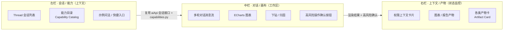
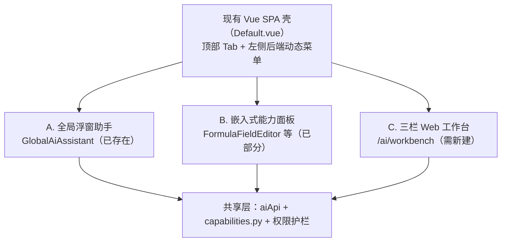

# HR Agent 建设方案（专家修订版）

> **版本**：V1.0（专家修订版）
> **修订日期**：2026-07-14
> **修订基线**：原《HR Agent 完整建设方案》V12.0
> **修订方式**：在对 `hr-portal/` 代码库（后端 `app/ai/`、`app/ucp/`、`app/warehouse/`、`app/datasets/`、`app/auth/`、`app/roles/`、`app/scopes/` 及既有 spec `004`/`011`/`012`）逐模块审计的基础上，保留原方案的战略判断、产品设计与全部迭代细节，**修正与代码现状冲突的技术假设**，并优化整体结构。

---

## 修订说明（先读这一页）

| 维度 | 原方案 V12.0 | 本修订版处理 |
|:---|:---|:---|
| 战略/产品/交互设计 | 方向正确、细节完整 | **完整保留**（双入口、权限贯穿、数据不出域、Skill 编排、自进化、三栏工作台、超链接协同） |
| 数据库 DDL | MySQL 语法（`AUTO_INCREMENT`、`TIMESTAMP ... ON UPDATE`） | **修正**：底座为 PostgreSQL + SQLAlchemy 2.0 async + Alembic；所有建表改为 ORM 模型 + 迁移 |
| LLM 提供方 | "Claude Agent SDK" | **修正**：实际为 OpenAI-compatible HTTP 端点（`app/ai/provider.py`，无 `anthropic`/`langgraph` 依赖）；改为"提供方无关 + 企业签约端点"口径 |
| 能力注册表 `agent_skills` | 新建表 | **复用** `app/ai/capabilities.py` 的 `CapabilityDefinition`（更成熟：含 `risk_level`/`confirmation`/`sensitive_context`/`policy_profile`/`audit`） |
| 脱敏 `sensitive_fields` + `apply_data_masking` | 新建 | **复用** `app/ucp/masking.py`（`mask_value`/`mask_phone`/`mask_name`/`mask_sensitive_fields`） |
| 编排 `WorkflowOrchestrator` + `workflow_definitions` | 新建 | **复用** `app/ucp/pipeline_engine.py`（生产级 DAG：CONNECTOR/TRANSFORM/BRANCH/LOOP） |
| 审批/二次确认 | 新建 | **复用** `app/ucp/approval_service.py`（SINGLE/ANY/ALL + NONE/SIMPLE/TOKEN） |
| AI 审计 `ai_interaction_logs` | 新建 | **复用** `app/ai/audit.py` + `AiConversation` |
| 指标层 | "七层数仓已 populated" | **修正**：实为 4 层（ODS/DWD/DWS/ADS）；`WarehouseMetric` 是口径目录；`compute_metric` 仅取单行（bug）；零 HR 指标定义 → 新增 **Phase 0 前置迭代** |
| 权限 `PermissionContext`/`feishu_user_mapping` | 新建 | **派生**自现有 `app/auth`+`app/roles`+`app/scopes`+`app/menus`（RBAC：menu_code × V/C/U/D/E）；`feishu_user_mapping` 先核实是否已存在 |
| 迭代工期 | 1-2 天/版本、硬骨头低估 | **重排**：将工程量从建表/CRUD 挪到 Planner/Reasoner/RAG/飞书对话 bot/指标引擎修复；取消不切实际的 1 天承诺 |
| 评估/质检 | 仅"成功率统计" | **新增**：复用 `app/ai/evals.py`，设定可量化 KPI（见第十三章） |

---

## 一、战略定位

### 1.1 核心结论

> **HR Agent 不是替代 HR Portal 的新产品，而是 HR Portal 的"智能交互层"。** 用户可通过两种方式交互：① 飞书机器人（轻量触达，随时随地）② Web 工作台（深度分析，完整体验）。两者共享同一套能力底座和数据，通过"飞书预览 + 链接跳转"实现无缝协同。

> **最关键的设计原则：权限管理贯穿始终，从第一个版本开始就是最高优先级。没有权限管控，Agent 再聪明也不能上线。**

> **数据安全是底线：未脱敏的原始数据不出 HR Portal 服务器；仅向 LLM 发送经过权限过滤和脱敏后的数据摘要（聚合统计优先）。** 〔专家修正：原"原始数据不出域"易在合规审计时产生歧义，准确口径见第七章。〕

> **Skill（Capability）编排是 Agent 能力的核心载体：原子能力是"乐高积木"，工作流编排是"设计图"。从第一天就预留编排能力，具体能力逐步填充——但编排引擎复用既有 UCP 管线引擎，不另起炉灶。**

### 1.2 双入口协同战略

| 入口 | 定位 | 适用场景 | 核心能力 | 输出形式 |
|:---|:---|:---|:---|:---|
| **飞书机器人** | 轻量触达入口 | 快速问答、即时查询、接收预警、消息通知 | 指标查询、简单分析、摘要推送 + 超链接 | 文本 + 表格 + 图表预览 + 跳转链接 |
| **Web 工作台** | 深度消费入口 | 复杂分析、图表交互、归因报告、下钻探索 | 全量能力（图表、下钻、报告、编排） | 完整图表 + 交互操作 + 报告 + 协作分享 |

### 1.3 数据安全的核心地位〔专家修正措辞〕

> **在 HR 系统中，数据安全不是"功能"，而是"底线"。** 未脱敏的原始数据绝不离开 HR Portal 服务器；发送给 LLM 的是脱敏后的数据摘要，且**优先发送聚合统计值而非行级明细**。

| 安全维度 | 正确表述 | 在 Agent 中的体现 |
|:---|:---|:---|
| **原始数据不出域** | 未脱敏的原始明细不出 HR Portal 服务器 | 查询/过滤/聚合/脱敏均在后端完成 |
| **脱敏摘要出域** | 脱敏后的摘要/统计值会发送至 LLM 端点 | 需明确告知：这是"出域"的，但不可还原为个人信息 |
| **权限强制隔离** | 行/列权限在数据查询层强制执行 | 复用 `scope_strategy_auto_inject`，AI 无法获取无权数据 |
| **不用于训练** | 仅发送至企业签约 LLM 端点，合同约束不用于训练 | **提供方无关**口径，不绑定单一厂商承诺 |
| **全链路审计** | 所有数据访问和 AI 调用记录在案 | 复用 `app/ai/audit.py` + `AiConversation` |

### 1.4 权限管理的核心地位

> **在 HR 系统中，权限不是"功能"，而是"底线"。没有权限管控，数据安全、合规审计、隐私保护全部无从谈起。**

| 权限维度 | 说明 | 在 Agent 中的体现 |
|:---|:---|:---|
| **身份认证** | 确认"你是谁" | 飞书用户与 HR Portal 用户身份映射（复用 `app/auth`） |
| **行级权限** | 控制"能看哪些行" | 不同部门的 HRBP 看到不同部门的数据 |
| **列级权限** | 控制"能看哪些列" | 普通 HR 看不到薪酬列，HRVP 可以看到 |
| **功能权限** | 控制"能做什么操作" | 普通用户只能查询，管理员可以修改指标口径 |
| **数据脱敏** | 敏感数据展示控制 | 飞书消息中敏感数据自动脱敏（复用 `masking.py`） |

### 1.5 飞书 + Web 协同模式

> **飞书做"通知+预览"，Web 做"深度交互"**

```
飞书机器人                              Web 工作台
┌─────────────────────┐                ┌─────────────────────┐
│ ① 快速问答           │                │ ⑤ 完整上下文恢复     │
│   文本 + 表格 + 预览 │                │   图表 + 下钻 + 编辑 │
│ ↓                   │                │ ↑                   │
│ ② 图表预览卡片       │ ── 点击链接 ─▶ │ ⑥ 深度交互分析       │
│   "查看完整图表"     │                │   归因报告 + 下载    │
│ ↓                   │                │ ↑                   │
│ ③ 分析摘要推送       │ ── 点击链接 ─▶ │ ⑦ 完整报告查看       │
│   "查看完整报告"     │                │   编辑 + 分享        │
│ ↓                   │                │ ↑                   │
│ ④ 预警消息推送       │ ── 点击链接 ─▶ │ ⑧ 预警详情查看       │
│   "查看详情"         │                │   趋势分析 + 建议    │
└─────────────────────┘                └─────────────────────┘
```

### 1.6 与通用 Agent 的本质区别〔专家修正〕

| 对比维度 | 通用 Agent（Cursor/Claude Code） | 你的 HR Agent |
|:---|:---|:---|
| **核心任务** | 写代码、处理通用任务 | 查询 HR 数据、分析离职率、生成报告 |
| **数据来源** | 公开数据 + 用户提供 | **HR Portal 数仓底座（可信数据，ODS/DWD/DWS/ADS 四层 + WarehouseMetric 口径目录）**〔修正：非"七层"〕 |
| **知识基础** | 通用知识 | **知识库 + 指标口径 + 分析方法论** |
| **权限边界** | 无 | **行/列权限贯穿始终，飞书用户身份自动映射** |
| **数据安全** | 数据可能被用于训练 | **原始数据不出域 + 脱敏处理，仅发送至签约 LLM 端点**〔修正：提供方无关〕 |
| **入口方式** | 单一工作台 | **飞书机器人 + Web 工作台双入口协同** |
| **图表能力** | 无 | **自动生成可交互图表 + 多格式下载 + 下钻** |
| **能力组织** | 零散工具 | **Capability 编排 + DAG 工作流（复用既有引擎），可复用可组合**〔修正〕 |
| **进化方式** | 模型升级 | **从第一天开始的反馈闭环 + 知识沉淀 + Skill 沉淀** |

### 1.7 与 AI 行业趋势的呼应

头部 AI Agent 产品（Cursor、Claude Code、Codex）不约而同采用三栏布局作为标准前端架构，这已成为行业共识。同时，Agent 的核心数据模型（Thread/Run/Artifact/Tool Invocation）和 Capability 编排机制已成为业界标准架构，这些理念将贯穿整个 HR Agent 设计方案。

---

## 二、现状资产盘点〔★专家新增·核心价值★〕

> 本章是本次修订的核心。在动手前先盘清"已有什么、该复用什么、该修正什么"，可避免约 40%-60% 的重复建设。

### 2.1 已具备能力（直接复用，勿重建）

| 方案计划新建 | 现有代码（已实现/更优） | 复用方式 |
|:---|:---|:---|
| Skill 注册表 `agent_skills` | `app/ai/capabilities.py`：`CapabilityDefinition`（含 `capability_id`/`required_permission`(接 RBAC)/`risk_level`/`confirmation`/`sensitive_context`/`policy_profile`/`audit_enabled`/`examples`/`failure_modes`） | **直接扩展 `capabilities.py`**，新增 HR 域 capability，不新建表 |
| 脱敏 `sensitive_fields` + `apply_data_masking` + `mask_*` | `app/ucp/masking.py`：`mask_value`/`mask_phone`/`mask_name`/`mask_sensitive_fields` | **直接调用**，如需配置化扩展字段分类元数据 |
| 工作流 `WorkflowOrchestrator` + `workflow_definitions` | `app/ucp/pipeline_engine.py`：CONNECTOR/TRANSFORM/BRANCH/LOOP 四类节点 + DAG 拓扑 + 版本快照 | **复用管线引擎**；Agent 工作流作为一类特殊 pipeline 接入 |
| 高风险二次确认/审批 | `app/ucp/approval_service.py`：SINGLE/ANY/ALL + NONE/SIMPLE/TOKEN | **直接调用** |
| AI 交互审计 `ai_interaction_logs` | `app/ai/audit.py` + `AiConversation`（多轮会话/审计） | **直接调用** |
| 行级权限 `WHERE dept_id IN (...)` | `data.compare` 的 `scope_strategy_auto_inject` + `app/scopes/` | **复用 scope 注入** |
| 飞书接入（通知/回调） | `app/integrations/feishu/` + `app/ucp/feishu_webhook.py` | **复用**；但现有为推送/回调，需新增**对话式 bot**能力 |
| 评估/质检 | `app/ai/evals.py` | **复用**做质量基线 |
| 指标定义模型 | `app/datasets/models.py:209` `WarehouseMetric`（表 `warehouse_metrics`） | **复用**，作为指标定义载体 |
| 数仓管道（DWS/ADS 物化） | `app/warehouse/materialization.py`、`modeling.py`(`generate_dws_view`)、`metric_automation.py` | **复用**物理视图构建 |

### 2.2 需修正/重建的部分

| 项目 | 问题 | 修正方向 |
|:---|:---|:---|
| `compute_metric`（`modeling.py:36`） | `SELECT * FROM {表} LIMIT 1` 取单行算公式，无法聚合离职率/HC/人均成本 | **Phase 0 修复**：改为真实 SQL 聚合 + 维度 GROUP BY + 周期过滤 |
| `WarehouseMetric` 指标定义 | 零条 HR 指标（离职率/HC/人均成本）seed | **Phase 0 seed** 首批指标定义 |
| 新建 `feishu_user_mapping` | 需先核实 `app/auth` 是否已存飞书 open_id 映射 | 核实后决定复用 or 扩展 |
| 新建独立 `PermissionContext` | 会与现有 RBAC/scope 形成双真理源 | **从现有角色/范围/用户模型派生** |

### 2.3 指标层现状复核〔据代码核实〕

- **分层实为 4 层**：`layer_policy.py:40` `LAYER_ORDER = {"ODS":0,"DWD":1,"DWS":2,"ADS":3}`，无 DM 层、无独立 METRIC 层。原方案"七层数仓"与代码不符。
- **`WarehouseMetric` 自身定位**：docstring 写明"一期为口径目录，不自动计算"。
- **计算引擎 bug**：`compute_metric` 取单行，`evaluate_formula` 无法做 COUNT/SUM 聚合。
- **零指标定义**：全仓搜索 `离职率/dimission/headcount/人均成本` 无定义/无值；无 migration/seed 写入 `warehouse_metrics`。
- **自动发布默认关**：`metric_automation`/L4 级联 feature flag 在 `core/config.py` 默认 `False`。

> **结论**：指标**定义骨架 + 数仓管道**已具备，但**计算引擎对 HR 聚合不可用、且未定义任何指标**。方案不能把指标层当"已完成依赖"直接消费，必须单列 Phase 0。

### 2.4 技术栈基线〔专家明确〕

- **数据库**：PostgreSQL（`asyncpg`）+ SQLAlchemy 2.0 async + Alembic。所有表以 ORM 模型 + 迁移脚本落地，禁止裸 MySQL DDL。
- **LLM 提供方**：OpenAI-compatible HTTP 端点（`app/ai/provider.py` 经 `httpx` 直连）。**不引入未经预研的 Agent SDK**；如确需增强编排能力（如 function-calling），在现有 provider 上扩展，保持提供方无关。
- **部署形态**：**集成进现有 FastAPI 应用**（`hr-portal/backend/app/`），作为 `app/agent/` 模块，复用现有 DB 连接、auth、Alembic、权限体系。**不另起独立后端服务**。
- **前端**：扩展现有 Vue 3 + Element Plus + Pinia 前端；三栏工作台可复用 `@vue-flow` 管线可视化经验；`GlobalAiAssistant.vue` 浮层作为起点。

---

## 三、核心设计原则

### 3.1 十大原则

| 原则 | 说明 |
|:---|:---|
| **权限贯穿始终** | 从第一个版本开始，每个迭代都必须包含权限管理内容。没有权限，不上线 |
| **数据不出域（精确口径）** | 未脱敏原始数据不出服务器；脱敏摘要/聚合统计可出域；优先聚合在库、LLM 只看统计 |
| **底座先行（修正）** | Agent 的智能程度取决于底座。数仓管道已具备，但**指标计算引擎需修复、指标需定义**，属一期前置 |
| **双入口协同** | 飞书机器人和 Web 工作台同步建设，共享同一套后端能力，通过超链接实现无缝协同 |
| **Skill（Capability）驱动** | 能力封装为 Capability，原子可组合为工作流；**复用既有 `capabilities.py` 与管线引擎** |
| **极小迭代** | 每个版本快速验证，用户可感知（*注：1-2 天仅适用于建表/CRUD 类轻量项；智能内核类需更久，见第九章*） |
| **资产持续复用** | **优先复用 `app/ai/`、`app/ucp/`、`app/warehouse/` 既有模块，不推翻重来**〔新增强调〕 |
| **渐进式增强** | 功能从简单到复杂，自然演进（原子 → 组合 → 工作流） |
| **底层支撑远期** | 早期架构预留扩展点（Capability 注册表、DAG 引擎已存在），但不提前实现复杂编排 |
| **自进化从第一天启动** | 反馈闭环从第一个用户开始；但需加防污染护栏（见第六章） |

### 3.2 演进哲学：从 A 到 B

| 场景 | MVP（A） | 后期（B） | 演进方式 |
|:---|:---|:---|:---|
| 知识库 | 口径配置表（复用 `WarehouseMetric`） | RAG + 知识图谱 | 配置表数据作为种子导入 |
| 反馈机制 | 点赞/点踩 | 完整自循环闭环 | 反馈数据持续积累 |
| 成功案例 | 简单 JSON 存储（复用 `AiConversation`/审计） | Few-shot 示例库 + 向量索引 | 案例数据迁移升级 |
| 图表 | ECharts 基础渲染 | 图表模板学习 + 智能推荐 | 用户偏好持续积累 |
| 飞书交互 | 文本问答（**新增：对话式 bot**） | 卡片交互 + 快捷按钮 + 超链接跳转 | 逐步丰富交互形态 |
| 权限管理 | 基础身份映射 + 行级权限（复用 scope） | 完整 RBAC + 列级权限 + 审计日志 | 权限体系持续增强 |
| 数据安全 | 基础脱敏 + 权限过滤（复用 `masking.py`） | 完整数据不出域 + 全链路审计 | 安全体系持续增强 |
| Skill | 原子 Capability（单一任务） | 组合 Capability + DAG 工作流（复用 `pipeline_engine`） | 从简单到复杂逐步演进 |

---

## 四、整体架构

### 4.1 分层架构（修正版）

```
┌──────────────────────────────────────────────────────────────────────────┐
│ HR Agent 分层架构（权限管理 + 数据安全 + Capability 编排贯穿所有层级）        │
├──────────────────────────────────────────────────────────────────────────┤
│ 第1层 交互层：飞书机器人入口（群聊/私聊/快捷命令/卡片/图表预览/超链接）      │
│           + Web 工作台入口（三栏布局 / ECharts / 侧边栏 / URL 恢复上下文）   │
│           🔐 身份认证（飞书 open_id → 系统用户，复用 app/auth）             │
│           🔒 飞书消息敏感数据自动脱敏（复用 masking.py）                     │
│ ↓                                                                          │
│ 第2层 推理层（Agent 引擎）：意图识别 → 任务拆解(Planner) → Capability 匹配   │
│           → 编排执行(复用 pipeline_engine) → 结果汇总(Reasoner)             │
│           🔐 每次工具调用前校验权限（复用 capabilities.required_permission） │
│           🔒 输入/输出全链路审计（复用 audit.py）                           │
│ ↓                                                                          │
│ 第3层 编排层（复用 UCP pipeline_engine，不新建引擎）：                       │
│           DAG 解析/拓扑排序/并行调度/条件分支/错误处理重试/数据传递           │
│           🔐 每个 Capability 执行前校验权限                                 │
│ ↓                                                                          │
│ 第4层 工具/Capability 层：原子（指标查询/维度拆解/趋势/归因/图表/知识检索…） │
│           复合（离职分析/成本分析/HC 分析…）                                │
│           🔐 注入当前用户权限上下文（部门 ID、角色、可见字段）              │
│           🔒 敏感字段脱敏（姓名→工号，薪酬→等级）复用 masking.py            │
│ ↓                                                                          │
│ 第5层 数据层（HR Portal 底座）：数仓（ODS/DWD/DWS/ADS 四层）                │
│           + WarehouseMetric 口径目录 + 行/列权限(scope)                     │
│           🔐 行级权限（scope_strategy_auto_inject）列级权限（白名单字段）    │
│           🔒 原始数据不出域；聚合在库，LLM 仅收统计摘要                     │
│ ↓                                                                          │
│ 第6层 执行层（连接器平台 UCP）：北森/飞书/滴滴/曹操 API + 管线编排          │
│           🔐 跨系统操作需二次确认（复用 approval_service）                  │
│ ↓                                                                          │
│ 第7层 进化层（自循环）：反馈采集 → 成功案例入库 → Few-shot 检索             │
│           → 口径完善 → 路径优化 → 图表模板学习 → Capability 沉淀            │
│           🔐 不同角色看到不同维度效果数据                                   │
└──────────────────────────────────────────────────────────────────────────┘
```

### 4.2 飞书机器人架构 + 权限集成 + 数据安全

```
飞书端                                         HR Portal Agent 后端（app/agent/）
┌──────────────┐  ┌──────────────┐  ┌──────────────────────────────────────┐
│ 群聊 @机器人  │─▶│ 飞书开放平台  │─▶│ ① 提取 open_id（复用 app/auth）       │
│ 私聊 机器人   │  │ 事件订阅      │  │ ② 映射为系统用户（核实 feishu 映射）  │
│ 快捷命令 /hr  │  │ 消息卡片交互  │  │ ③ 加载权限上下文（派生自 roles/scope）│
│ 图表预览图片  │  │              │  │ ④ 匹配 Capability/工作流              │
│ 超链接跳转 Web│  │              │  │ ⑤ 编排执行（复用 pipeline_engine）    │
└──────────────┘  └──────────────┘  │ ⑥ 权限过滤结果                       │
                                    │ ⑦ 数据脱敏（复用 masking.py）         │
                                    │ ⑧ 返回（无权限/敏感已屏蔽）           │
                                    └──────────────────────────────────────┘
▼ 返回结果（两种格式 + 超链接，均已脱敏/过滤）
  轻量结果（飞书消息卡片：文本+表格+图表预览+"查看完整分析→"）
  深度结果（Web 工作台：完整图表+交互+归因报告+下钻+下载+分享）
🔐 飞书用户身份自动映射到 HR Portal 权限体系，无权限数据永不返回
🔒 原始数据不出域；脱敏摘要出域；优先聚合统计
```

### 4.3 权限体系架构（派生自现有 RBAC）

```
身份层：飞书用户 → open_id 查询 → HR Portal 用户（含部门/角色/权限，复用 app/auth+roles+scopes）
   ↓
权限层：PermissionContext（从现有角色/范围/用户模型派生，不新建真理源）
   user_permission_context = {
     "user_id": ..., "department_ids": [...],   ← 行级（派生自 scope）
     "role": "HRBP",
     "visible_columns": [...],                  ← 列级（派生自 role+menu 配置）
     "can_manage_metrics": bool,                ← 功能权限（派生自 role）
     "can_export_data": bool,
     "sensitive_masks": [...]                   ← 复用 masking.py 规则
   }
   ↓
执行层：权限注入与过滤（复用既有机制）
   · 行级：scope_strategy_auto_inject 自动拼 WHERE dept_id IN (...)
   · 列级：返回数据裁剪至 visible_columns
   · 敏感操作：二次确认（复用 approval_service）
   · 审计：谁/何时/做了什么/结果（复用 audit.py）
```

### 4.4 数据安全架构（复用既有，非新建）

```
敏感字段脱敏（复用 app/ucp/masking.py：mask_value/mask_phone/mask_name/mask_sensitive_fields）
   │ 规则：手机号中间4位*、身份证中间*、银行卡前后4位、薪酬/凭证整体[已脱敏]
   ▼
数据脱敏执行（在后端完成，绝不发原始值给 LLM）
   apply_data_masking(data, permission_context)  ← 直接调用 masking.py
   ▼
AI 交互审计（复用 app/ai/audit.py + AiConversation）
   记录：谁、何时、问了什么、AI 看到的数据摘要（已脱敏）、AI 返回、权限上下文
```

### 4.5 Capability（Skill）编排架构（复用 capabilities.py + pipeline_engine）

```
Capability 定义层（复用 app/ai/capabilities.py）
   · 原子 Capability（单一任务：query_metric, drill_down, trend_analysis…）
   · 复合 Capability（组合：dimission_analysis）
   · 元数据（名称/描述/触发关键词/所需权限/版本/risk_level/confirmation/sensitive_context）
        ↓
编排层（复用 app/ucp/pipeline_engine.py，不新建 WorkflowOrchestrator）
   · DAG 解析与拓扑排序 · 并行执行调度 · 条件分支 · 错误处理与重试 · 数据传递
        ↓
执行层（复用既有执行器 + 审计）
   · Capability 调度 · 并发控制 · 状态管理 · 结果收集 · 审计日志
```

### 4.6 Capability 与工具的关系

```
工具层（原子能力）        Capability 层（组合能力）              工作流层（编排能力）
┌─────────────────┐    ┌─────────────────────────────┐    ┌────────────────┐
│ 指标查询工具     │    │ 离职分析 Capability          │    │ DAG 工作流     │
│ 维度拆解工具     │──▶│ → 指标查询 → 维度拆解         │──▶│ 条件分支       │
│ 趋势分析工具     │ 组合│ → 趋势分析 → 图表生成        │    │ 并行执行       │
│ 图表生成工具     │    │ → 报告生成                   │    └────────────────┘
│ 知识检索工具     │    └─────────────────────────────┘
│ 归因分析工具     │
└─────────────────┘
特点：工具是"做什么"，Capability 是"怎么做"，工作流是"什么时候做、谁先做"
```

---

## 五、产品与交互设计

### 5.1 首页入口策略

| 区域 | 内容 | 作用 | 权限控制 | 数据安全 |
|:---|:---|:---|:---|:---|
| 核心指标卡片 | 员工数、入职数、离职数 | 一登录即见关键数据 | 受行/列权限管控 | 敏感数据自动脱敏 |
| 异常预警 | 主动推送预警 | 点击进入 Agent 工作台 | 仅显示有权限部门预警 | 预警内容脱敏 |
| 首页对话输入框 | 快捷提问入口 | 降低门槛 | 自动注入权限上下文 | 输入/输出审计 |
| 快捷入口 | 各模块导航 | 传统界面 + Agent 入口 | 按角色显隐 | — |

### 5.2 Agent 工作台三栏布局

> 规划原文（方案第 95/145 行）明确将"三栏布局"列为 Web 工作台的核心入口（行业共识，类 Claude Code / Cursor）。**三栏是"布局"，不是"独立应用"**——它作为现有 `Default.vue` 壳里的一个普通路由页 `/ai/workbench` 存在，走既有菜单注册三步（后端 menuCode → 前端 `MENU_ROUTE_MAP` → 懒加载路由），不引入 iframe / 微前端 / 另起 Vue 工程。
>
> 〔**专家评审保留意见**〕三栏对"深度分析会话"合理，但**不宜作为所有 HR 用户的默认唯一入口**（详见 5.2.4）。HR 用户为轻度、任务型，固定三栏在轻交互时左右空白、首屏负担重；建议改为渐进式披露（默认单栏、会话变深再展开）。

#### 5.2.1 三栏布局结构（与现有资产对接）



| 栏 | 规划定位（深度消费） | 复用现有资产 |
|:---|:---|:---|
| **左栏 · 会话/能力** | Thread 列表 + 能力目录 + 示例问法 | `capabilities.py` 数据 + `aiApi` 会话接口；把 `GlobalAiAssistant` 的聊天逻辑抽成可复用组件 |
| **中栏 · 对话/画布** | 多轮对话 + ECharts 图表 + 下钻归因 | `aiApi.chat()` 直接复用；图表接 ECharts；后端出 Plan、前端只渲染结果 + 高风险确认按钮 |
| **右栏 · 上下文/产物** | 权限上下文 + 图表/报告 + 各类产物卡 | `CompareResultCard` / `DocumentActionPreview` / `AutomationRuleArtifactPreview` **现成组件，零新建** |

#### 5.2.2 三种 AI 触达方式并存（前端共存模型）

三栏工作台不是"取代"现有界面，而是与另外两种已存在的 AI 触达方式**并存**；三者共享 `aiApi` + `capabilities.py` + 同一套权限护栏（policy_guard / scope / masking），互不复写：



- **A. 全局浮窗助手**（`components/GlobalAiAssistant.vue`，已存在）：任意页面右下角随时唤起的轻量对话，复用 `aiApi.chat()`，**不重写**。
- **B. 嵌入式能力面板**（如 `FormulaFieldEditor.vue` / `ReportFieldWorkbench.vue`，已部分）：在业务页里"长"出来的 AI 能力，复用现有产物渲染组件。
- **C. 三栏 Web 工作台**（`/ai/workbench`，需新建）：规划要求的深度分析主入口，内部三栏布局。

#### 5.2.3 注册到现有界面的三步（标准套路）

1. **后端**：菜单表加一条 `menuCode: 'ai.workbench'`，父级挂到对应顶级 Tab。
2. **前端 `constants/menuRoutes.ts`**：`MENU_ROUTE_MAP['ai.workbench'] = '/ai/workbench'`。
3. **前端 `router/index.ts`**：加一条懒加载路由，权限自动生效（route guard 比对 `userStore.menus`，无权限跳 `/home`，与现有页面一致）：
   ```ts
   { path: 'workbench', name: 'AiWorkbench',
     component: () => import('@/views/ai/Workbench.vue'),
     meta: { label: 'AI 工作台', menuCode: 'ai.workbench' } }
   ```

> 三栏页 ≈ **组装**而非**从零造**：聊天逻辑抽组件（来自已存在的 `GlobalAiAssistant`）、能力目录（来自 `capabilities.py`）、右栏产物卡（全现成）。真正难点在后端——把 `/api/v1/ai/chat` 接到 Planner / Reasoner / Capability 编排层。

#### 5.2.4 专家评审：三栏布局的适用边界与渐进式建议〔批判性〕

> 本节是对"三栏为核心入口"的独立审视，不盲从原规划与行业范式。结论：**三栏方向对，但被高估**——它是"深度分析会话"的正确形态，而非所有 HR 用户的默认唯一入口。

| 批判性观点 | 说明 | 对原方案的影响 |
|:---|:---|:---|
| **用户画像错配** | Claude/Cursor 三栏服务于"全天候泡在工具里的开发者"；HR 用户（HRBP/SSC/HRVP）是**轻度、任务型**，多数交互"问一句→拿结果就走"。固定三栏在轻交互时左右空白、首屏负担重，对非技术用户有 intimidation 效应 | 不应作为默认首屏 |
| **右栏易与中栏重复** | 示例图右栏放"图表/报告产物卡"，但图表本就在中栏对话流渲染；若仅回显即时结果则是重复 chrome | 右栏须重定义为**常驻可操作产物**（保存的报告/导出文件/下钻面包屑/书签分析），而非即时回显 |
| **左栏目录默认应折叠** | 静态能力目录仅在 agent 路由不准的早期有"可发现性"价值；成熟后应靠上下文推荐 | 默认收起，或改为"情境化建议问法"，避免对轻度用户造成噪音 |
| **隐喻值得商榷** | HR 是"消费洞察"而非"与 agent 协同编辑"；右栏用"正在生长的报告文档"（类 ChatGPT canvas / Notion AI）比"工具结果面板"更贴合，本质是 2.5 栏 | 右栏定位从"工具结果"改为"生长中的报告/答案文档" |
| **ROI 最低、成本最高** | 三触达点中（A 全局浮窗已存在 / B 嵌入式价值高 / C 三栏），C 前端成本最高、使用频次最不确定 | 建设顺序应为 **A → B → C 最后做**，且 C 由 B 演化，非另起大工程（原 9.7 将 5.1 三栏列为核心入口，是最贵赌注） |
| **应渐进式披露** | 默认聚焦单栏对话；当会话变深（产生图表/多轮/产物）时**自动展开**左右栏 | 比"一进来就三栏"更契合 HR 使用节律，也拆薄前端一次性投入 |

**修订结论（写入迭代编排）**：
- 三栏保留为"**深度分析模式**"，但降级为可选展开形态，而非 Web 工作台唯一核心入口。
- 默认轻量（单栏对话 + 渐进展开）；右栏重定义为常驻可操作产物；左栏默认折叠。
- 五期 5.1"三栏布局"建议改为"深度分析模式（渐进式三栏）"，优先级排在 A/B 之后；B（嵌入式能力面板）应作为前期主要 Web AI 载体优先建设。

### 5.3 权限不足时的交互反馈

| 场景 | 交互反馈 |
|:---|:---|
| 飞书提问无权限 | "您暂无权限查看该数据，如需访问请联系 HRVP 授权" |
| Web 工作台无权限 | 友好权限提示，引导申请权限 |
| 部分权限 | 数据正常展示，无权字段自动隐藏，不展示敏感信息 |
| 操作权限不足 | 操作按钮置灰，hover 提示"您暂无此操作权限" |
| 跨系统操作需确认 | 弹窗二次确认（复用 approval_service），记录审计 |
| Capability 执行中权限不足 | 状态面板显示"步骤 2/5 权限不足，已跳过" |
| 敏感数据脱敏提示 | 数据显示为"***"，旁标"🔒 数据已脱敏" |

---

## 六、Agent 能力架构〔专家重写〕

### 6.1 推理层：意图识别 → Planner → Capability 匹配 → 编排 → Reasoner

复用既有 `ai.chat` capability（"识别用户目标并受控调用已注册 Capability"）作为起点。关键专家判断：

- **LLM 调用协议：结构化 Plan + 后端执行（不自主调工具）**。明确采用已验证的安全范式（见 `data.compare`）：`LLM 仅输出结构化 Plan/JSON → 后端引擎编译执行（含权限注入、零注入风险）`。**不要**走"LLM 实时自主调工具"模式——在 HR 高敏场景风险过高、可控性差。
- **Capability 匹配**：优先 keyword 触发（MVP），逐步升级为 LLM 路由；匹配目标是 `capabilities.py` 中已注册的 capability。
- **编排执行**：复用 `pipeline_engine`，Agent 工作流作为一类 pipeline。

### 6.2 Capability（Skill）注册（复用 capabilities.py）

原 `agent_skills` 表的字段，应映射到既有 `CapabilityDefinition`：

| 原方案 agent_skills 字段 | 映射到 CapabilityDefinition |
|:---|:---|
| skill_code / skill_name | capability_id / name |
| description | description |
| trigger_keywords | examples（兼作触发语料） |
| steps（JSON） | 通过 pipeline_engine 的 DAG 实现，不存 steps JSON |
| required_permissions（JSON） | required_permission（接现有 RBAC） |
| version / status | version / is_enabled |
| execution_count / avg_success_rate | 复用 audit + evals 统计 |

> **不要新建 `agent_skills` 表**；在 `capabilities.py` 追加 HR 域 capability 即可。

### 6.3 编排层（复用 pipeline_engine，不新建 WorkflowOrchestrator）

原方案的 `WorkflowOrchestrator` + `workflow_definitions` 与既有 `pipeline_engine.py` 功能重叠。改为：
- Agent 复合 Capability = 一个 `pipeline`（DAG），节点类型为既有 CONNECTOR/TRANSFORM/BRANCH/LOOP，或在 semantic 上映射为"Capability 调用节点"。
- 并行组、依赖、条件分支、重试均复用引擎能力。
- 工作流定义可视化：可复用前端 `@vue-flow` 管线设计器经验。

### 6.4 自进化闭环（保留 + 加护栏）

```
用户提问 → Agent 回答 → 用户反馈（👍/👎/追问/修改）
   → ① 正反馈 → 成功案例入库（脱敏后存储，复用审计）
   → ② 负反馈 → 分析原因 → 口径待补充
   → ③ 追问 → 记录盲区 → 生成知识补充任务
   → ④ 用户修改 → 记录偏好 → 个性化适配
   → ⑤ 高频成功案例 → 沉淀为 Capability 模板
   → 每周分析：高频成功案例→Few-shot；高频追问→补知识库；高频路径→生成 Capability
   → 下次回答更准确
```

**专家护栏（原方案缺失）**：
1. **防反馈污染**：点赞直接入库可能自我强化错误回答。设置"管理员确认门槛"才将案例升级为 Few-shot 候选（原方案 1.5 点赞直存与 6.3 管理员确认前后不一致，已统一为需确认）。
2. **复用 `app/ai/evals.py`** 做质量基线，Few-shot 仅采用通过评估的案例。
3. MVP 阶段案例量不足以支撑 few-shot，先以"口径问答对"做检索增强。

---

## 七、权限与数据安全详细设计〔专家修正〕

### 7.1 核心原则：数据不出域（精确口径）

> **未脱敏的原始数据不离开 HR Portal 服务器；仅向 LLM 发送经过权限过滤和脱敏后的数据摘要（优先聚合统计值）。**

```
用户请求 → HR Portal 后端（数据查询 + 权限过滤 + 聚合 + 脱敏）→ 发送给 LLM 的仅是脱敏摘要/统计 →
AI 返回分析 → 后端合并原始数据(如需展示明细) → 返回用户
```

### 7.2 敏感字段与脱敏（复用 masking.py）

现有 `app/ucp/masking.py` 已实现：

| 字段类型 | 现有函数 | 示例（原始 → 脱敏后） |
|:---|:---|:---|
| 姓名 | `mask_name` | "张三" → "张*" |
| 手机号 | `mask_phone` | "13812345678" → "138****5678" |
| 身份证 | （mask_value 中间替换） | "1101…1234" → "1101********1234" |
| 银行卡 | （mask_value 前后4位） | "6222…1234" → "6222****1234" |
| 薪酬/凭证 | （整体替换） | "25000" → "[已脱敏]" |

> 原方案 `sensitive_fields` 表 + `apply_data_masking` 属重复建设。**如需"字段分类元数据驱动"的更强脱敏，应在 `masking.py` 之上扩展配置表，而非另建引擎。**

### 7.3 权限上下文（派生自现有 RBAC）

```python
# PermissionContext：从现有 app/auth + app/roles + app/scopes + app/menus 派生，不新建表
class PermissionContext:
    def __init__(self, user):
        self.user_id = user.id
        self.department_ids = get_subordinate_departments(user)   # 派生自 scope
        self.visible_columns = get_visible_columns(user)           # 派生自 role+menu 配置
        self.can_manage_metrics = user.role in ['HRVP', 'ADMIN']
        self.can_export_data = user.role in ['HRVP', 'SSC', 'ANALYST']
        self.can_execute_actions = user.role in ['HRVP', 'SSC']
        self.sensitive_masks = load_mask_rules()                  # 复用 masking.py
```

### 7.4 行/列权限实现（复用 scope 注入）

```sql
-- 行级：复用 scope_strategy_auto_inject，自动注入用户可见部门
SELECT * FROM dws.monthly_dimission
WHERE dept_id IN (${user_department_ids})  -- 自动注入，无需手写
  AND month = '2026-06';

-- 列级：返回时按 visible_columns 裁剪（复用既有白名单字段机制）
```

### 7.5 数据流向详解（修正示例）

```
用户："研发部离职率为什么上升了？"
   → ① 权限校验：HRBP，仅看本部门(dept_id=101)
   → ② 数据查询（聚合在库）：SELECT dept_id, COUNT(*) FILTER(WHERE is_left) / COUNT(*) ...
   → ③ 脱敏：姓名→工号/星号，薪酬→等级（复用 masking.py）
   → ④ 发送给 LLM 的内容（仅统计，无行级明细）：
        "2026年6月，部门101离职率20%，同比上升8%。"（LLM 看不到具体员工）
   → ⑤ AI 返回分析 → 后端合并原始数据(如需明细展示) → 返回用户
   → ⑥ 用户看到：完整部门名、数据表格、图表（均基于权限）
```

### 7.6 与通用 Agent 的数据安全对比（修正）

| 对比维度 | 通用 Agent | 你的 HR Agent |
|:---|:---|:---|
| 数据访问 | Agent 直读文件 | 经 API，权限过滤 |
| 处理位置 | Agent 运行环境 | HR Portal 后端，原始数据不出域 |
| 脱敏摘要出域 | — | 脱敏摘要/统计**会**发送至 LLM 端点（明确告知） |
| 是否用于训练 | 可能 | 仅签约 LLM 端点，合同约束不用于训练（提供方无关） |
| 权限控制 | OS 权限 | 行/列级精细控制 |
| 脱敏 | 无 | 敏感字段自动脱敏 |
| 审计 | 有限 | 完整审计（复用 audit.py） |

---

## 八、指标体系前置建设〔专家重写·关键路径〕

> 本章对应原方案最大的隐含假设。经代码核实，指标层**不是**"已 populated 的七层"，而是"定义骨架 + 数仓管道已具备，但计算引擎对 HR 聚合不可用、且未定义任何指标"。故单列 **Phase 0** 前置迭代。

### 8.1 现状

- 分层 4 层（ODS/DWD/DWS/ADS），无 DM/METRIC 独立层。
- `WarehouseMetric`（`warehouse_metrics`）为口径目录，不自动计算。
- `compute_metric`（`modeling.py:36`）`SELECT * FROM {表} LIMIT 1` 取单行 → 无法聚合。
- `warehouse_metrics` 当前零条 HR 指标。
- `metric_automation`/L4 级联 feature flag 默认 `False`。

### 8.2 Phase 0-A：修复指标计算引擎（真实聚合）

将 `compute_metric` 改为：根据 `formula_expr` + 维度过滤 + 周期，生成**真实聚合 SQL**（COUNT/SUM/GROUP BY），而非单行公式。可借鉴 `data.compare` 的"LLM 出结构化规格 → 后端编译为参数化 SQL → scope 注入 → 零注入"范式。

### 8.3 Phase 0-B：定义首批 HR 指标（seed）

向 `warehouse_metrics` 写入：离职率（`monthly_dimission` 相关）、HC（headcount）、人均成本（cost per capita）等，含 `formula_expr`/`related_dataset_id`/`related_fields`/`subject_area`。

> 完成 Phase 0 后，迭代 1.2「查离职率」方可真正跑通。

---

## 九、极小迭代规划〔保留全部细节 + 修正技术实现〕

### 9.1 迭代地图（修正）

| 里程碑 | 迭代 | 天数（修正） | 飞书能力 | Web 能力 | 权限 | 数据安全 | Capability 编排 | 超链接 |
|:---|:---|:---|:---|:---|:---|:---|:---|:---|
| **Phase 0** | 0-A/0-B | 5-8 天 | — | — | — | — | — | — |
| 一期 MVP | 1.1-1.11 | 16-22 天 | 基础问答+口径+点赞 | 同步上线 | 身份映射+行级 | 敏感声明+脱敏+审计 | Capability 注册+3 原子 | 基础跳转 |
| 二期扩展 | 2.1-2.9 | 14-18 天 | 维度拆解+多轮+按钮 | 同步增强 | 列级+角色 | 脱敏扩展 | 复合+顺序编排 | 上下文链接 |
| 三期分析 | 3.1-3.6 | 14-18 天 | 分析摘要+链接 | 完整归因报告 | 操作权限+审计 | 审计增强 | 工作流(DAG) | 报告跳转 |
| 四期图表 | 4.1-4.6 | 12-16 天 | 图表预览+链接 | 图表交互+下载+下钻 | 脱敏+导出权限 | 飞书消息脱敏 | 图表 Capability | 图表跳转 |
| 五期成熟 | 5.1-5.8 | 18-24 天 | 预警卡片+命令 | 深度分析模式(渐进式三栏)+RAG | 完整 RBAC | 审计看板 | 工作流库+编排界面 | 全场景 |
| 六期主动 | 6.1-6.3 | 8-12 天 | 预警推送 | 预警看板 | 权限审计 | 合规报告 | Capability 自沉淀 | 预警跳转 |

> **专家说明**：原"1-2 天/版本"对建表/CRUD 类成立，但对"搭建对话 bot / Planner / Reasoner / RAG / 指标引擎修复"等严重低估。本表将工程量重排到硬骨头，天数相应上调，更贴近真实。

---

### 9.2 Phase 0：指标底座修复（5-8 天）〔专家新增〕

| 迭代 | 做什么 | 技术实现（复用/修正） | 验收标准 |
|:---|:---|:---|:---|
| 0-A | 修复指标计算引擎 | 改 `compute_metric`（`modeling.py`）为真实聚合 SQL（COUNT/SUM/GROUP BY + 维度 + 周期）；复用 `data.compare` 结构化规格范式 | 离职率/HC 能正确聚合计算 |
| 0-B | 定义首批 HR 指标 | 向 `warehouse_metrics` seed 离职率/HC/人均成本；开启 `metric_automation` flag（如需） | `POST /metrics/{id}/compute` 返回正确值 |

---

### 9.3 一期：MVP 双入口 + 基础权限 + Capability + 数据安全（16-22 天）

#### 迭代 1.1：后端模块骨架 + 飞书对话机器人接入（2-3 天）〔修正〕

| 项目 | 内容 |
|:---|:---|
| 做什么 | 在现有 FastAPI 应用内新增 `app/agent/` 模块；配置飞书**对话式**机器人（事件订阅 message 事件） |
| 技术实现 | 复用现有 FastAPI + Alembic + auth；**不引入 Claude Agent SDK**，经 OpenAI-compatible provider 接入 LLM；飞书对话事件复用 `app/integrations/feishu/` + `feishu_webhook.py` 并扩展 |
| 用户可感知 | 飞书里 @机器人能收到回复 |
| 验收标准 | 飞书机器人能接收消息并回复（含欢迎语/路由到 capability） |

#### 迭代 1.2：指标口径 + 第一个指标查询 Capability（1-2 天）

| 项目 | 内容 |
|:---|:---|
| 做什么 | 复用 `WarehouseMetric` 作为口径载体；在 `capabilities.py` 注册第一个原子 Capability（查询离职率） |
| 技术实现 | **不建 `metric_definitions` 表**（复用 `warehouse_metrics`）；**不建 `agent_skills` 表**（注册 capability）；开发 `query_metric` capability |
| 用户可感知 | 问"离职率是多少"，看到"5.2% + 口径说明" |
| 验收标准 | 飞书和 Web 均能正确查询离职率（依赖 Phase 0）；capability 注册生效 |

#### 迭代 1.3：用户身份映射 + 基础行级权限 + 敏感字段声明（2 天）★权限+安全★〔修正〕

| 项目 | 内容 |
|:---|:---|
| 做什么 | 飞书用户→系统用户映射；基础行级权限；声明敏感字段 |
| 技术实现 | **先核实 `app/auth` 是否已存飞书 open_id 映射**，复用或扩展；行级复用 `scope_strategy_auto_inject`；敏感字段声明**作为 `masking.py` 的配置扩展**，非新建 `sensitive_fields` 引擎 |
| 用户可感知 | 不同部门用户看到不同数据；敏感字段被标记 |
| 验收标准 | 不同用户看到不同数据；脱敏规则可配置生效 |

#### 迭代 1.4：扩大到 3-5 个核心指标 Capability（1-2 天）

| 项目 | 内容 |
|:---|:---|
| 做什么 | 录入 HC、人均成本、入职人数等指标（Phase 0 seed）；注册对应原子 Capability |
| 用户可感知 | 能问多个指标 |
| 验收标准 | 3-5 个核心指标均可正确查询 |

#### 迭代 1.5：点赞/点踩 + 成功案例留存 + Capability 执行记录（2 天）〔修正护栏〕

| 项目 | 内容 |
|:---|:---|
| 做什么 | 飞书消息卡片 👍/👎；点赞后案例留存（**需管理员确认才入 Few-shot 候选**，防污染）；记录执行日志 |
| 技术实现 | 复用 `AiConversation`/audit 存案例；**管理员确认门槛**（修正原 1.5 直存不一致） |
| 验收标准 | 案例可追溯；执行日志完整 |

#### 迭代 1.6：基础数据脱敏 + AI 交互审计（1-2 天）★安全★〔修正〕

| 项目 | 内容 |
|:---|:---|
| 做什么 | 基础脱敏（姓名→工号/星号）；AI 交互审计 |
| 技术实现 | **调用 `masking.py`**（不写 `apply_data_masking`）；**复用 `audit.py`**（不建 `ai_interaction_logs`） |
| 验收标准 | 敏感字段自动脱敏；审计可查询 |

#### 迭代 1.7：Web 工作台基础版 + Capability 执行状态（2 天）

| 项目 | 内容 |
|:---|:---|
| 做什么 | Web 基础对话界面；右侧展示当前 Capability/工作流名称与步骤 |
| 技术实现 | 扩展现有 Vue3 前端；复用 `GlobalAiAssistant.vue` 作为起点 |
| 验收标准 | Web 对话正常；状态展示正常 |

#### 迭代 1.8：飞书消息卡片优化 + 权限/脱敏提示（1-2 天）

| 项目 | 内容 |
|:---|:---|
| 做什么 | 卡片优化；无权限友好提示；展示 Capability 名称；"🔒 已脱敏"标识 |
| 验收标准 | 跳转正常；提示可见 |

#### 迭代 1.9：操作审计日志 + Capability 执行审计（1-2 天）★权限★

| 项目 | 内容 |
|:---|:---|
| 做什么 | 记录所有 Agent 操作与 Capability 执行审计 |
| 技术实现 | 复用 `audit.py` |
| 验收标准 | 审计日志可查询；执行记录完整 |

#### 迭代 1.10：Capability 注册表管理界面（1-2 天）★Capability★

| 项目 | 内容 |
|:---|:---|
| 做什么 | Capability 列表查看、启用/停用管理界面 |
| 技术实现 | 前端页面读取 `capabilities.py` 注册态 |
| 验收标准 | 列表展示；状态切换生效 |

#### 迭代 1.11：数据脱敏规则配置界面（1-2 天）★安全★

| 项目 | 内容 |
|:---|:---|
| 做什么 | 敏感字段与脱敏规则配置界面 |
| 技术实现 | 前端 + `masking.py` 配置扩展 |
| 验收标准 | 配置可用；生效自动脱敏 |

---

### 9.4 二期：维度拆解 + 多轮对话 + 列级权限 + 顺序编排（14-18 天）

#### 迭代 2.1：单维度拆解 Capability（2 天）
封装"按部门拆解"原子 Capability；权限继承行级；部门名敏感自动脱敏。

#### 迭代 2.2：列级权限（2 天）★权限★
不同角色可见不同字段（如薪酬列管控）；验收：同指标不同角色返回字段不同。

#### 迭代 2.3：多维度拆解 Capability（2 天）
按司龄/岗位/职级拆解；全部受权限与脱敏管控。

#### 迭代 2.4：趋势分析 Capability（1-2 天）
封装趋势分析；问"近 6 个月离职率趋势"可见。

#### 迭代 2.5：多轮对话上下文保持（2-3 天）
上下文管理，理解省略追问（"研发部呢？"）；复用 `AiConversation` 多轮。

#### 迭代 2.6：飞书消息卡片增强 + 快捷按钮（1-2 天）

#### 迭代 2.7：Web 工作台增强（1-2 天）
维度拆解/趋势可视化展示。

#### 迭代 2.8：上下文传递 + 深度链接 + 权限继承（1-2 天）
thread_id 携带；Web 恢复上下文并继承权限/安全配置。

#### 迭代 2.9：顺序编排 + 复合 Capability（2 天）★Capability★
"离职分析"复合 = query_metric → drill_down_by_dept → trend_analysis（**复用 pipeline_engine 串联**，非新建引擎）。

---

### 9.5 三期：分析能力 + 操作权限 + DAG 工作流（14-18 天）

#### 迭代 3.1：Planner 基础版 + 操作权限（3-4 天）★权限★〔修正工期〕
任务拆解；只读 vs 可操作区分。〔专家：Planner 稳定性非 2 天可成〕

#### 迭代 3.2：Reasoner 基础版（3-4 天）〔修正工期〕
归因分析；输出归因结论。

#### 迭代 3.3：分析报告生成 Capability（1-2 天）
报告中敏感数据自动脱敏。

#### 迭代 3.4：工作流定义 + DAG 编排（3-4 天）★Capability★〔修正〕
**复用 `pipeline_engine`** 实现 Agent 工作流 DAG（拓扑排序/并行/条件分支）；不建 `workflow_definitions` 表。

#### 迭代 3.5：飞书分析摘要 + 链接跳转（1-2 天）

#### 迭代 3.6：审计增强 + 工作流执行日志 + AI 审计增强（2 天）★权限+安全★
复用 audit；脱敏前后对比。

---

### 9.6 四期：图表能力 + 数据脱敏 + 图表 Capability（12-16 天）

#### 迭代 4.1：ECharts 基础图表 + 图表 Capability（2-3 天）
图表数据基于权限过滤；敏感自动脱敏。

#### 迭代 4.2：图表自动选择 + Capability 增强（1-2 天）

#### 迭代 4.3：图表下载 + 导出权限（2-3 天）★权限★
PNG/SVG/PDF/CSV；仅可导出角色；导出保持脱敏。

#### 迭代 4.4：下钻功能 + 下钻 Capability（2-3 天）
下钻继承原权限上下文；保持脱敏。

#### 迭代 4.5：飞书图表预览 + 链接跳转（1-2 天）

#### 迭代 4.6：飞书消息数据脱敏（1-2 天）★安全★

---

### 9.7 五期：工作台完善 + RAG + 完整 RBAC + 编排界面 + 安全看板（18-24 天）

#### 迭代 5.1：深度分析模式（渐进式三栏）+ Capability 状态面板（2-3 天）
> 〔依 §5.2.4 评审修正〕三栏**不再作为默认首屏**，而是"会话变深（产生图表/多轮/产物）时自动展开"的**深度分析模式**；右栏重定义为常驻可操作产物（保存的报告/导出文件/下钻面包屑），左栏默认折叠。前期 Web AI 载体以 **B（嵌入式能力面板）** 为主，C（三栏）排最后。
#### 迭代 5.2：执行状态面板 + 步骤可视化（2-3 天）
#### 迭代 5.3：完整 RBAC + 功能权限 + Capability 权限绑定（3 天）★权限★
每个 Capability 绑定所需权限（复用 `required_permission`）。
#### 迭代 5.4：传统界面 AI 助手侧边栏 + 上下文感知推荐（3 天）
#### 迭代 5.5：RAG 知识库升级 + 知识检索 Capability（4-5 天）〔修正工期〕
RAG 切片/向量库/召回率均非 3 天可生产级。
#### 迭代 5.6：飞书快捷命令 /hr（1-2 天）
#### 迭代 5.7：深度链接全面覆盖 + 权限继承 + Capability 恢复（1-2 天）
#### 迭代 5.8：工作流可视化编排界面 + 数据安全审计看板（3-4 天）★Capability+安全★
复用 `@vue-flow` 管线设计器经验；安全审计看板复用 audit 数据。

---

### 9.8 六期：主动智能 + 权限审计 + Capability 自沉淀 + 合规（8-12 天）

#### 迭代 6.1：异常主动发现 + 飞书预警推送 + 预警 Capability（3-4 天）
#### 迭代 6.2：权限审计看板 + Capability 使用统计 + 安全合规报告（2-3 天）★权限+安全★
#### 迭代 6.3：Capability 自沉淀（2 天）★Capability★
高频成功案例（经管理员确认 + evals 通过）→ 生成 Capability 草稿 → 发布。

---

## 十、演进总览〔保留原结构·修正底层模块名〕

### 10.1 数据安全演进总览

| 迭代 | 数据安全新增能力 | 类型 |
|:---|:---|:---|
| 1.3 | 敏感字段声明（masking.py 配置扩展） | 声明 |
| 1.6 | 基础脱敏（复用 masking.py） | 脱敏 |
| 1.6 | AI 交互审计（复用 audit.py） | 审计 |
| 1.8 | 飞书消息脱敏标识 | 可视化 |
| 1.11 | 脱敏规则配置界面 | 管理 |
| 2.8 | 深度链接安全上下文传递 | 继承 |
| 3.6 | AI 审计增强（脱敏前后对比） | 审计 |
| 4.6 | 飞书消息数据脱敏 | 脱敏 |
| 5.8 | 数据安全审计看板 | 可观测 |
| 6.2 | 安全合规报告 | 报告 |

### 10.2 权限管理演进总览

| 迭代 | 权限新增能力 | 类型 |
|:---|:---|:---|
| 1.3 | 身份映射（飞书→系统，复用 app/auth） | 身份认证 |
| 1.3 | 基础行级权限（复用 scope） | 行级 |
| 1.7 | 权限不足友好提示 | 交互 |
| 1.9 | 操作审计 + Capability 执行审计（复用 audit） | 审计 |
| 2.2 | 列级权限 | 列级 |
| 3.1 | 操作权限（只读 vs 可执行） | 功能 |
| 3.6 | 审计增强 + 工作流执行日志 | 审计 |
| 4.3 | 导出权限 | 功能 |
| 5.3 | 完整 RBAC + Capability 权限绑定 | 功能 |
| 5.7 | 深度链接权限继承 | 传递 |
| 6.2 | 权限审计看板 | 审计 |

### 10.3 Capability/工作流编排演进总览

| 迭代 | 新增能力 | 类型 |
|:---|:---|:---|
| 1.2 | Capability 注册（复用 capabilities.py） | 框架 |
| 1.2-1.4 | 原子 Capability | 原子 |
| 1.7 | 执行状态展示 | 可视化 |
| 1.10 | 注册表管理界面 | 管理 |
| 2.9 | 顺序编排 + 复合 Capability（复用 pipeline_engine） | 顺序 |
| 3.4 | DAG 工作流编排（复用 pipeline_engine） | DAG |
| 3.6 | 工作流执行日志 | 可观测 |
| 4.1-4.4 | 图表/下钻 Capability | 原子 |
| 5.1-5.2 | 状态面板 + 步骤可视化 | 可视化 |
| 5.3 | Capability 权限绑定 | 权限 |
| 5.4 | 上下文感知推荐 | 智能 |
| 5.8 | 可视化编排界面 | 管理 |
| 6.1 | 异常检测 Capability | 原子 |
| 6.3 | Capability 自沉淀 | 进化 |

### 10.4 飞书机器人能力演进总览

| 迭代 | 新增能力 | 交互 | 权限 | 安全 | Capability |
|:---|:---|:---|:---|:---|:---|
| 1.1 | 消息接收回复（对话式 bot） | 文本 | ❌ | ❌ | ❌ |
| 1.2 | 指标查询（口径说明） | 文本+引用 | ❌ | ❌ | ✅ |
| 1.3 | 行级权限生效 | 文本 | ✅ | ✅ | ❌ |
| 1.5 | 点赞/点踩 | 卡片按钮 | ❌ | ❌ | ✅ |
| 1.6 | AI 审计 | 后台 | ❌ | ✅ | ❌ |
| 1.7 | 卡片优化+Capability 名 | 卡片+链接 | ✅ | ❌ | ✅ |
| 1.8 | 脱敏标识 | 卡片 | ❌ | ✅ | ❌ |
| 2.1-2.2 | 维度拆解 | 表格 | ✅+列级 | ✅ | ✅ |
| 2.3 | 趋势分析 | 表格 | ✅ | ✅ | ✅ |
| 2.5 | 快捷按钮 | 按钮 | ❌ | ❌ | ❌ |
| 2.7 | 上下文+深度链接 | 链接 | ✅ | ✅ | ✅ |
| 2.9 | 复合 Capability | 文本 | ✅ | ✅ | ✅ |
| 3.4 | 分析摘要+链接 | 文本+链接 | ✅ | ✅ | ✅ |
| 4.5 | 图表预览+链接 | 图片+链接 | ✅ | ✅ | ✅ |
| 4.6 | 飞书消息脱敏 | 卡片 | ❌ | ✅ | ❌ |
| 5.6 | 快捷命令 /hr | 命令 | ✅ | ❌ | ✅ |
| 5.7 | 深度链接全覆盖 | 链接 | ✅ | ✅ | ✅ |
| 6.1 | 异常预警推送 | 主动卡片 | ✅ | ✅ | ✅ |

---

## 十一、超链接协同技术规范〔保留〕

### 11.1 链接格式
```
https://{portal_domain}/agent/redirect?thread_id={thread_id}&chart_id={chart_id}&report_id={report_id}&alert_id={alert_id}&skill_code={skill_code}
```

### 11.2 权限继承 + 安全上下文传递
用户点击 → Web 解析 URL → 从 Session/Token 取身份 → 验证 thread/skill 权限 → 加载脱敏规则 → 有权限则恢复上下文并执行（自动脱敏），无权限则展示权限不足页。

### 11.3 参数说明

| 参数 | 说明 | 必填 | 示例 |
|:---|:---|:---|:---|
| `thread_id` | 会话 ID | 是 | `thread_20260714_001` |
| `chart_id` | 图表 ID | 否 | `chart_20260714_003` |
| `report_id` | 报告 ID | 否 | `report_20260714_001` |
| `alert_id` | 预警 ID | 否 | `alert_20260714_002` |
| `skill_code` | Capability 编码 | 否 | `dimission_analysis` |

---

## 十二、工具/Capability 层完整清单〔保留〕

### 12.1 原子 Capability 清单

| 名称 | 功能 | 权限 | 安全 | 迭代 |
|:---|:---|:---|:---|:---|
| `query_metric` | 查询指标值（带口径） | 行级 | 脱敏 | 1.2 |
| `query_metric_definition` | 查询业务口径 | 读取 | 无 | 1.2 |
| `drill_down_by_dept` | 按部门拆解 | 行+列 | 脱敏 | 2.1 |
| `drill_down_by_tenure` | 按司龄拆解 | 行+列 | 脱敏 | 2.3 |
| `drill_down_by_position` | 按岗位拆解 | 行+列 | 脱敏 | 2.3 |
| `trend_analysis` | 时间序列趋势 | 行级 | 脱敏 | 2.4 |
| `search_knowledge` | RAG 检索 | 读取 | 无 | 5.5 |
| `generate_chart` | 自动生成图表 | 行+列 | 脱敏 | 4.1 |
| `drill_down` | 图表下钻 | 继承 | 继承 | 4.4 |
| `attribution_analysis` | 归因分析 | 读取 | 脱敏 | 3.2 |
| `generate_report` | 生成报告 | 读取 | 脱敏 | 3.3 |
| `anomaly_detection` | 异常检测 | 读取 | 脱敏 | 6.1 |

### 12.2 复合 Capability 清单

| 名称 | 组合 | 包含原子 | 权限 | 迭代 |
|:---|:---|:---|:---|:---|
| `dimission_analysis` | 顺序 | query_metric→drill_down_by_dept→trend_analysis→attribution_analysis→generate_report | 行+列 | 2.9 |
| `cost_analysis` | 顺序 | query_metric→drill_down_by_dept→trend_analysis→generate_report | 行+列 | 3.4 |
| `hc_analysis` | 顺序 | query_metric→drill_down_by_dept→generate_chart | 行+列 | 3.4 |

### 12.3 工作流清单（复用 pipeline_engine）

| 工作流 | DAG 节点 | 并行组 | 权限 | 安全 | 迭代 |
|:---|:---|:---|:---|:---|:---|
| `dimission_analysis_workflow` | 5 | ②③④并行 | 行+列 | 脱敏 | 3.4 |
| `cost_analysis_workflow` | 4 | ②③并行 | 行+列 | 脱敏 | 3.4 |
| `full_hr_dashboard_workflow` | 8 | 多组并行 | 行+列 | 脱敏 | 5.8 |

---

## 十三、验收与评估〔★专家新增★〕

> 原方案仅有"成功率统计"，不足以衡量 Agent 质量。本版引入可量化 KPI，并复用 `app/ai/evals.py`。

### 13.1 质量基线（复用 evals.py）
- 每个 Capability 上线前跑评测集（输入→期望输出schema/权限行为）。
- 指标查询类：数值准确率 ≥ 99%（依赖 Phase 0 引擎修复）。
- 归因类：专家抽评一致性 ≥ 80%。

### 13.2 可量化 KPI

| 维度 | 指标 | 目标 |
|:---|:---|:---|
| 准确性 | 指标查询数值准确率 | ≥ 99% |
| 安全性 | 越权访问拦截率 | 100% |
| 安全性 | 敏感字段脱敏漏脱率 | 0 |
| 可用性 | 飞书首响延迟 P95 | < 3s |
| 可用性 | Web 对话成功率 | ≥ 95% |
| 进化 | 周活反馈案例数 / Few-shot 采纳率 | 持续上升 |
|  adoption | 双入口周活用户数 | 逐期上升 |

### 13.3 反馈污染防护
- 进入 Few-shot 候选的案例须经：管理员确认 + evals 通过。
- 负反馈案例不进入正样本。

---

## 十四、风险与关键依赖〔★专家新增★〕

| 风险 | 等级 | 说明 | 缓解 |
|:---|:---|:---|:---|
| 指标引擎未修复即消费 | 高 | `compute_metric` 单行 bug，Phase 0 未做则 1.2 卡死 | 强制 Phase 0 先于一期 |
| 技术栈冲突 | 高 | 原 DDL 为 MySQL，系统是 PG；Provider 为 OpenAI-compatible | 全量改 ORM+Alembic；提供方无关 |
| 重复建设 | 高 | `agent_skills`/`sensitive_fields`/`WorkflowOrchestrator` 与既有重叠 | 第二章映射，强制复用 |
| 权限双真理源 | 中 | 新建 `PermissionContext`/`feishu_user_mapping` 与现有 RBAC 冲突 | 派生自现有模型；先核实映射表 |
| 工期失真 | 中 | 硬骨头低估 | 第九章重排 |
| 反馈污染 | 中 | 点赞直存自我强化错误 | 管理员确认 + evals 门槛 |
| 数据出域合规 | 中 | "不出域"措辞误导审计 | 第七章精确口径 |
| RAG/Planner 可靠性 | 中 | 生产级难度被压缩 | 工期上调 + evals 基线 |

---

## 十五、资源投入总览〔修正〕

| 阶段 | 迭代数 | 天数（修正） | 人力 | 核心产出 |
|:---|:---|:---|:---|:---|
| Phase 0 | 2 | 5-8 | 1-2 | 指标引擎修复 + 首批指标 seed |
| 一期 MVP | 11 | 16-22 | 2 | 双入口 + 口径 + 原子 Capability + 反馈 + 基础脱敏 |
| 二期 | 9 | 14-18 | 2 | 维度拆解 + 多轮 + 列级 + 复合 |
| 三期 | 6 | 14-18 | 2 | 归因 + DAG 工作流 |
| 四期 | 6 | 12-16 | 1-2 | 图表交互 |
| 五期 | 8 | 18-24 | 2 | 三栏 + RAG + 编排界面 |
| 六期 | 3 | 8-12 | 1 | 预警 + 自沉淀 |

> 总工期约 **87-118 人天**（原约 57-73 人天）。多出的主要来自：Phase 0 指标修复、对话 bot 基建、Planner/Reasoner/RAG 合理工期、DAG 编排接入既有引擎的适配。专家认为这是**更贴近真实的估算**，原估算会因硬骨头低估而在执行中严重超期。

---

## 十六、总结

| 问题 | 答案（专家修订版） |
|:---|:---|
| 权限管理什么时候开始？ | 迭代 1.3（复用 scope + 核实 auth 映射） |
| 数据安全什么时候开始？ | 迭代 1.3 敏感声明；1.6 基础脱敏（复用 masking.py）+ 审计（复用 audit.py） |
| Capability 框架什么时候开始？ | 迭代 1.2（复用 capabilities.py，非新建表） |
| 数据会暴露给 AI 吗？ | 未脱敏原始数据不出服务器；脱敏摘要/聚合统计发送至签约 LLM 端点 |
| AI 能看到什么？ | 仅权限过滤+脱敏后的摘要（如"部门101，离职率20%"），优先统计非行级明细 |
| 原始数据在哪处理？ | HR Portal 后端完成查询/过滤/聚合/脱敏 |
| AI 用数据训练吗？ | 仅签约 LLM 端点，合同约束不用于训练（提供方无关） |
| 如果厂商违约？ | 数据已脱敏，即使泄露难还原为个人信息 |
| 我能审计吗？ | 复用 audit.py，全链路记录 |
| 为什么 Capability 早于编排？ | 注册表是编排基础；既有 capabilities.py + pipeline_engine 已就位，直接演进 |
| 指标层为何要前置？ | `compute_metric` 单行 bug + 零指标定义，须 Phase 0 修复+seed，否则 1.2 卡死 |

> **一句话总结（修订版）：权限贯穿始终，从迭代 1.3 就位；数据安全精确口径——原始数据不出域、脱敏摘要出域、聚合优先；Capability 框架从 1.2 复用既有 `capabilities.py` 与 `pipeline_engine`，从原子演进到复合再到 DAG；指标底座以 Phase 0 前置修复。没有权限，不上线；没有数据安全，不扩展；没有复用盘点，不重写。**

---

## 附录 A：资产映射对照表（完整版）

| 原方案新建物 | 现有代码 | 处置 |
|:---|:---|:---|
| `agent_skills` 表 | `app/ai/capabilities.py` | 复用，不新建 |
| `sensitive_fields` 表 + `apply_data_masking` | `app/ucp/masking.py` | 复用，配置化扩展 |
| `WorkflowOrchestrator` + `workflow_definitions` | `app/ucp/pipeline_engine.py` | 复用引擎 |
| 审批/二次确认 | `app/ucp/approval_service.py` | 复用 |
| `ai_interaction_logs` 表 | `app/ai/audit.py` + `AiConversation` | 复用 |
| 行级权限 SQL | `scope_strategy_auto_inject` + `app/scopes` | 复用 |
| 飞书接入 | `app/integrations/feishu/` + `feishu_webhook.py` | 复用+扩展对话 bot |
| `metric_definitions` 表 | `warehouse_metrics`（`WarehouseMetric`） | 复用 |
| `compute_metric` | 需修复（单行→聚合） | Phase 0-A |
| `feishu_user_mapping` 表 | 先核实 `app/auth` | 复用或扩展 |
| `PermissionContext`（独立） | `app/auth`+`roles`+`scopes`+`menus` | 派生，不新建真理源 |
| `success_cases`/`user_feedbacks` | `AiConversation`/audit | 复用存储 |
| MySQL DDL | PostgreSQL + SQLAlchemy async + Alembic | 全量改 ORM |
| "Claude Agent SDK" | OpenAI-compatible provider | 提供方无关，不引入未预研 SDK |

## 附录 B：术语对照

- **Capability（能力）** = 原方案 "Skill"，对应 `capabilities.py` 的 `CapabilityDefinition`。
- **Pipeline（管线）** = 原方案 "工作流/DAG"，对应 `pipeline_engine.py`。
- **数仓分层** = ODS/DWD/DWS/ADS（4 层，非原方案所称 7 层）。
- **口径目录** = `WarehouseMetric`（`warehouse_metrics`），指标定义载体。
