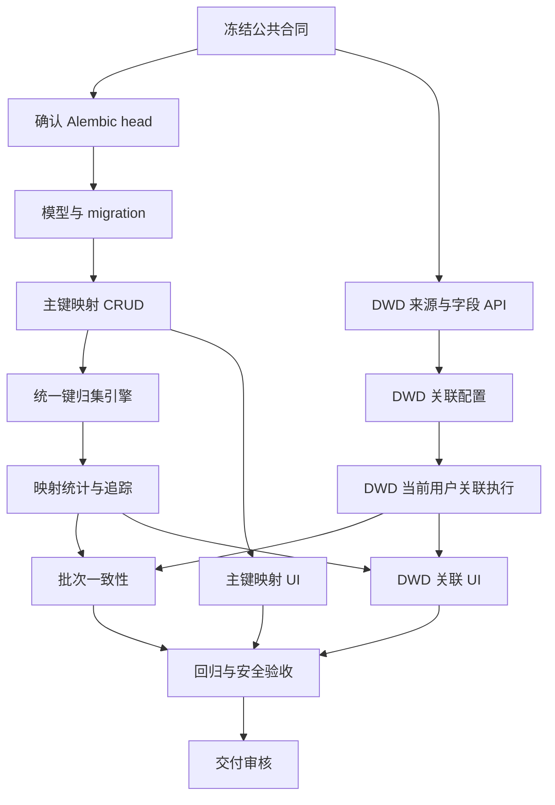

# 表格归集：主键映射与 DWD 数据集关联开发任务包

> 文档状态：待评审，未授权主代理勾选任务
> 所属需求：006-excel-table-tools
> 生成日期：2026-08-13
> 依据：`specs/006-excel-table-tools/spec.md`、`表格归集工具-已建模板新增源映射开发Spec.md`、现有后端/前端代码基线及已确认业务要求

## 0. 需求输入确认

- 需求名称：表格归集主键映射与 DWD 数据集关联
- 目标项目/目录：`D:\AI项目\HR提效工具搭建\hr-portal`
- 需求来源：表格归集新增需求讨论
- 是否涉及已有代码：是
- 是否涉及 UI：是
- 是否涉及 API：是
- 是否涉及数据库或 migration：是，预计涉及；最终以评审后的模型方案为准
- 是否涉及权限或敏感数据：是，涉及证件信息、DWD 字段和行级数据范围
- 是否涉及外部系统、消息或事件：首期不涉及外部系统；是否复用现有自动化事件待确认
- 是否涉及 Legacy 兼容或数据迁移：是，必须兼容未配置新能力的既有模板
- 已发现的关键依赖：现有 MergeTemplate/MergeSourceMapping/engine；DataSet/Report/ReportAcl/DataSetAcl；`run_dataset_query()`；字段权限校验；`scope_filter`；现有 table_tools 权限
- 当前缺失且必须确认的信息：见第 11 节阻塞事项

---

# 1. 背景与目标

## 1.1 背景

现有表格归集工具已经支持：

- 多文件、多 Sheet Excel 解析；
- 多行表头及合并单元格处理；
- 源列到标准字段映射；
- 派生字段；
- 按 `MergeTemplate.merge_keys` 精确归集；
- 数值聚合和冲突异常；
- 预览和 XLSX 下载；
- 已建模板新增源映射。

当前按主键归集时，两个来源必须提供相同的主键值组合。例如两个来源分别使用不同证件类型和证件号码，即使业务上指向同一个人，也会被拆成两组。

同时，系统已有报表绑定 `DataSet`，并且数据集支持 DWD 层级、表间关系、字段元数据、ACL、敏感字段和数据范围控制。表格归集需要在不读取报表展示结果、不绕过现有权限的前提下，补充 DWD 数据集字段。

## 1.2 本期目标

### 目标 A：主键值映射

维护模板级、精确的主键值映射：

```text
源字段主键值
→ 归集统一键
→ 现有归集引擎按统一键合并
```

多个不同原始主键可以映射到同一个归集统一键；归集统一键只服务于本次模板归集，不作为系统全局人员主键，也不自动成为 DWD 关联键。

### 目标 B：DWD 数据集关联

通过已有报表作为 DWD 数据集的选择/发现入口：

```text
表格归集配置
→ 选择已有报表
→ 解析其 dataset_id
→ 强制校验 DataSet.warehouse_layer == DWD
→ 配置归集结果字段与 DWD 字段的独立关联关系
→ 以当前用户身份查询 DWD
→ 补充允许返回的字段
```

DWD 关联映射与主键归集映射必须独立维护、独立执行、独立审计。

## 1.3 成功指标

- 同一模板中多个不同原始主键可按配置合并为一条归集结果；
- 未配置新映射的既有模板行为不变；
- 归集主结果不会错误地把被合并的多套原始证件字段压缩成单值；
- DWD 关联只能使用 DWD 数据集；
- 交互式 DWD 查询使用当前用户权限和数据范围；
- DWD 字段未经后端字段权限校验不得进入结果；
- 关联未命中、多命中和字段冲突可见且可处理；
- 预览与下载使用一致的映射配置和关联配置快照；
- 所有新增合同、权限、边界和迁移均有可执行测试证据。

## 1.4 非目标 / 不做范围

- 不做姓名、证件号码模糊匹配或 AI 自动判断“是否同一人”；
- 不建设全局人员主档或全局身份主键；
- 不将归集统一键写入 DWD；
- 不要求最终主结果长期保存归集统一键；
- 不要求 DWD 使用归集统一键；
- 不把报表渲染结果、报表缓存或报表导出文件作为关联数据源；
- 不允许使用报表 owner 身份代替当前交互用户执行 DWD 关联；
- 首期不默认支持一对多结果展开；
- 首期不引入模糊、递归或链式主键映射；
- 首期不新增外部通知、UCP 调用或第三方连接器；
- 不修改既有 migration 文件；
- 不删除既有主键归集逻辑。

---

# 2. 用户场景与状态

## 2.1 模板管理员维护主键值映射

- 入口：表格归集模板的主键映射配置区。
- 前置条件：用户拥有模板维护权限，且为模板创建者或超级管理员。
- 操作：新增、编辑、启用、停用、删除或批量导入精确映射。
- 系统反馈：校验模板主键字段、来源上下文、源键唯一性和目标键非空性。
- 成功结果：映射保存并生成新版本或更新时间；后续归集可加载该配置。
- 失败态：表单错误、源键重复、目标键为空、模板不存在、无权维护。
- 空态：尚未配置映射，明确提示“未配置时沿用原有主键归集”。
- 冲突态：同一来源上下文和源键指向不同目标键，整体拒绝保存。
- 可恢复方式：修正冲突、停用错误映射或恢复上一版本；不静默覆盖。

## 2.2 用户执行归集

- 入口：既有模板的归集执行页。
- 前置条件：用户拥有 `table_tools:V`；上传一个或多个合法 Excel。
- 操作：上传文件、选择模板、预览归集、查看映射命中/未命中/冲突、下载结果。
- 系统反馈：展示归集行数、归集组数、映射统计、异常统计和来源识别日志。
- 成功结果：按归集统一键合并；主结果中的业务字段按既有 aggregate 规则处理。
- 未命中：默认回退到原有 `merge_keys` 归集，并显示未命中统计；若模板配置为强制映射，则该批次失败或进入阻断态。
- 空态：没有可归集数据时返回空结果和原因，不生成虚假行。
- 冲突态：映射配置冲突或聚合冲突进入异常，不静默覆盖。
- 下载：要求 `table_tools:E`；不得因下载重新加载到另一套不一致的配置。

## 2.3 模板管理员配置 DWD 关联

- 入口：模板归集配置中的“DWD 数据集关联”区域。
- 前置条件：用户可访问报表及其绑定的数据集，并拥有模板维护权限。
- 操作：选择已有报表、选择关联字段、选择返回字段、配置多命中和缺失策略。
- 系统反馈：后端返回报表对应数据集；若层级不是 DWD，禁止继续。
- 成功结果：保存独立的 DWD 关联配置，不修改主键映射配置。
- 无权限态：报表访问权、数据集访问权或字段访问权不足时，返回统一错误并隐藏不可用字段。
- 配置冲突：关联键类型不兼容、目标字段不可见、结果字段重名或多命中策略缺失时拒绝保存。

## 2.4 归集结果执行 DWD 关联

- 入口：归集预览或下载流程中的已启用 DWD 关联。
- 前置条件：主键归集完成；DWD 配置快照有效；当前用户仍有访问权。
- 操作：将归集记录的指定字段作为 DWD 关联键，批量查询并回填指定字段。
- 成功结果：主归集结果增加 DWD 补充字段；不要求保留归集统一键。
- 未命中：按配置保留空值或记为关联异常。
- 多命中：首期默认拒绝回填并记异常；只有显式配置后才允许受控策略。
- 权限变化：执行前重新校验，权限失效则整批阻断，不返回未经授权的部分结果。

## 2.5 状态机

| 当前状态 | 操作 | 前置条件 | 下一状态 | 失败结果 | 是否可重试 |
|---|---|---|---|---|---|
| draft | 保存主键映射 | DTO 和冲突校验通过 | active | validation/conflict | 是 |
| active | 停用映射 | 有维护权限 | disabled | 403/404 | 是 |
| disabled | 启用映射 | 配置仍合法 | active | conflict/validation | 是 |
| template-ready | 配置 DWD 关联 | 报表、数据集、字段均可访问且为 DWD | relation-ready | permission/layer/field error | 是 |
| relation-ready | 执行预览 | 当前用户权限仍有效 | previewed | query/association error | 是 |
| relation-ready | 下载 | `table_tools:E` 且配置快照有效 | exported | export/query error | 是 |

---

# 3. 代码基线与复用计划

| 能力 | 已有实现 | 真实入口 | 本期复用方式 | 是否修改 | 是否允许新建 |
|---|---|---|---|---|---|
| 模板与源映射 | `MergeTemplate`、`MergeSourceMapping` | `backend/app/table_tools/models.py`、`router.py` | 作为主键映射所属模板和源结构上下文 | 需要 | 允许新增独立模型 |
| Excel 解析与归集 | `parse_header()`、`extract_records()`、`aggregate_records()`、`run_merge()` | `backend/app/table_tools/engine.py` | 在标准化记录和聚合之间加入独立主键解析；关联在归集结果阶段执行 | 需要 | 允许新增纯函数/服务 |
| 模板映射维护 | 映射 CRUD、批量保存、AI 草稿 | `backend/app/table_tools/router.py` | 复用权限、模板加载、版本递增和统一校验风格 | 需要 | 不复制既有映射 CRUD |
| 归集前端 | `TableMerge.vue` | `frontend/src/views/tools/TableMerge.vue` | 增加配置区、异常展示和关联结果区；必要时拆分子组件 | 需要 | 允许在 `components/table-tools/` 新建子组件，需先确认不存在同职责组件 |
| 前端 API | `tableToolsApi` | `frontend/src/api/tableTools.ts` | 扩展类型和调用 | 需要 | 不新建第二套 table-tools API 封装 |
| 报表访问 | `_can_access()` 等 | `backend/app/reports/router.py` | 作为报表入口访问校验 | 需要复用 | 不复制报表 ACL 逻辑 |
| 数据集模型 | `DataSet`、`DataSetTable`、`DataSetRelation`、`DataSetAcl` | `backend/app/datasets/models.py`、`router.py` | 校验 `warehouse_layer == DWD` 和数据集访问权 | 可能修改调用服务 | 不新建 DWD 数据集事实源 |
| DWD 查询 | `run_dataset_query()`、`sql_builder.py` | `backend/app/reports/sql_builder.py` | 复用字段引用、范围过滤、脱敏和安全查询能力 | 可能增加受控调用适配 | 不直接拼接动态 SQL |
| 字段权限 | `ensure_valid_report_field_references()` | `backend/app/reports/validation.py` | 校验关联键和补充字段 | 需要复用 | 不在 table_tools 新建字段白名单事实源 |
| 行级范围 | `scope_filter.py` | `backend/app/permissions/scope_filter.py` | 以当前用户执行 DWD 查询 | 不应复制 | 不允许 owner 代查 |
| 公式能力 | `app/ai_formula` | 现有公共公式模块 | 本期不新增公式语义；若做字段转换必须复用 | 待确认 | 禁止新写 eval |
| 运行批次 | `MergeJob` 模型 | `backend/app/table_tools/models.py` | 如纳入本期，补齐实际写入和快照 | 需要 | 不新增平行批次事实源 |
| migration | Alembic 现有版本 | `backend/alembic/versions/` | 新增单一 revision，禁止改旧 migration | 需要 | 允许新增 migration |
| 测试 | `test_table_merge_mapping_routes.py`、`test_table_merge_capability.py` | `backend/tests/` | 扩展后端路由和引擎测试；新增文件需按职责拆分 | 需要 | 允许新增测试文件 |

### 3.1 禁止重复建设

- 不新建第二个 Excel 解析器；
- 不新建第二个报表 SQL builder；
- 不新建第二套 DataSet ACL、Report ACL、scope_filter 或字段脱敏逻辑；
- 不将 DWD 数据复制到 table_tools 自有缓存表作为授权事实源；
- 不把“归集统一键”抽象为全局人员主键；
- 不把 DWD 关联映射复用为归集主键映射，反之亦然；
- 不把报表 owner 作为交互式关联的查询用户。

### 3.2 共享高冲突文件

- `backend/app/table_tools/engine.py`：主键映射任务与 DWD 关联任务必须串行合并；
- `backend/app/table_tools/router.py`：所有新增 API 串行修改；
- `frontend/src/views/tools/TableMerge.vue`：UI 任务串行修改，优先拆组件；
- `backend/app/main.py`：只有确需注册新 router 时才允许修改；
- `backend/alembic/versions/`：每个 migration 任务只能新增自己的 revision，不修改既有文件。

### 3.3 已有未提交修改

基线快照显示仓库存在大量未提交修改，包括 `main.py`、`report_service.py`、调度、映射、性能、前端路由和测试等文件。实现 AI 不得覆盖或回退这些变更；主代理必须在合并前按任务文件检查 diff。

---

# 4. 功能范围

| 功能项 | 是否本期实现 | 对应任务 | 对应测试 | 说明 |
|---|---:|---|---|---|
| 模板级主键值映射模型 | 是 | X0061 | T0061 | 与 MergeTemplate 绑定 |
| 主键映射精确 CRUD | 是 | X0062 | T0062 | 支持启用/停用和冲突校验 |
| 映射后统一键归集 | 是 | X0063 | T0063 | 兼容无映射模板 |
| 原始主键明细追踪 | 部分，首期以批次/异常明细或预览附属结果承载 | X0064 | T0064 | 不压入合并主结果单值字段 |
| DWD 报表入口选择 | 是 | X0065 | T0065 | 报表仅为发现/追溯入口 |
| DWD 层级强校验 | 是 | X0065 | T0065 | 只接受 `DataSet.warehouse_layer == DWD` |
| DWD 关联字段配置 | 是 | X0066 | T0066 | 与主键映射独立 |
| 当前用户 DWD 查询 | 是 | X0067 | T0067 | 复用现有权限、范围和脱敏 |
| DWD 一对一/多对一关联 | 是 | X0067 | T0067 | 多命中默认异常 |
| DWD 一对多展开 | 否 | - | - | 后续需求单独设计 |
| MergeJob 实际持久化 | 阻塞确认 | X0068 | T0068 | 是否纳入本期必须确认 |
| 事件、通知、UCP | 否 | - | - | 本期无外部副作用 |
| 前端配置与结果展示 | 是 | X0069 | T0069 | 复用 TableMerge 工作台 |
| 报表结果直接关联 | 否 | - | - | 明确禁止 |
| 全局人员主档 | 否 | - | - | 明确禁止 |

---

# 5. 技术设计

## 5.1 数据库 / 数据模型

### 5.1.1 主键映射事实源

建议新增 `MergeKeyMapping`，作为“模板级归集主键值映射”的唯一事实源。

字段合同在实现前必须由架构评审确认，以下为待冻结候选合同：

| 字段 | 候选类型 | 约束 |
|---|---|---|
| `id` | BigInteger | 主键 |
| `template_id` | BigInteger | 外键到 `merge_templates`，级联删除或按既有策略处理 |
| `source_mapping_id` | BigInteger，可空 | 可选来源结构上下文；若采用必须校验属于同一模板 |
| `source_key` | JSON | 按模板 `merge_keys` 表达的精确源键，不允许空对象 |
| `canonical_merge_key` | JSON 或 String | 仅作为模板内归集键，不能为空 |
| `enabled` | Boolean | 默认 true |
| `version` | Integer | 配置版本或快照版本，语义待确认 |
| `created_by` | BigInteger，可空 | 创建人 |
| `created_at` / `updated_at` | DateTime | 审计时间 |

唯一性至少应覆盖：

```text
(template_id, source_mapping_id, normalized_source_key)
```

同一源键不能指向多个目标键；多个源键可以指向同一目标键。

是否将 `source_key` 和 `canonical_merge_key` 设计成 JSON、规范化字符串还是独立字段，属于阻塞合同，不能在实现任务中自行决定。若主键字段固定为两个且已有规范化函数，才可采用独立列；否则优先采用结构化 JSON + 服务端规范化哈希唯一索引。

### 5.1.2 DWD 关联事实源

建议新增 `MergeDwdRelation`，作为“表格归集模板到 DWD 数据集的独立关联配置”唯一事实源。

候选字段：

| 字段 | 候选类型 | 约束 |
|---|---|---|
| `id` | BigInteger | 主键 |
| `template_id` | BigInteger | 外键到模板 |
| `report_id` | BigInteger | 选择入口和审计来源；是否必填待确认 |
| `dataset_id` | BigInteger | 后端从报表解析并保存；必须是 DWD |
| `join_keys` | JSON | 归集结果字段与 DWD 字段的成对映射 |
| `selected_fields` | JSON | 返回字段清单及展示标签配置 |
| `filters` | JSON | 仅允许已授权字段，是否首期开放待确认 |
| `cardinality` | String | 首期限定 one_to_one / many_to_one |
| `multi_match_strategy` | String | 首期默认 reject；其余值须显式支持 |
| `missing_strategy` | String | keep_empty / report_anomaly |
| `enabled` | Boolean | 默认 true |
| `version` | Integer | 配置快照版本 |
| `created_by` / 时间字段 | - | 审计 |

不得将 DWD 原始数据复制到该表。该表只保存配置，不保存查询结果事实。

### 5.1.3 结果和原始键边界

主归集结果是聚合后的行集合。映射后的不同原始证件类型/号码不能作为同一行中的普通单值字段保留。

如业务要求追溯原始键，必须采用以下之一并在评审时冻结：

1. 批次结果中的独立明细/关系表；
2. 预览响应的独立 `identity_details` 集合；
3. 下载文件的独立“原始键明细” Sheet。

不允许把多个值拼接到同一普通字段后冒充结构化事实。

### 5.1.4 MergeJob

`MergeJob` 已存在但当前执行接口未确认实际落库。是否在本期补齐批次持久化是阻塞项。

若纳入本期，必须保存至少：模板、执行人、输入文件元数据、主键映射快照、DWD 关联快照、状态、统计、异常和结果引用；预览和下载必须能明确使用同一批次或同一配置快照。

### 5.1.5 Migration 合同

- 不得修改 `0041_table_tools_merge.py` 或其他既有 migration；
- 新增一个或多个 revision 前，必须读取当前 Alembic head 并确认无未解释多 head；
- upgrade 创建新表、索引、约束；
- downgrade 删除本期新增对象，不删除既有模板、源映射和数据；
- 必须验证空库 upgrade、已有数据 upgrade、持久数据库 upgrade/downgrade；
- 如 JSON 唯一约束无法由目标数据库安全表达，必须采用服务端规范化键或数据库生成列，并在合同评审中确认。

## 5.2 后端接口

以下 API 是候选合同，标记为“待冻结”的部分必须在 X0060 合同任务完成前确认。

### 主键映射

#### `GET /table-tools/templates/{tid}/key-mappings`

- 用途：分页读取模板主键映射。
- 权限：`table_tools:V`；是否按模板创建者隔离，沿用现有模板访问规则，待产品确认。
- Query：`page`、`page_size`、`enabled`、搜索条件（若开放须定义）。
- Response：`items[]`、`total`、每项包含 `id/source_key/canonical_merge_key/source_mapping_id/enabled/version`。
- 状态：200、403、404。
- 事务：只读。

#### `POST /table-tools/templates/{tid}/key-mappings`

- 用途：新增精确主键映射。
- 权限：`table_tools:U` + 创建者/超级管理员。
- Request：版本字段、`source_mapping_id`、`source_key`、`canonical_merge_key`、`enabled`。
- 状态：201、400、403、404、409。
- 幂等：候选为同模板同源键重复返回 409；是否支持 idempotency key 待确认。
- 事务：单条写事务。

#### `PUT /table-tools/templates/{tid}/key-mappings/{mid}`

- 用途：编辑映射或启停映射。
- 权限：同新增。
- 并发：必须使用版本号或 If-Match；具体机制待冻结。
- 状态：200、400、403、404、409。

#### `DELETE /table-tools/templates/{tid}/key-mappings/{mid}`

- 用途：删除配置。
- 权限：`table_tools:D` + 创建者/超级管理员，或由维护权限统一管理，待确认。
- 状态：204、403、404、409。
- 是否允许删除已被批次引用的映射：待确认；保守方案为软停用而非物理删除。

### DWD 关联

#### `GET /table-tools/dwd-relation-sources`

- 用途：返回当前用户可访问、且绑定 DWD 数据集的报表入口。
- 权限：`table_tools:V`。
- Response：`report_id/report_name/dataset_id/dataset_name/warehouse_layer`。
- 必须同时执行报表访问权和数据集访问权校验；不得返回仅前端隐藏的敏感字段。

#### `GET /table-tools/reports/{report_id}/dwd-fields`

- 用途：读取报表绑定 DWD 数据集的可用字段。
- 权限：`table_tools:V` + 报表访问 + 数据集访问。
- 规则：数据集不存在、非 DWD、未发布或无权访问均拒绝；字段必须经过现有字段可见性/敏感字段规则。
- 状态：200、403、404、409。

#### `GET /table-tools/templates/{tid}/dwd-relations`

- 用途：读取模板关联配置。
- 权限：`table_tools:V`；返回配置时不得泄露未授权字段。

#### `POST /table-tools/templates/{tid}/dwd-relations`

- 用途：保存 DWD 关联配置。
- 权限：模板创建者/超级管理员 + `table_tools:U`。
- Request：`report_id`、由后端解析的 dataset 绑定、`join_keys`、`selected_fields`、策略字段、版本字段。
- 后端不得信任客户端的 dataset 层级和字段目录，必须重新加载并校验。
- 状态：201、400、403、404、409。
- 事务：配置和版本在一个写事务中提交。

#### `POST /table-tools/templates/{tid}/merge`

- 既有接口保留。
- 新增可选配置快照/关联配置参数只能在合同冻结后实施。
- 权限仍为 `table_tools:V`。
- 执行关联时使用当前用户，不调用 owner 身份查询。
- 归集主键映射和 DWD 关联映射分别加载、分别统计、分别报错。

#### `POST /table-tools/templates/{tid}/download`

- 既有接口保留。
- 权限为 `table_tools:E`。
- 下载结果中 DWD 字段必须遵守当前用户字段权限和脱敏规则。
- 预览和下载不能因分别执行而使用不同配置快照；批次方案待确认。

### 稳定错误码候选

必须先搜索现有错误码，确认无同义重复后才能冻结：

| 错误码候选 | HTTP | 条件 | 可重试 |
|---|---:|---|---|
| `TABLE_MERGE_KEY_MAPPING_INVALID` | 400 | 源键、目标键或字段结构非法 | 否 |
| `TABLE_MERGE_KEY_MAPPING_CONFLICT` | 409 | 同一源键指向多个目标键或并发版本冲突 | 修正配置后是 |
| `TABLE_MERGE_DWD_DATASET_REQUIRED` | 409 | 报表未绑定数据集或数据集不是 DWD | 否 |
| `TABLE_MERGE_DWD_FIELD_FORBIDDEN` | 403 | 关联键/返回字段无权访问 | 否 |
| `TABLE_MERGE_DWD_RELATION_INVALID` | 400 | 关联键或策略不合法 | 否 |
| `TABLE_MERGE_DWD_MATCH_CONFLICT` | 422 | 一组归集结果出现未允许的多命中/字段冲突 | 配置或数据修正后是 |
| `TABLE_MERGE_DWD_QUERY_FAILED` | 502 或既有查询错误映射 | DWD 查询失败 | 是 |

候选错误码不是已冻结合同。实现 AI 不得直接复制使用而跳过错误码检索。

## 5.3 公共 DTO / Policy / Adapter / Executor

### DTO

- 主键映射 DTO 版本候选：`MergeKeyMappingV1`；
- DWD 关联 DTO 版本候选：`MergeDwdRelationV1`；
- 未确认前不得在多个模块各自定义字段变体；
- unknown fields 的保存方式必须由合同任务确认；
- DTO 必须拒绝无法无损表达的输入，不得静默丢字段。

### Policy

后端必须根据 `template_id`、`report_id` 和 `dataset_id` 重新加载事实元数据：

- 前端字段列表只用于展示；
- 不能用前端传入字段白名单替代后端校验；
- RBAC 操作权限先于业务对象权限；
- 业务字段访问、敏感字段、数据范围和 DWD 层级必须全部校验；
- 403 表示权限不足；400/409/422 表示配置或数据业务错误。

### Adapter

本期不涉及 Legacy Adapter、外部系统 Adapter 或 UCP Adapter。Excel 输入继续由现有 UploadFile 与 `engine.run_merge()` 处理。

### Executor

不得在 `engine.py` 的纯归集函数中直接访问数据库。建议边界：

```text
Excel 解析/标准化（纯函数）
→ 主键映射解析（纯函数，输入已加载配置）
→ 归集聚合（纯函数）
→ DWD 关联服务（权限校验、受控查询、结果投影）
```

DWD 查询服务负责加载配置和权限；聚合执行器不得直接写数据库、调用通知、访问凭证或执行动态 SQL。

## 5.4 业务逻辑

### 主键映射

1. 根据现有 `key_map` 获得标准主键字段；
2. 按模板 `merge_keys` 生成规范化源键；
3. 使用 `source_mapping_id` 等来源上下文查找启用映射；
4. 命中时生成仅用于本次归集的 `canonical_merge_key`；
5. 未命中时按模板兼容策略回退或阻断；
6. 聚合仅按归集统一键分组；
7. 原始主键不得作为合并后主结果的单值列；如需追溯，进入独立明细、异常或批次快照结构；
8. 映射冲突不得静默选择。

### DWD 关联

1. 根据 `report_id` 加载 Report；
2. 读取其 `dataset_id`，重新加载 DataSet；
3. 强制校验 `warehouse_layer == "DWD"`、活动状态和访问权；
4. 校验关联键、筛选字段和返回字段；
5. 归集后使用配置的独立 join keys 批量查询 DWD；
6. 查询时传入当前用户和 scope strategy；
7. 应用字段可见性、敏感字段脱敏和行级范围；
8. 按显式策略处理未命中、多命中和字段冲突；
9. 返回只包含授权字段的结果。

主键归集映射与 DWD 关联映射不能互相推导，也不能共享同一个配置事实源。

### 事务、并发与一致性

- 配置保存使用单事务；
- 同一模板的映射版本更新必须有并发控制；
- 预览/下载应加载同一配置快照；若本期不实现 MergeJob，则必须明确接受“请求期间配置不可变”的限制；
- DWD 数据查询失败不得返回部分未经标识的成功结果；
- 结果中的关联异常必须与归集异常分组展示。

## 5.5 前端与 UI/交互

页面真实入口：`frontend/src/views/tools/TableMerge.vue`。

建议在不继续扩大单文件的前提下拆分：

- `TableMergeKeyMappingPanel.vue`：主键值映射维护；
- `TableMergeDwdRelationPanel.vue`：报表/DWD 数据集及字段配置；
- `TableMergeResultTabs.vue`：归集结果、关联异常、原始键/来源明细。

新建前必须确认目录不存在同职责组件。

### 主键映射区

- 显示模板归集主键字段；
- 源主键字段按模板配置动态生成；
- 目标统一键输入；
- 启用/停用；
- 新增、编辑、删除；
- 冲突提示；
- 未配置说明和兼容行为说明；
- 不把统一键描述为系统人员主键。

### DWD 关联区

- 报表下拉只显示当前用户可访问的候选报表；
- 选择报表后显示绑定数据集和层级；
- 非 DWD 显示明确阻断，不显示可保存按钮；
- 关联字段采用左右字段配对；
- 返回字段支持选择，但以后端返回字段目录为准；
- 显示一对一/多对一和未命中策略；
- 首期多命中默认 reject，不提供未实现策略的控件；
- 关联配置与主键映射配置分区、分保存、分错误提示。

### 结果区

至少区分：

- 归集结果；
- DWD 关联补充结果；
- 归集异常；
- DWD 关联异常；
- 如提供原始键追溯，必须使用独立明细区域或 Sheet，不将多个原始值拼入主结果单元格。

必须覆盖加载、空数据、无权限、非 DWD、未命中、多命中和查询失败状态。

## 5.6 权限、安全与外部系统

- 模板查看/运行：`table_tools:V`；
- 模板配置维护：现有 `table_tools:U` + 创建者/超级管理员；
- 删除或停用：沿用既有 D/U 语义，最终以权限评审冻结；
- 下载：`table_tools:E`；
- DWD 关联候选、字段目录和执行：当前用户必须通过报表访问权、数据集 ACL、字段权限和 scope_filter；
- 报表 ACL 不得绕过 DataSet ACL；
- DataSet ACL 不得绕过报表入口访问规则，除非产品明确确认改变规则；
- DWD 敏感字段沿用现有脱敏；
- 证件号等敏感值不得写入普通日志、AI 上下文或错误消息；
- 动态字段、排序、筛选和 SQL 必须继续经过现有校验，不允许字符串拼接未经白名单验证的 SQL；
- 本期不发送外部消息，不触发 UCP，不访问凭证，不新增通知事件。

---

# 6. 原子任务清单

## 合同与调查

- [ ] X0060 冻结主键映射与 DWD 关联公共合同
  - 目标：冻结 DTO、字段类型、版本、API、错误码、权限、并发、事务、原始键追踪载体和未命中策略。
  - 任务类型：合同
  - 前置任务：无
  - 必读文件与章节：本文件第 5 节；`specs/006-excel-table-tools/spec.md`；`backend/app/table_tools/models.py`；`backend/app/datasets/models.py`；`backend/app/reports/router.py`；`backend/app/reports/sql_builder.py`
  - 允许修改文件：仅本 Spec 或评审决策记录
  - 允许新增文件：无
  - 禁止修改文件：所有业务实现文件
  - 输入合同：现有模板、数据集、报表和权限事实源
  - 输出合同：一份冻结决策，消除本文件第 11 节阻塞
  - UI 要求：冻结字段和状态，不实现页面
  - UCP/外部系统要求：不涉及
  - 测试合同：
    - Given：存在不同源键、不同层级数据集、无权限字段
    - When：评审合同
    - Then：每种情况都有明确 DTO/API/错误码/权限结论
    - 必测测试文件：无自动测试，需保留评审记录
    - 验收命令：文档审查和跨文档一致性检查
    - skipped 规则：若未完成架构/产品确认，必须标阻塞
  - 验收标准：无关键字段或行为靠实现 AI 自行猜测
  - 完成证据：评审决策、更新后的合同章节
  - 阻塞条件：第 11 节任一 P0/P1 项未决
  - 不在范围：代码实现
  - 完成定义：主代理确认合同冻结后才可勾选

- [ ] X0061 确认 Alembic head 与 migration 依赖
  - 目标：确认新 migration 的唯一 `down_revision`、是否存在多 head 及持久库验证方式。
  - 任务类型：migration/合同
  - 前置任务：X0060
  - 必读文件与章节：`backend/alembic/env.py`、`backend/alembic/versions/0041_table_tools_merge.py`、当前 head 相关 revision
  - 允许修改文件：无；仅输出调查证据
  - 允许新增文件：无
  - 禁止修改文件：既有 migration
  - 测试合同：Given 当前仓库 migration；When 查询 heads；Then 无未解释多 head
  - 验收命令：`cd hr-portal/backend && alembic heads && alembic history -n 20`
  - 验收标准：明确新 revision 命名和回滚边界
  - 完成证据：命令输出和依赖说明
  - 阻塞条件：多 head 或持久库状态无法确认
  - 不在范围：写 migration
  - 完成定义：主代理审查证据后勾选

## 主键映射后端

- [ ] X0062 实现主键映射模型与 migration
  - 目标：新增模板级主键值映射持久化模型、唯一约束、索引和审计字段。
  - 任务类型：后端/migration
  - 前置任务：X0060、X0061
  - 必读文件：`backend/app/table_tools/models.py`、`backend/app/core/db.py`、`backend/alembic/versions/0041_table_tools_merge.py`
  - 允许修改文件：`backend/app/table_tools/models.py`
  - 允许新增文件：`backend/alembic/versions/<新revision>_table_tools_key_mapping_dwd_relation.py`
  - 禁止修改文件：既有 migration、`datasets/models.py`、`reports/models.py`
  - 输入合同：X0060 冻结的数据模型
  - 输出合同：ORM 模型和可升级/回滚 migration
  - UI 要求：不涉及 UI
  - UCP/外部系统要求：不涉及
  - 测试合同：
    - Given 空库和已有模板
    - When upgrade、插入合法/重复/孤儿配置、downgrade
    - Then 约束、外键、索引和回滚符合合同
    - 必测测试文件：新增 `backend/tests/test_table_merge_key_mapping_model.py`
    - 验收命令：`cd hr-portal/backend && pytest tests/test_table_merge_key_mapping_model.py -q`
    - skipped 规则：数据库不可用必须明确 skipped，不得写通过
  - 验收标准：不得形成全局人员主键事实源；不得破坏既有模板
  - 完成证据：migration diff、upgrade/downgrade 输出、已有数据检查
  - 阻塞条件：X0060 未冻结 JSON/列结构
  - 不在范围：路由和引擎
  - 完成定义：代码、迁移和测试证据齐全后由主代理勾选

- [ ] X0063 实现主键映射 DTO、校验与 CRUD API
  - 目标：提供映射的读取、新增、更新、启停和删除接口，确保同一源键不能指向多个目标键。
  - 任务类型：API/后端
  - 前置任务：X0062
  - 必读文件：`backend/app/table_tools/router.py`、`backend/app/table_tools/models.py`、`backend/app/core/deps.py`、`backend/tests/test_table_merge_mapping_routes.py`
  - 允许修改文件：`backend/app/table_tools/router.py`、必要的 `backend/app/table_tools/schemas.py`（若该文件已存在）
  - 允许新增文件：仅在不存在统一职责模块时新增 `backend/app/table_tools/key_mapping_service.py`
  - 禁止修改文件：`reports/router.py`、`datasets/router.py`、既有源映射 DTO
  - 输入合同：X0060 的 `MergeKeyMappingV1`
  - 输出合同：稳定错误码、分页响应、版本并发控制
  - UI 要求：返回足够字段供配置面板展示
  - UCP/外部系统要求：不涉及
  - 测试合同：
    - Given 合法映射、重复源键、不同目标键、无权用户、跨模板 source_mapping_id
    - When 调用 CRUD
    - Then 返回正确 2xx/4xx，失败无部分写入
    - 必测测试文件：新增 `backend/tests/test_table_merge_key_mapping_routes.py`
    - 验收命令：`cd hr-portal/backend && pytest tests/test_table_merge_key_mapping_routes.py -q`
    - skipped 规则：不可用 DB 场景必须说明原因
  - 验收标准：后端重新加载模板和来源映射；不信任前端字段目录；权限和创建者边界与现有模板一致
  - 完成证据：OpenAPI、API 测试、并发冲突测试
  - 阻塞条件：删除语义、查看范围和版本并发未冻结
  - 不在范围：主键归集执行
  - 完成定义：所有状态码和权限分支有测试

- [ ] X0064 在引擎中加入统一归集键解析
  - 目标：在现有标准化记录进入聚合前，按启用映射生成仅用于本次归集的统一键。
  - 任务类型：后端
  - 前置任务：X0063
  - 必读文件：`backend/app/table_tools/engine.py`、`backend/app/table_tools/models.py`
  - 允许修改文件：`backend/app/table_tools/engine.py`、必要的 `backend/app/table_tools/router.py`
  - 允许新增文件：仅允许新增纯函数测试文件
  - 禁止修改文件：`app/reports/sql_builder.py`、DWD 数据表
  - 输入合同：已加载、已校验的映射快照
  - 输出合同：聚合结果按 canonical merge key 分组；内部原始键上下文进入独立追踪结构，不作为合并后单值字段
  - UI 要求：不涉及 UI
  - UCP/外部系统要求：不涉及
  - 测试合同：
    - Given 两个不同源键映射到同一目标键
    - When 执行归集
    - Then 生成一条聚合结果且数值按既有规则合并
    - Given 无映射、映射停用、源键冲突、空键
    - When 执行归集
    - Then 分别回退、阻断或记录异常，符合 X0060
    - 必测测试文件：新增 `backend/tests/test_table_merge_key_mapping_engine.py`
    - 验收命令：`cd hr-portal/backend && pytest tests/test_table_merge_key_mapping_engine.py -q`
    - skipped 规则：不得因缺少真实 Excel 而跳过纯函数测试
  - 验收标准：既有无映射模板结果不变；不把 passport/work_permit 两套证件值压到主结果单值列；金额冲突仍按既有规则报异常
  - 完成证据：fixture、结果对比、异常明细
  - 阻塞条件：未命中策略未冻结
  - 不在范围：DWD 查询
  - 完成定义：引擎单测和既有 table_tools 回归均通过

- [ ] X0065 接入主键映射执行统计和追踪结果
  - 目标：扩展 merge 预览/下载响应，使命中、未命中、冲突和原始键追踪信息可审计且不泄露到普通日志。
  - 任务类型：API/后端
  - 前置任务：X0064
  - 必读文件：`backend/app/table_tools/router.py`、`engine.py`、`TableMerge.vue`
  - 允许修改文件：`backend/app/table_tools/router.py`、`engine.py`
  - 允许新增文件：按 X0060 冻结的结果 DTO 文件
  - 禁止修改文件：报表查询权限模块
  - 输入合同：X0060 追踪结果结构
  - 输出合同：`stats` 和异常结构版本化；原始证件号不写普通应用日志
  - UI 要求：结果区分归集结果和主键映射异常/明细
  - UCP/外部系统要求：不涉及
  - 测试合同：
    - Given 两个源键合并、一个未命中、一个映射冲突
    - When 请求 merge
    - Then 统计和独立追踪结果准确，主结果仍是一行
    - 必测测试文件：扩展 `backend/tests/test_table_merge_routes.py` 或实际存在的归集路由测试文件
    - 验收命令：`cd hr-portal/backend && pytest tests/test_table_merge* -q`
    - skipped 规则：不存在的测试文件不得写入测试合同为已通过
  - 验收标准：preview/download 的字段和错误语义一致
  - 完成证据：API JSON、XLSX Sheet 或结果对比
  - 阻塞条件：原始键追踪是独立响应、独立 Sheet 还是批次明细表未冻结
  - 不在范围：MergeJob 完整历史
  - 完成定义：主代理确认无原始键结构丢失

## DWD 关联后端

- [ ] X0066 实现 DWD 来源发现与字段目录 API
  - 目标：通过可访问报表发现其绑定数据集，只返回层级为 DWD 且当前用户有权访问的来源和字段。
  - 任务类型：API/后端
  - 前置任务：X0060
  - 必读文件：`backend/app/reports/router.py`、`backend/app/reports/validation.py`、`backend/app/datasets/router.py`、`backend/app/datasets/models.py`
  - 允许修改文件：`backend/app/table_tools/router.py`、必要的独立 `dwd_relation_service.py`
  - 允许新增文件：仅允许新增独立 DWD 关联服务和测试
  - 禁止修改文件：不得复制或改写 `_can_access()`、字段校验和 `scope_filter`
  - 输入合同：report_id
  - 输出合同：report、dataset、layer、授权字段目录
  - UI 要求：非 DWD 不可选择/保存
  - UCP/外部系统要求：不涉及
  - 测试合同：
    - Given DWD、DWS、ODS、无数据集、无报表权、无数据集权、无字段权
    - When 调用来源和字段 API
    - Then 只有符合权限且为 DWD 的来源成功返回
    - 必测测试文件：新增 `backend/tests/test_table_merge_dwd_source_routes.py`
    - 验收命令：`cd hr-portal/backend && pytest tests/test_table_merge_dwd_source_routes.py -q`
    - skipped 规则：权限测试不得因前端未完成而跳过
  - 验收标准：不能信任前端传入的 warehouse_layer；不泄露未授权字段
  - 完成证据：API 测试、OpenAPI、权限矩阵
  - 阻塞条件：报表访问权与数据集访问权的组合规则未确认
  - 不在范围：DWD 结果查询
  - 完成定义：权限和层级负向测试齐全

- [ ] X0067 实现独立 DWD 关联配置与 CRUD
  - 目标：保存模板到报表/DWD 数据集的独立关联配置，禁止与主键映射配置混用。
  - 任务类型：API/后端/migration
  - 前置任务：X0062、X0066
  - 必读文件：`backend/app/table_tools/models.py`、`router.py`、`reports/config.py`、`reports/validation.py`
  - 允许修改文件：`backend/app/table_tools/models.py`、`router.py`
  - 允许新增文件：若 X0062 未包含则新增对应 migration；新增 `dwd_relation_service.py`
  - 禁止修改文件：`reports/report_service.py` 的 owner 执行语义；不得把 DWD 结果写入报表事实源
  - 输入合同：X0060 的 `MergeDwdRelationV1`
  - 输出合同：关联键、返回字段、基数和缺失/多命中策略均可验证
  - UI 要求：字段成对选择，未实现策略不得展示
  - UCP/外部系统要求：不涉及
  - 测试合同：
    - Given 合法 DWD 关联、非 DWD、不可见字段、错误 alias、重复输出字段
    - When 保存或更新配置
    - Then 正确接受或拒绝且失败无部分写入
    - 必测测试文件：新增 `backend/tests/test_table_merge_dwd_relation_routes.py`
    - 验收命令：`cd hr-portal/backend && pytest tests/test_table_merge_dwd_relation_routes.py -q`
    - skipped 规则：无
  - 验收标准：后端从 report 重新解析 dataset；不允许客户端伪造 DWD 层级；配置修改有并发保护
  - 完成证据：migration、API 测试、OpenAPI
  - 阻塞条件：关联配置字段和删除/版本语义未冻结
  - 不在范围：DWD 查询执行
  - 完成定义：合同与权限测试通过

- [ ] X0068 实现当前用户 DWD 批量关联执行器
  - 目标：归集完成后，使用独立 join keys 批量查询 DWD 并按策略回填授权字段。
  - 任务类型：后端
  - 前置任务：X0067、X0064
  - 必读文件：`backend/app/reports/sql_builder.py`、`backend/app/reports/validation.py`、`backend/app/permissions/scope_filter.py`、`backend/app/table_tools/engine.py`
  - 允许修改文件：新增独立服务文件；必要时最小修改 `router.py`
  - 允许新增文件：`backend/app/table_tools/dwd_relation_service.py`、`backend/tests/test_table_merge_dwd_relation_service.py`
  - 禁止修改文件：不修改 owner 定时执行语义；不写物理 DWD 表；不直接拼动态 SQL
  - 输入合同：归集后的结果行、DWD 关联配置、当前用户、数据库会话
  - 输出合同：授权字段、关联状态和异常；不输出归集统一键作为 DWD 主键
  - UI 要求：显示 DWD 关联状态和异常
  - UCP/外部系统要求：不涉及
  - 测试合同：
    - Given 一对一命中、未命中、多命中、范围过滤、敏感字段、查询失败
    - When 执行关联
    - Then 只返回当前用户授权的数据和字段；未允许多命中不回填且记录异常
    - 必测测试文件：`test_table_merge_dwd_relation_service.py`、现有 reports/dataset 权限测试
    - 验收命令：`cd hr-portal/backend && pytest tests/test_table_merge_dwd_relation_service.py tests/test_dataset_acl.py tests/test_reports_sql_builder_entity.py -q`
    - skipped 规则：数据库集成测试不可用时必须报告环境阻塞
  - 验收标准：批量查询避免 N+1；当前用户而非 owner；DWD 数据范围和脱敏由既有查询链路执行
  - 完成证据：权限负向测试、SQL/查询审计、关联结果 fixture
  - 阻塞条件：DWD 是多表数据集时的查询投影和关联键来源未冻结
  - 不在范围：一对多展开
  - 完成定义：安全、性能和异常策略均有证据

- [ ] X0069 补齐 MergeJob 快照与预览下载一致性（待确认是否纳入首期）
  - 目标：保证一次归集的映射配置、DWD 关联配置和输入元数据可追溯，并避免 preview/download 双执行不一致。
  - 任务类型：后端/migration
  - 前置任务：X0065、X0067、X0068、X0060
  - 必读文件：`backend/app/table_tools/models.py`、`router.py`、`engine.py`
  - 允许修改文件：上述 table_tools 文件和新增 migration
  - 允许新增文件：批次服务和测试
  - 禁止修改文件：已有 MergeJob migration（如存在）
  - 输入合同：X0060 对批次范围的决策
  - 输出合同：批次状态、配置快照、异常和结果引用
  - UI 要求：批次状态、执行时间和失败原因可见
  - UCP/外部系统要求：不涉及
  - 测试合同：Given 配置在预览与下载之间变化；When 下载；Then 结果使用快照或明确阻断
  - 必测测试文件：新增 `backend/tests/test_table_merge_job_consistency.py`
  - 验收命令：`cd hr-portal/backend && pytest tests/test_table_merge_job_consistency.py -q`
  - skipped 规则：若产品决定不纳入首期，必须在文档中明确延期，不得将未实现写成通过
  - 验收标准：无双执行事实冲突；失败可查询和重试规则明确
  - 完成证据：批次记录、快照对比、失败恢复测试
  - 阻塞条件：是否持久化结果和原始键明细未确认
  - 不在范围：异步队列和外部通知
  - 完成定义：产品确认纳入后才可勾选

## 前端

- [x] X0070 实现主键映射配置面板
  - 目标：在既有 TableMerge 工作台中维护模板级主键值映射。
  - 任务类型：前端
  - 前置任务：X0063
  - 必读文件：`frontend/src/views/tools/TableMerge.vue`、`frontend/src/api/tableTools.ts`、`frontend/src/components/common/PermissionButton.vue`
  - 允许修改文件：`frontend/src/api/tableTools.ts`、`frontend/src/views/tools/TableMerge.vue`
  - 允许新增文件：先确认不存在后可新增 `frontend/src/components/table-tools/TableMergeKeyMappingPanel.vue`
  - 禁止修改文件：报表设计器和通用报表组件
  - 输入合同：主键映射 API
  - 输出合同：表单、列表、错误提示和权限按钮与 API 一致
  - UI 要求：覆盖加载、空态、保存、冲突、无权限、停用和删除确认
  - UCP/外部系统要求：不涉及
  - 测试合同：Given 有/无映射及冲突响应；When 操作面板；Then 状态和提示正确
  - 必测测试文件：新增 `frontend/src/components/table-tools/TableMergeKeyMappingPanel.spec.ts`
  - 验收命令：`cd hr-portal/frontend && npm.cmd run test -- --run <实际测试文件>`、`npm.cmd run build`
  - skipped 规则：不得以无浏览器为由跳过组件测试；环境限制必须说明
  - 验收标准：不把归集统一键显示为全局人员主键；使用 PermissionButton
  - 完成证据：组件测试、构建输出、人工截图或录屏
  - 阻塞条件：最终 DTO/删除权限未冻结
  - 不在范围：DWD 关联 UI
  - 完成定义：组件、API 类型、构建和错误态齐全

- [ ] X0071 实现 DWD 关联配置与结果展示
  - 目标：通过已有报表选择 DWD 数据集，配置独立关联键和补充字段，并展示关联状态。
  - 任务类型：前端/API 集成
  - 前置任务：X0066、X0067、X0068
  - 必读文件：`frontend/src/views/tools/TableMerge.vue`、`frontend/src/api/tableTools.ts`、`frontend/src/views/report/ReportList.vue`
  - 允许修改文件：table_tools API 类型和归集页面
  - 允许新增文件：`frontend/src/components/table-tools/TableMergeDwdRelationPanel.vue`、结果 tabs 组件（需先确认不存在）
  - 禁止修改文件：报表权限组件和报表查询页面
  - 输入合同：DWD 来源、字段、关联配置和执行结果 API
  - 输出合同：用户可区分归集映射、DWD 关联、归集异常和 DWD 异常
  - UI 要求：非 DWD、无权限、未命中、多命中、敏感字段和查询失败均有明确状态
  - UCP/外部系统要求：不涉及
  - 测试合同：Given DWD/DWS 候选、字段权限和关联异常；When 选择/保存/执行；Then UI 正确阻断或展示
  - 必测测试文件：新增组件测试并扩展 `TableMerge` 现有测试（若存在）
  - 验收命令：`cd hr-portal/frontend && npm.cmd run test -- --run <实际测试文件>`、`npm.cmd run build`
  - skipped 规则：不得将未实现的 one_to_many 控件伪装为完成
  - 验收标准：不显示后端未授权字段；不把 DWD 关联键误显示为归集统一键
  - 完成证据：组件测试、构建、人工验收记录
  - 阻塞条件：报表访问权与数据集访问权规则未冻结
  - 不在范围：报表设计器改造
  - 完成定义：UI 与后端合同一致且全部状态可恢复

## 回归与交付

- [ ] X0072 后端回归、迁移和安全验收
  - 目标：验证既有 table_tools、dataset、report 权限和 migration 不回归。
  - 任务类型：测试/回归
  - 前置任务：X0062-X0069
  - 必读文件：本文件第 8-10 节；相关测试和 migration
  - 允许修改文件：仅测试 fixture 或测试文件；不得修正生产逻辑逃避失败
  - 允许新增文件：测试文件和证据目录
  - 禁止修改文件：无关业务模块
  - 输入合同：所有实现任务产物
  - 输出合同：真实测试输出和失败清单
  - UI 要求：不涉及 UI 实现
  - UCP/外部系统要求：确认无外部副作用
  - 测试合同：Given 既有无映射模板和新配置模板；When 执行完整回归；Then 旧行为不变、新能力符合合同
  - 必测测试文件：`tests/test_table_merge_mapping_routes.py`、`tests/test_table_merge_capability.py`、新增主键/DWD 测试
  - 验收命令：`cd hr-portal/backend && pytest tests/test_table_merge_mapping_routes.py tests/test_table_merge_capability.py tests/test_table_merge_key_mapping*.py tests/test_table_merge_dwd*.py -q`
  - skipped 规则：每个 skipped 必须写出环境、原因、替代证据和补测计划
  - 验收标准：无 P0/P1 失败，无权限绕过，无敏感泄露
  - 完成证据：测试输出、migration 输出、`git diff --check`
  - 阻塞条件：任何关键测试未执行或失败
  - 不在范围：部署和生产数据变更
  - 完成定义：仅主代理可勾选

- [ ] X0073 文档一致性与交付审核
  - 目标：核对代码、API、DTO、权限、错误码、UI、migration、测试和任务状态一致。
  - 任务类型：文档/审核
  - 前置任务：X0072
  - 必读文件：本任务包和全部实现 diff
  - 允许修改文件：本任务包、必要的验收文档
  - 允许新增文件：无
  - 禁止修改文件：生产代码
  - 输入合同：真实 diff 和测试结果
  - 输出合同：标准交付报告和主代理审核结论
  - UI 要求：核对所有状态和权限文案
  - UCP/外部系统要求：确认无未声明事件/通知
  - 测试合同：Given 全部任务；When 执行跨文档检查；Then 无术语、接口、错误码和版本冲突
  - 必测测试文件：不新增
  - 验收命令：`git diff --check`；前后端构建和回归命令
  - skipped 规则：未执行项不得标记通过
  - 验收标准：只有证据完整的任务允许由主代理改为 `[x]`
  - 完成证据：交付报告、审核清单、diff 摘要
  - 阻塞条件：任一合同冲突、未解释 skipped 或未授权修改
  - 不在范围：继续开发新功能
  - 完成定义：主代理完成最终审核

---

# 7. 任务依赖图与门禁



门禁：

- X0060 未冻结前，不得实现后端 DTO、migration 或前端字段；
- X0061 未确认前，不得新增 migration；
- X0063 未完成前，不得接入主键映射 UI；
- X0066/X0067 未完成前，不得接入 DWD 关联 UI；
- DWD 查询必须通过既有权限、字段校验、脱敏和 scope_filter；
- 所有业务迁移、测试和证据完成前，不得宣称首期完成；
- 只有主代理可以将任务 `[ ]` 改为 `[x]`。

---

# 8. 测试计划

## 8.1 主键映射

### 精确映射合并

- Given：A 为 `passport:P123456`，B 为 `work_permit:WP987654`，两者映射到同一目标键；
- When：执行归集；
- Then：主结果只有一行，金额按既有规则合并，不能将两套证件字段压成普通单值。

### 未命中兼容

- Given：模板未启用映射或记录未命中；
- When：执行归集；
- Then：按 X0060 的回退/阻断决策执行，既有无映射模板结果保持不变。

### 配置冲突

- Given：相同模板、来源上下文和源键指向两个不同目标键；
- When：保存；
- Then：返回 409 或冻结的业务错误码，无部分写入。

### 多源合一

- Given：多个源键指向同一目标键；
- When：执行归集；
- Then：允许合并，统计命中数正确。

### 原始键追踪

- Given：合并组包含多个不同原始证件键；
- When：查看预览/导出/批次明细；
- Then：原始键只能出现在独立结构中，且与统一键、来源文件、Sheet、行号一一对应。

## 8.2 DWD 关联

### DWD 层级校验

- Given：报表绑定 DWD、DWS、ODS 数据集；
- When：请求候选或保存关联；
- Then：只有 DWD 可继续，DWS/ODS 被阻断。

### 权限校验

- Given：用户无报表权、无数据集权、无字段权或无行级范围标签；
- When：读取字段或执行关联；
- Then：返回 403 或冻结的权限错误，不返回数据样本。

### 当前用户范围

- Given：报表 owner 可看全量，当前交互用户只能看部分组织；
- When：当前用户执行关联；
- Then：结果只包含当前用户范围，不使用 owner 范围。

### 未命中与多命中

- Given：关联键无匹配或匹配多行；
- When：执行关联；
- Then：按策略返回空值/异常；默认多命中不得静默取第一条。

### 敏感字段

- Given：DWD 返回字段敏感或依赖敏感字段的计算字段；
- When：执行关联；
- Then：沿用现有脱敏策略，不可通过 table_tools 绕过。

### 批量查询

- Given：归集结果包含重复关联键；
- When：执行 DWD 关联；
- Then：按唯一关联键批量查询，不能产生逐行 N+1 查询。

## 8.3 Migration 与回归

- `cd hr-portal/backend && alembic heads`
- `cd hr-portal/backend && alembic upgrade head`
- 使用测试数据库验证已有模板和源映射不丢失；
- 在独立数据库执行 downgrade，再验证新增对象消失、既有对象保留；
- `cd hr-portal/backend && pytest tests/test_table_merge_mapping_routes.py tests/test_table_merge_capability.py tests/test_table_merge_key_mapping*.py tests/test_table_merge_dwd*.py -q`
- `cd hr-portal/frontend && npm.cmd run build`
- `cd hr-portal/frontend && npm.cmd run test -- --run <实际新增测试文件>`
- 在最终审核前执行 `git diff --check`。

不存在的测试文件不能写成“已覆盖”；未运行的命令不能写成“通过”。

---

# 9. 首期阻断标准

以下任一项存在，禁止宣称完成：

- 主键映射和 DWD 关联使用同一事实源；
- 未明确“归集统一键不是 DWD 关联键”；
- 合并后的主结果以单值字段错误保留多套原始证件类型/号码；
- DWD 层级依赖前端传值而非后端重新校验；
- DWD 查询使用报表 owner 代替当前用户；
- 字段权限、敏感字段或行级范围未经过后端校验；
- 任一新增 API 没有权限、错误码、并发和事务说明；
- 任一新增表没有 upgrade/downgrade 和已有数据验证；
- 任一未命中、多命中、冲突状态无测试；
- 预览和下载配置/结果一致性未定义；
- 存在未经授权的动态 SQL、ODS 写入、外部副作用或敏感日志；
- 测试未实际运行却标记为通过；
- 存在未解释的 skipped 或失败 P0/P1 测试。

---

# 10. 验收标准

## 用户

- 能配置两个不同原始主键归集到同一归集统一键；
- 能清楚区分“归集主键映射”和“DWD 关联配置”；
- 能查看归集结果、关联结果和两类异常；
- 无权限、非 DWD、冲突和未命中均有可理解提示。

## 产品/业务

- 归集统一键只决定是否合并，不被误认为全局人员主键；
- DWD 关联单独维护，不要求保留或使用归集统一键；
- 主结果不出现无法表达一对多关系的伪单值证件字段；
- 多命中行为由显式策略决定。

## 后端

- 复用现有引擎、DataSet、Report、字段校验、scope_filter 和脱敏事实源；
- 不复制报表权限和 SQL 构建逻辑；
- 所有错误使用稳定错误码；
- 所有写操作具备事务和并发边界。

## 前端

- 复用既有 table_tools 权限按钮和工作台；
- 主键映射和 DWD 关联分区维护；
- 所有关键加载、空、错误、冲突、无权限状态可见；
- 不用前端隐藏字段代替后端授权。

## 测试

- 正常、空、异常、冲突、权限、范围、敏感字段、兼容和迁移均有 Given/When/Then 证据；
- 前后端真实命令已执行；
- 不存在未解释 skipped。

## 数据库与迁移

- 不修改既有 migration；
- 新增 migration 可升级、可回滚；
- 已有模板、源映射和既有结果不受破坏；
- 不产生 DWD 数据副本作为 table_tools 事实源。

## 上线、回滚和运维

- 未配置新能力的模板可以继续运行；
- 新配置异常可停用；
- migration 失败可回滚；
- 无外部通知或第三方副作用；
- 运行日志不包含证件号码明文。

---

# 11. 风险、假设与待确认事项

## 11.1 风险

| 风险 | 等级 | 影响 | 应对方案 | 是否阻断 |
|---|---|---|---|---|
| 归集统一键被误当作全局人员主键 | P0 | 错误影响 DWD 关联和跨业务数据 | 在 DTO、UI、API 和测试中明确两套键完全独立 | 是 |
| 合并后多套原始证件字段被压成单值 | P0 | 数据语义丢失或错误展示 | 独立明细/快照/Sheet，禁止拼接冒充结构化字段 | 是 |
| 使用 owner 权限查询 DWD | P0 | 越权泄露 | 交互式查询强制使用当前用户 | 是 |
| 前端伪造 DWD 层级或字段 | P0 | 非 DWD 消费或字段越权 | 后端根据 report/dataset 重新加载并校验 | 是 |
| DWD 多命中导致业务金额放大 | P1 | 归集结果错误 | 默认 reject；显式策略和异常 | 是 |
| 预览和下载重复执行使用不同配置 | P1 | 用户下载结果与预览不一致 | MergeJob/配置快照，或冻结请求期间配置 | 是 |
| JSON 源键无法安全唯一约束 | P1 | 重复映射和并发覆盖 | 规范化键/哈希唯一索引，合同评审确认 | 是 |

## 11.2 最小假设

- 既有 `MergeTemplate.merge_keys` 仍是源键字段定义；
- 主键映射首期采用精确匹配；
- DWD 关联仅面向当前用户发起的交互式预览/下载；
- DWD 数据查询继续复用既有查询构建器，不创建 table_tools 专属 SQL 引擎；
- 既有 table_tools 权限码 `V/U/D/E` 在本期继续沿用，除非权限评审明确切换到自定义动作。

## 11.3 待确认 / 阻塞

以下问题涉及关键合同，不能用实现假设替代：

1. 未命中主键映射时，默认回退到原有 `merge_keys`，还是模板配置为强制映射并阻断？
2. 原始主键追踪首期落在预览响应、下载独立 Sheet、MergeJob 明细表，还是允许只在异常中保留？
3. `source_key` / `canonical_merge_key` 使用 JSON、规范化字符串还是独立列？
4. 主键映射是否必须绑定 `source_mapping_id`？
5. DWD 关联是否必须同时拥有所选报表访问权和 DWD 数据集访问权？
6. DWD 关联配置是否必须绑定 `report_id`，还是仅保存 dataset_id 并将 report_id 作为审计来源？
7. DWD 关联字段是否允许固定筛选条件？
8. DWD 数据集多表关联时，字段选择和 alias 语义如何冻结？
9. DWD 多命中首期是否只允许 reject，还是允许 latest/first？若允许，依据字段和排序合同是什么？
10. 是否将 `MergeJob` 实际持久化、配置快照和复跑纳入本期？
11. 映射配置删除是否改为软停用，以保护历史批次引用？
12. 模板列表和映射列表是否继续对所有具备 V 权限的用户可见，还是增加创建者/业务范围隔离？

在上述事项完成前，不得进入 X0062、X0063、X0067 的实现阶段。

---

# 12. 标准交付报告

每个实现 AI 必须返回：

```markdown
## 任务
- 编号：
- 目标：
- 前置任务：

## 已阅读
- 需求文档：
- 代码文件：
- 协同合同：

## 修改文件
- 新增：
- 修改：
- 未修改的关键边界文件：

## 实现结果
- 输入/输出合同：
- 兼容行为：
- 错误码：
- 副作用边界：

## 测试命令与结果
- 命令：
- 结果：真实通过/失败/未执行
- skipped/警告：

## 完成证据
- fixture：
- migration：
- UI 状态：
- diff/审计/回归：

## 未完成与阻塞
- 无 / 具体说明：

## 风险
- ...

## 建议主代理勾选
- 是 / 否，原因：
```

---

# 13. 主代理审核清单

- [ ] 任务范围没有扩大；
- [ ] 允许修改和禁止修改文件符合任务卡；
- [ ] 主键映射与 DWD 关联是两套独立合同和事实源；
- [ ] 没有把合并后的多套原始证件字段压成单值；
- [ ] 公共 DTO、权限、错误码和版本没有自行变体；
- [ ] 共享文件没有并发覆盖；
- [ ] 交互式 DWD 查询使用当前用户；
- [ ] DWD 层级、数据集 ACL、字段权限、脱敏和行级范围均有证据；
- [ ] migration upgrade/downgrade、已有数据和持久数据库已验证；
- [ ] 正常、空、权限、冲突、多命中和兼容测试已真实执行；
- [ ] 没有未解释 skipped 或失败测试；
- [ ] `git diff --check` 通过；
- [ ] 只有主代理将任务 `[ ]` 改为 `[x]`。

---

# 14. 跨文档一致性检查

最终实现前必须核对：

- “归集统一键”“原始主键”“DWD 关联键”三个术语没有混用；
- `MergeKeyMapping` 与 `MergeDwdRelation` 没有共用事实源；
- DTO 版本、字段、枚举和 API 一致；
- table_tools 权限、报表权限、数据集权限和字段权限顺序一致；
- DWD 只接受 `DataSet.warehouse_layer == DWD`；
- 任务编号、测试文件和依赖图一致；
- migration revision、upgrade/downgrade 说明一致；
- 预览、下载和批次快照语义一致；
- UI 不展示后端未授权字段；
- 未执行测试没有被标记为通过。

发现冲突时必须回到 X0060，不得由实现 AI 自行选择权威版本。

---

# 15. 生成自检

- [x] 已完成相关代码与文档基线审查
- [x] 已识别真实入口和可复用模块
- [ ] 已冻结公共合同（待 X0060）
- [x] 每个任务都有前置任务
- [x] 每个任务都有允许/禁止修改文件
- [x] 每个任务都有输入/输出合同
- [x] 每个任务都有 Given/When/Then 测试合同
- [x] 每个任务都有完成证据
- [x] 已定义阻塞条件和不在范围
- [ ] 已最终冻结错误码和 HTTP 状态（待 X0060）
- [x] 已定义权限、安全和敏感字段边界
- [x] 已定义 migration 升级、回滚和协作规则
- [x] 已定义无外部事件、通知和 UCP 副作用边界
- [x] 已输出依赖图和首期阻断标准
- [x] 已完成基于当前代码的跨文档一致性初检
- [x] 未把未执行测试写成通过
